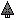

"Mercy": Tech 2 Guided Missile
----
<table align="right">
    <thead>
        <tr>
            <th align="left" colspan="2">
                Mercy Tech 2 Guided Missile
            </th>
        </tr>
    </thead>
    <tbody>
        <tr>
            <td align="right"><strong>Source:</strong></td>
            <td><a href="Forged Alliance Forever">Forged Alliance Forever</a></td>
        </tr>
        <tr>
            <td align="right"><strong>Unit ID:</strong></td>
            <td><a href="https://github.com/FAForever/fa/D:/faf-development/fa/units/DAA0206/DAA0206_unit.bp"><code>daa0206</code></a></td>
        </tr>
        <tr>
            <td align="right"><strong>Faction:</strong></td>
            <td><a href="_categories.AEON">Aeon</a></td>
        </tr>
        <tr>
            <td align="right"><strong>Tech level:</strong></td>
            <td> 2</td>
        </tr>
        <tr><td align="center" colspan="2"></td></tr>
        <tr>
            <td align="right"><strong>Health:</strong></td>
            <td> 90</td>
        </tr>
        <tr>
            <td align="right"><strong>Armour:</strong></td>
            <td><code>Light</code></td>
        </tr>
        <tr><td align="center" colspan="2"></td></tr>
        <tr>
            <td align="right"><strong>Energy cost:</strong></td>
            <td> 6000</td>
        </tr>
        <tr>
            <td align="right"><strong>Mass cost:</strong></td>
            <td> 300</td>
        </tr>
        <tr>
            <td align="right"><strong>Build time:</strong></td>
            <td>2000 (<a href="#construction">Details</a>)</td>
        </tr>
        <tr><td align="center" colspan="2"></td></tr>
        <tr>
            <td align="right"><strong>Vision radius:</strong></td>
            <td> 10 (200 m)</td>
        </tr>
        <tr>
            <td align="right"><strong>Water vision radius:</strong></td>
            <td> 10 (200 m)</td>
        </tr>
        <tr><td align="center" colspan="2"></td></tr>
        <tr>
            <td align="right"><strong>Motion type:</strong></td>
            <td><code>RULEUMT_Air</code></td>
        </tr>
        <tr>
            <td align="right"><strong>Movement speed:</strong></td>
            <td> 13 (260 m/s)</td>
        </tr>
        <tr>
            <td align="right"><strong>Fuel:</strong></td>
            <td> 06:40</td>
        </tr>
        <tr>
            <td align="right"><strong>Elevation:</strong></td>
            <td>12</td>
        </tr>
        <tr><td align="center" colspan="2"></td></tr>
        <tr>
            <td align="right"><strong>Weapons:</strong></td>
            <td>2 (<a href="#weapons">Details</a>)</td>
        </tr>
    </tbody>
</table>

"Mercy" is an Aeon aircraft unit included in *Forged Alliance Forever*.
It is classified as a tech 2 guided missile unit.
The build description for this unit is:

<blockquote>Kamikaze drone, with a short operational range and practically non-existent armour. Can inflict enormous damage to regions with no anti-air presence.</blockquote>

Contents

1. – <a href="#abilities">Abilities</a>
2. – <a href="#construction">Construction</a>
3. – <a href="#order-capabilities">Order capabilities</a>
4. – <a href="#weapons">Weapons</a>

### Abilities
Hover over abilities to see effect descriptions.

* Suicide Weapon

### Construction
Build times from the development branch of the game:
*  00:50 ‒  120/s ‒  6/s — Built by <a href="UAB0202">Tech 2 Air Factory HQ</a>
*  00:50 ‒  120/s ‒  6/s — Built by <a href="ZAB9502">Tech 2 Air Factory</a>
*  00:16 ‒  360/s ‒  18/s — Built by <a href="UAB0302">Tech 3 Air Factory HQ</a>
*  00:16 ‒  360/s ‒  18/s — Built by <a href="ZAB9602">Tech 3 Air Factory</a>

### Order capabilities
The following orders can be issued to the unit:
<table>
<td></td>
<td></td>
<td></td>
<td></td>
</table>

### Weapons

Kamikaze

    <table>
        <tr>
            <td align="right"><strong>Target type:</strong></td>
            <td><code>RULEWTT_Unit</code> (Anti-Surface)</td>
        </tr>
        <tr>
            <td align="right"><strong>Projectile:</strong></td>
            <td><a href="Projectiles#aif-guided-missile-01"><code>AIFGuidedMissile01</code></a></td>
        </tr>
        <tr>
            <td align="right"><strong>DPS estimate:</strong></td>
            <td>80000 (<u>?</u>)</td>
        </tr>
        <tr>
            <td align="right"><strong>Damage:</strong></td>
            <td>50 (<u>?</u>)</td>
        </tr>
        <tr>
            <td align="right"><strong>Damage radius:</strong></td>
            <td> 7.5 (150 m)</td>
        </tr>
        <tr>
            <td align="right"><strong>Damage instances:</strong></td>
            <td>8 fragments 20 DoT pulses</td>
        </tr>
        <tr>
            <td align="right"><strong>Damage type:</strong></td>
            <td><code>Normal</code></td>
        </tr>
        <tr>
            <td align="right"><strong>Max range:</strong></td>
            <td> 25 (0.5 km)</td>
        </tr>
        <tr>
            <td align="right"><strong>Firing arc:</strong></td>
            <td>80°</td>
        </tr>
        <tr>
            <td align="right"><strong>Firing cycle:</strong></td>
            <td>Once every 0.1s (<u>?</u>)</td>
        </tr>
        <tr>
            <td align="right"><strong>Flags:</strong></td>
            <td>Collide friendly Damage friendly</td>
        </tr>
    </table>

Air Crash

    <table>
        <tr>
            <td align="right"><strong>Damage:</strong></td>
            <td>25</td>
        </tr>
        <tr>
            <td align="right"><strong>Damage radius:</strong></td>
            <td> 3 (60 m)</td>
        </tr>
        <tr>
            <td align="right"><strong>Damage type:</strong></td>
            <td><code>Normal</code></td>
        </tr>
        <tr>
            <td align="right"><strong>Flags:</strong></td>
            <td>Damage friendly</td>
        </tr>
    </table>

<table align="center">
<td width="1215px">Categories : 
<a href="_categories.AEON">AEON</a> · 
<a href="_categories.TECH2">TECH2</a> · 
<a href="_categories.MOBILE">MOBILE</a> · 
<a href="_categories.AIR">AIR</a> · 
<a href="_categories.BOMBER">BOMBER</a></td>
</table>
