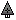

"Janus": Tech 2 Fighter/Bomber
----
<table align="right">
    <thead>
        <tr>
            <th align="left" colspan="2">
                Janus Tech 2 Fighter/Bomber
            </th>
        </tr>
    </thead>
    <tbody>
        <tr>
            <td align="right"><strong>Source:</strong></td>
            <td><a href="Forged Alliance Forever">Forged Alliance Forever</a></td>
        </tr>
        <tr>
            <td align="right"><strong>Unit ID:</strong></td>
            <td><a href="https://github.com/FAForever/fa/D:/faf-development/fa/units/DEA0202/DEA0202_unit.bp"><code>dea0202</code></a></td>
        </tr>
        <tr>
            <td align="right"><strong>Faction:</strong></td>
            <td><a href="_categories.UEF">UEF</a></td>
        </tr>
        <tr>
            <td align="right"><strong>Tech level:</strong></td>
            <td> 2</td>
        </tr>
        <tr><td align="center" colspan="2"></td></tr>
        <tr>
            <td align="right"><strong>Health:</strong></td>
            <td> 1200</td>
        </tr>
        <tr>
            <td align="right"><strong>Armour:</strong></td>
            <td><code>Light</code></td>
        </tr>
        <tr><td align="center" colspan="2"></td></tr>
        <tr>
            <td align="right"><strong>Energy cost:</strong></td>
            <td> 12600</td>
        </tr>
        <tr>
            <td align="right"><strong>Mass cost:</strong></td>
            <td> 360</td>
        </tr>
        <tr>
            <td align="right"><strong>Build time:</strong></td>
            <td>2800 (<a href="#construction">Details</a>)</td>
        </tr>
        <tr><td align="center" colspan="2"></td></tr>
        <tr>
            <td align="right"><strong>Vision radius:</strong></td>
            <td> 32 (0.64 km)</td>
        </tr>
        <tr>
            <td align="right"><strong>Water vision radius:</strong></td>
            <td> 10 (200 m)</td>
        </tr>
        <tr>
            <td align="right"><strong>Radar radius:</strong></td>
            <td> 64 (1.28 km)</td>
        </tr>
        <tr><td align="center" colspan="2"></td></tr>
        <tr>
            <td align="right"><strong>Motion type:</strong></td>
            <td><code>RULEUMT_Air</code></td>
        </tr>
        <tr>
            <td align="right"><strong>Movement speed:</strong></td>
            <td> 15 (300 m/s)</td>
        </tr>
        <tr>
            <td align="right"><strong>Fuel:</strong></td>
            <td> 08:20</td>
        </tr>
        <tr>
            <td align="right"><strong>Elevation:</strong></td>
            <td>18</td>
        </tr>
        <tr>
            <td align="right"><strong>Transport class:</strong></td>
            <td> Small</td>
        </tr>
        <tr><td align="center" colspan="2"></td></tr>
        <tr>
            <td align="right"><strong>Weapons:</strong></td>
            <td>4 (<a href="#weapons">Details</a>)</td>
        </tr>
        <tr>
            <td align="right"><strong>Wreckage:</strong></td>
            <td> 1080  291.6</td>
        </tr>
    </tbody>
</table>

"Janus" is a UEF aircraft unit included in *Forged Alliance Forever*.
It is classified as a tech 2 fighter/bomber unit.
The build description for this unit is:

<blockquote>Fast Assault Fighter, armed with two high-damage anti-air Railguns and powerful Damage-Over-Time napalm bombs.</blockquote>

Contents

1. – <a href="#abilities">Abilities</a>
2. – <a href="#construction">Construction</a>
3. – <a href="#order-capabilities">Order capabilities</a>
4. – <a href="#weapons">Weapons</a>
5. – <a href="#veteran-levels">Veteran levels</a>

### Abilities
Hover over abilities to see effect descriptions.

* Anti-Air
* Radar

### Construction
Build times from the development branch of the game:
*  01:10 ‒  180/s ‒  5/s — Built by <a href="UEB0202">Tech 2 Air Factory HQ</a>
*  01:10 ‒  180/s ‒  5/s — Built by <a href="ZEB9502">Tech 2 Air Factory</a>
*  00:23 ‒  540/s ‒  15/s — Built by <a href="UEB0302">Tech 3 Air Factory HQ</a>
*  00:23 ‒  540/s ‒  15/s — Built by <a href="ZEB9602">Tech 3 Air Factory</a>
*  00:15 ‒  810/s ‒  23/s — Built by <a href="UES0401">Experimental Aircraft Carrier</a>

### Order capabilities
The following orders can be issued to the unit:
<table>
<td></td>
<td></td>
<td></td>
<td></td>
<td></td>
<td></td>
<tr>
<td></td>
<td></td>
</table>

### Weapons

Linked Railgun (×2)

    <table>
        <tr><td align="center" colspan="2">Note: Stats are per instance of the weapon.</td></tr>
        <tr>
            <td align="right"><strong>Target type:</strong></td>
            <td><code>RULEWTT_Unit</code> (Anti-Air)</td>
        </tr>
        <tr>
            <td align="right"><strong>Projectile:</strong></td>
            <td><a href="Projectiles#taa-railgun-03"><code>TAARailgun03</code></a></td>
        </tr>
        <tr>
            <td align="right"><strong>DPS estimate:</strong></td>
            <td>75 (<u>?</u>)</td>
        </tr>
        <tr>
            <td align="right"><strong>Damage:</strong></td>
            <td>75 (<u>?</u>)</td>
        </tr>
        <tr>
            <td align="right"><strong>Damage radius:</strong></td>
            <td>0</td>
        </tr>
        <tr>
            <td align="right"><strong>Damage type:</strong></td>
            <td><code>Normal</code></td>
        </tr>
        <tr>
            <td align="right"><strong>Max range:</strong></td>
            <td> 30 (0.6 km)</td>
        </tr>
        <tr>
            <td align="right"><strong>Firing arc:</strong></td>
            <td>110°</td>
        </tr>
        <tr>
            <td align="right"><strong>Firing cycle:</strong></td>
            <td>Once every 1.0s (<u>?</u>)</td>
        </tr>
    </table>

Napalm Carpet Bomb

    <table>
        <tr>
            <td align="right"><strong>Target type:</strong></td>
            <td><code>RULEWTT_Unit</code> (Anti-Surface)</td>
        </tr>
        <tr>
            <td align="right"><strong>Projectile:</strong></td>
            <td><a href="Projectiles#tif-napalm-carpet-bomb-02"><code>TIFNapalmCarpetBomb02</code></a></td>
        </tr>
        <tr>
            <td align="right"><strong>DPS estimate:</strong></td>
            <td>120 (<u>?</u>)</td>
        </tr>
        <tr>
            <td align="right"><strong>Damage:</strong></td>
            <td>6 (<u>?</u>)</td>
        </tr>
        <tr>
            <td align="right"><strong>Damage radius:</strong></td>
            <td> 3 (60 m)</td>
        </tr>
        <tr>
            <td align="right"><strong>Damage instances:</strong></td>
            <td>20 projectiles 10 DoT pulses</td>
        </tr>
        <tr>
            <td align="right"><strong>Damage type:</strong></td>
            <td><code>Normal</code></td>
        </tr>
        <tr>
            <td align="right"><strong>Max range:</strong></td>
            <td> 60 (1.2 km)</td>
        </tr>
        <tr>
            <td align="right"><strong>Firing cycle:</strong></td>
            <td>Once every 10.0s (<u>?</u>)</td>
        </tr>
        <tr>
            <td align="right"><strong>Flags:</strong></td>
            <td>Damage friendly</td>
        </tr>
    </table>

Air Crash

    <table>
        <tr>
            <td align="right"><strong>Damage:</strong></td>
            <td>200</td>
        </tr>
        <tr>
            <td align="right"><strong>Damage radius:</strong></td>
            <td> 1 (20 m)</td>
        </tr>
        <tr>
            <td align="right"><strong>Damage type:</strong></td>
            <td><code>Normal</code></td>
        </tr>
        <tr>
            <td align="right"><strong>Flags:</strong></td>
            <td>Damage friendly</td>
        </tr>
    </table>

### Veteran levels
Note: Each veteran level buff replaces the previous by default; values are shown here as written.

1. 6 kills gives:  +120
2. 12 kills gives:  +240
3. 18 kills gives:  +360
4. 24 kills gives:  +480
5. 30 kills gives:  +600

<table align="center">
<td width="1215px">Categories : 
<a href="_categories.UEF">UEF</a> · 
<a href="_categories.TECH2">TECH2</a> · 
<a href="_categories.MOBILE">MOBILE</a> · 
<a href="_categories.ANTIAIR">ANTIAIR</a> · 
<a href="_categories.AIR">AIR</a> · 
<a href="_categories.BOMBER">BOMBER</a></td>
</table>
