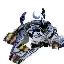

"Uyanah": Tech 3 Lightning Tank
----
<table align="right">
    <thead>
        <tr>
            <th align="left" colspan="2">
                Uyanah Tech 3 Lightning Tank
            </th>
        </tr>
    </thead>
    <tbody>
        <tr>
            <td align="right"><strong>Source:</strong></td>
            <td><a href="Forged Alliance Forever">Forged Alliance Forever</a></td>
        </tr>
        <tr>
            <td align="right"><strong>Unit ID:</strong></td>
            <td><a href="https://github.com/FAForever/fa/D:/faf-development/fa/units/DSLK004/DSLK004_unit.bp"><code>dslk004</code></a></td>
        </tr>
        <tr>
            <td align="right"><strong>Faction:</strong></td>
            <td><a href="_categories.SERAPHIM">Seraphim</a></td>
        </tr>
        <tr>
            <td align="right"><strong>Tech level:</strong></td>
            <td> 3</td>
        </tr>
        <tr><td align="center" colspan="2"></td></tr>
        <tr>
            <td align="right"><strong>Health:</strong></td>
            <td> 1800</td>
        </tr>
        <tr>
            <td align="right"><strong>Armour:</strong></td>
            <td><code>Normal</code></td>
        </tr>
        <tr><td align="center" colspan="2"></td></tr>
        <tr>
            <td align="right"><strong>Energy cost:</strong></td>
            <td> 9600</td>
        </tr>
        <tr>
            <td align="right"><strong>Mass cost:</strong></td>
            <td> 720</td>
        </tr>
        <tr>
            <td align="right"><strong>Build time:</strong></td>
            <td>3600 (<a href="#construction">Details</a>)</td>
        </tr>
        <tr><td align="center" colspan="2"></td></tr>
        <tr>
            <td align="right"><strong>Vision radius:</strong></td>
            <td> 26 (0.52 km)</td>
        </tr>
        <tr>
            <td align="right"><strong>Water vision radius:</strong></td>
            <td> 10 (200 m)</td>
        </tr>
        <tr><td align="center" colspan="2"></td></tr>
        <tr>
            <td align="right"><strong>Motion type:</strong></td>
            <td><code>RULEUMT_Land</code></td>
        </tr>
        <tr>
            <td align="right"><strong>Movement speed:</strong></td>
            <td> 3.4 (68 m/s)</td>
        </tr>
        <tr>
            <td align="right"><strong>Transport class:</strong></td>
            <td> Large</td>
        </tr>
        <tr><td align="center" colspan="2"></td></tr>
        <tr>
            <td align="right"><strong>Weapons:</strong></td>
            <td>2 (<a href="#weapons">Details</a>)</td>
        </tr>
        <tr>
            <td align="right"><strong>Wreckage:</strong></td>
            <td> 1620  583.2</td>
        </tr>
    </tbody>
</table>

"Uyanah" is a Seraphim land unit included in *Forged Alliance Forever*.
It is classified as a tech 3 lightning tank unit.
The build description for this unit is:

<blockquote> Mobile Anti-Air unit. Armed with a high-speed lasers, excellent against enemy gunships or air-fighters. Capable of switching weapon to anti-land attack but with smaller damage.</blockquote>

Contents

1. – <a href="#abilities">Abilities</a>
2. – <a href="#construction">Construction</a>
3. – <a href="#order-capabilities">Order capabilities</a>
4. – <a href="#weapons">Weapons</a>
5. – <a href="#veteran-levels">Veteran levels</a>

### Abilities
Hover over abilities to see effect descriptions.

* Anti-Air

### Construction
Build times from the development branch of the game:
*  00:40 ‒  240/s ‒  18/s — Built by <a href="XSB0301">Tech 3 Land Factory HQ</a>
*  00:40 ‒  240/s ‒  18/s — Built by <a href="ZSB9601">Tech 3 Land Factory</a>

### Order capabilities
The following orders can be issued to the unit:
<table>
<td></td>
<td></td>
<td></td>
<td></td>
<td></td>
<td></td>
<tr>
<td></td>
</table>

### Weapons

Unstable Phason Laser 2

    <table>
        <tr>
            <td align="right"><strong>Target type:</strong></td>
            <td><code>RULEWTT_Unit</code> (Anti-Surface)</td>
        </tr>
        <tr>
            <td align="right"><strong>DPS estimate:</strong></td>
            <td>56 (<u>?</u>)</td>
        </tr>
        <tr>
            <td align="right"><strong>Damage:</strong></td>
            <td>75 (<u>?</u>)</td>
        </tr>
        <tr>
            <td align="right"><strong>Damage radius:</strong></td>
            <td> 1 (20 m)</td>
        </tr>
        <tr>
            <td align="right"><strong>Damage instances:</strong></td>
            <td>3 beam collisions</td>
        </tr>
        <tr>
            <td align="right"><strong>Damage type:</strong></td>
            <td><code>Normal</code></td>
        </tr>
        <tr>
            <td align="right"><strong>Max range:</strong></td>
            <td> 28 (0.56 km)</td>
        </tr>
        <tr>
            <td align="right"><strong>Min range:</strong></td>
            <td>0</td>
        </tr>
        <tr>
            <td align="right"><strong>Firing cycle:</strong></td>
            <td>Once every 4.0s (<u>?</u>)</td>
        </tr>
    </table>

Unstable Phason Laser

    <table>
        <tr>
            <td align="right"><strong>Target type:</strong></td>
            <td><code>RULEWTT_Unit</code> (Anti-Air)</td>
        </tr>
        <tr>
            <td align="right"><strong>DPS estimate:</strong></td>
            <td>1200 (<u>?</u>)</td>
        </tr>
        <tr>
            <td align="right"><strong>Damage:</strong></td>
            <td>200 (<u>?</u>)</td>
        </tr>
        <tr>
            <td align="right"><strong>Damage radius:</strong></td>
            <td> 1 (20 m)</td>
        </tr>
        <tr>
            <td align="right"><strong>Damage instances:</strong></td>
            <td>6 beam collisions</td>
        </tr>
        <tr>
            <td align="right"><strong>Damage type:</strong></td>
            <td><code>Normal</code></td>
        </tr>
        <tr>
            <td align="right"><strong>Max range:</strong></td>
            <td> 58 (1.16 km)</td>
        </tr>
        <tr>
            <td align="right"><strong>Min range:</strong></td>
            <td>0</td>
        </tr>
        <tr>
            <td align="right"><strong>Firing cycle:</strong></td>
            <td>Once every 1.0s (<u>?</u>)</td>
        </tr>
    </table>

### Veteran levels
Note: Each veteran level buff replaces the previous by default; values are shown here as written.

1. 15 kills gives:  +180
2. 30 kills gives:  +360
3. 45 kills gives:  +540
4. 60 kills gives:  +720
5. 75 kills gives:  +900

<table align="center">
<td width="1215px">Categories : 
<a href="_categories.SERAPHIM">SERAPHIM</a> · 
<a href="_categories.TECH3">TECH3</a> · 
<a href="_categories.MOBILE">MOBILE</a> · 
<a href="_categories.ANTIAIR">ANTIAIR</a> · 
<a href="_categories.LAND">LAND</a></td>
</table>
