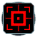

"Pulsar": Tech 3 Mobile EMP Missile Launcher
----
<table align="right">
    <thead>
        <tr>
            <th align="left" colspan="2">
                Pulsar Tech 3 Mobile EMP Missile Launcher
            </th>
        </tr>
    </thead>
    <tbody>
        <tr>
            <td align="right"><strong>Source:</strong></td>
            <td><a href="Forged Alliance Forever">Forged Alliance Forever</a></td>
        </tr>
        <tr>
            <td align="right"><strong>Unit ID:</strong></td>
            <td><a href="https://github.com/FAForever/fa/D:/faf-development/fa/units/SRL0310/SRL0310_unit.bp"><code>srl0310</code></a></td>
        </tr>
        <tr>
            <td align="right"><strong>Faction:</strong></td>
            <td><a href="_categories.CYBRAN">Cybran</a></td>
        </tr>
        <tr>
            <td align="right"><strong>Tech level:</strong></td>
            <td> 3</td>
        </tr>
        <tr><td align="center" colspan="2"></td></tr>
        <tr>
            <td align="right"><strong>Health:</strong></td>
            <td> 800</td>
        </tr>
        <tr>
            <td align="right"><strong>Armour:</strong></td>
            <td><code>Normal</code></td>
        </tr>
        <tr><td align="center" colspan="2"></td></tr>
        <tr>
            <td align="right"><strong>Energy cost:</strong></td>
            <td> 4800</td>
        </tr>
        <tr>
            <td align="right"><strong>Mass cost:</strong></td>
            <td> 420</td>
        </tr>
        <tr>
            <td align="right"><strong>Build time:</strong></td>
            <td>3600 (<a href="#construction">Details</a>)</td>
        </tr>
        <tr><td align="center" colspan="2"></td></tr>
        <tr>
            <td align="right"><strong>Vision radius:</strong></td>
            <td> 20 (400 m)</td>
        </tr>
        <tr>
            <td align="right"><strong>Water vision radius:</strong></td>
            <td> 10 (200 m)</td>
        </tr>
        <tr><td align="center" colspan="2"></td></tr>
        <tr>
            <td align="right"><strong>Motion type:</strong></td>
            <td><code>RULEUMT_AmphibiousFloating</code></td>
        </tr>
        <tr>
            <td align="right"><strong>Movement speed:</strong></td>
            <td> 3.5 (70 m/s)</td>
        </tr>
        <tr>
            <td align="right"><strong>Transport class:</strong></td>
            <td> Large</td>
        </tr>
        <tr><td align="center" colspan="2"></td></tr>
        <tr>
            <td align="right"><strong>Weapons:</strong></td>
            <td>1 (<a href="#weapons">Details</a>)</td>
        </tr>
        <tr>
            <td align="right"><strong>Wreckage:</strong></td>
            <td> 720  340.2</td>
        </tr>
    </tbody>
</table>

"Pulsar" is a Cybran floating amphibious unit included in *Forged Alliance Forever*.
It is classified as a tech 3 mobile emp missile launcher unit.
The build description for this unit is:

<blockquote> Mobile support unit. Designed to attack and destroy enemy shields. Weapon system only very briefly stuns enemy units.</blockquote>

Contents

1. – <a href="#abilities">Abilities</a>
2. – <a href="#construction">Construction</a>
3. – <a href="#order-capabilities">Order capabilities</a>
4. – <a href="#weapons">Weapons</a>
5. – <a href="#veteran-levels">Veteran levels</a>

### Abilities
Hover over abilities to see effect descriptions.

* Amphibious
* EMP Weapon

### Construction
Build times from the development branch of the game:
*  00:40 ‒  120/s ‒  11/s — Built by <a href="URB0301">Tech 3 Land Factory HQ</a>
*  00:40 ‒  120/s ‒  11/s — Built by <a href="ZRB9601">Tech 3 Land Factory</a>

### Order capabilities
The following orders can be issued to the unit:
<table>
<td></td>
<td></td>
<td></td>
<td></td>
<td></td>
<td></td>
<tr>
<td></td>
</table>

### Weapons

Othismash EMP Missile Barrage

    <table>
        <tr>
            <td align="right"><strong>Target type:</strong></td>
            <td><code>RULEWTT_Unit</code> (Anti-Surface)</td>
        </tr>
        <tr>
            <td align="right"><strong>Projectile:</strong></td>
            <td><a href="Projectiles#cif-othismashemp-missile-01"><code>CIFOthismashEMPMissile01</code></a></td>
        </tr>
        <tr>
            <td align="right"><strong>DPS estimate:</strong></td>
            <td>4 (<u>?</u>)</td>
        </tr>
        <tr>
            <td align="right"><strong>Damage:</strong></td>
            <td>2 (<u>?</u>)</td>
        </tr>
        <tr>
            <td align="right"><strong>Damage to shields:</strong></td>
            <td>325</td>
        </tr>
        <tr>
            <td align="right"><strong>Damage radius:</strong></td>
            <td>0</td>
        </tr>
        <tr>
            <td align="right"><strong>Damage instances:</strong></td>
            <td>4 projectiles</td>
        </tr>
        <tr>
            <td align="right"><strong>Damage type:</strong></td>
            <td><code>Normal</code></td>
        </tr>
        <tr>
            <td align="right"><strong>Max range:</strong></td>
            <td> 60 (1.2 km)</td>
        </tr>
        <tr>
            <td align="right"><strong>Min range:</strong></td>
            <td> 5 (100 m)</td>
        </tr>
        <tr>
            <td align="right"><strong>Firing cycle:</strong></td>
            <td>Once every 2.0s (<u>?</u>)</td>
        </tr>
        <tr>
            <td align="right"><strong>Buffs:</strong></td>
            <td><code>STUN</code></td>
        </tr>
    </table>

### Veteran levels
Note: Each veteran level buff replaces the previous by default; values are shown here as written.

1. 9 kills gives:  +80 (+3/s)
2. 18 kills gives:  +160 (+6/s)
3. 27 kills gives:  +240 (+9/s)
4. 36 kills gives:  +320 (+12/s)
5. 45 kills gives:  +400 (+15/s)

<table align="center">
<td width="1215px">Categories : 
<a href="_categories.CYBRAN">CYBRAN</a> · 
<a href="_categories.TECH3">TECH3</a> · 
<a href="_categories.MOBILE">MOBILE</a> · 
<a href="_categories.LAND">LAND</a> · 
<a href="_categories.SILO">SILO</a></td>
</table>
