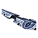
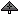

"Shimmer": Tech 1 Attack Bomber
----
<table align="right">
    <thead>
        <tr>
            <th align="left" colspan="2">
                Shimmer Tech 1 Attack Bomber
            </th>
        </tr>
    </thead>
    <tbody>
        <tr>
            <td align="right"><strong>Source:</strong></td>
            <td><a href="Forged Alliance Forever">Forged Alliance Forever</a></td>
        </tr>
        <tr>
            <td align="right"><strong>Unit ID:</strong></td>
            <td><a href="https://github.com/FAForever/fa/D:/faf-development/fa/units/UAA0103/UAA0103_unit.bp"><code>uaa0103</code></a></td>
        </tr>
        <tr>
            <td align="right"><strong>Faction:</strong></td>
            <td><a href="_categories.AEON">Aeon</a></td>
        </tr>
        <tr>
            <td align="right"><strong>Tech level:</strong></td>
            <td> 1</td>
        </tr>
        <tr><td align="center" colspan="2"></td></tr>
        <tr>
            <td align="right"><strong>Health:</strong></td>
            <td> 205</td>
        </tr>
        <tr>
            <td align="right"><strong>Armour:</strong></td>
            <td><code>Light</code></td>
        </tr>
        <tr><td align="center" colspan="2"></td></tr>
        <tr>
            <td align="right"><strong>Energy cost:</strong></td>
            <td> 2050</td>
        </tr>
        <tr>
            <td align="right"><strong>Mass cost:</strong></td>
            <td> 90</td>
        </tr>
        <tr>
            <td align="right"><strong>Build time:</strong></td>
            <td>500 (<a href="#construction">Details</a>)</td>
        </tr>
        <tr><td align="center" colspan="2"></td></tr>
        <tr>
            <td align="right"><strong>Vision radius:</strong></td>
            <td> 32 (0.64 km)</td>
        </tr>
        <tr>
            <td align="right"><strong>Water vision radius:</strong></td>
            <td> 10 (200 m)</td>
        </tr>
        <tr>
            <td align="right"><strong>Radar radius:</strong></td>
            <td> 44 (0.88 km)</td>
        </tr>
        <tr><td align="center" colspan="2"></td></tr>
        <tr>
            <td align="right"><strong>Motion type:</strong></td>
            <td><code>RULEUMT_Air</code></td>
        </tr>
        <tr>
            <td align="right"><strong>Movement speed:</strong></td>
            <td> 10 (200 m/s)</td>
        </tr>
        <tr>
            <td align="right"><strong>Fuel:</strong></td>
            <td> 06:40</td>
        </tr>
        <tr>
            <td align="right"><strong>Elevation:</strong></td>
            <td>14</td>
        </tr>
        <tr>
            <td align="right"><strong>Transport class:</strong></td>
            <td> Medium</td>
        </tr>
        <tr><td align="center" colspan="2"></td></tr>
        <tr>
            <td align="right"><strong>Weapons:</strong></td>
            <td>2 (<a href="#weapons">Details</a>)</td>
        </tr>
        <tr>
            <td align="right"><strong>Wreckage:</strong></td>
            <td> 184.5  72.9</td>
        </tr>
    </tbody>
</table>

"Shimmer" is an Aeon aircraft unit included in *Forged Alliance Forever*.
It is classified as a tech 1 attack bomber unit.
The build description for this unit is:

<blockquote>Lightly armoured Bomber, armed with EMP Bombs which can stun enemy units.</blockquote>

Contents

1. – <a href="#abilities">Abilities</a>
2. – <a href="#construction">Construction</a>
3. – <a href="#order-capabilities">Order capabilities</a>
4. – <a href="#weapons">Weapons</a>
5. – <a href="#veteran-levels">Veteran levels</a>

### Abilities
Hover over abilities to see effect descriptions.

* EMP Weapon

### Construction
Build times from the development branch of the game:
*  00:25 ‒  82/s ‒  4/s — Built by <a href="UAB0102">Tech 1 Air Factory</a>
*  00:12 ‒  164/s ‒  7/s — Built by <a href="UAB0202">Tech 2 Air Factory HQ</a>
*  00:12 ‒  164/s ‒  7/s — Built by <a href="ZAB9502">Tech 2 Air Factory</a>
*  00:04 ‒  492/s ‒  22/s — Built by <a href="UAB0302">Tech 3 Air Factory HQ</a>
*  00:04 ‒  492/s ‒  22/s — Built by <a href="ZAB9602">Tech 3 Air Factory</a>
*  00:02 ‒  738/s ‒  32/s — Built by <a href="UAA0310">Experimental Aircraft Carrier</a>

### Order capabilities
The following orders can be issued to the unit:
<table>
<td></td>
<td></td>
<td></td>
<td></td>
<td></td>
<td></td>
<tr>
<td></td>
<td></td>
</table>

### Weapons

Graviton Bomb

    <table>
        <tr>
            <td align="right"><strong>Target type:</strong></td>
            <td><code>RULEWTT_Unit</code> (Anti-Surface)</td>
        </tr>
        <tr>
            <td align="right"><strong>Projectile:</strong></td>
            <td><a href="Projectiles#aif-bomb-graviton-01"><code>AIFBombGraviton01</code></a></td>
        </tr>
        <tr>
            <td align="right"><strong>DPS estimate:</strong></td>
            <td>40 (<u>?</u>)</td>
        </tr>
        <tr>
            <td align="right"><strong>Damage:</strong></td>
            <td>200 (<u>?</u>)</td>
        </tr>
        <tr>
            <td align="right"><strong>Damage radius:</strong></td>
            <td> 4 (80 m)</td>
        </tr>
        <tr>
            <td align="right"><strong>Damage type:</strong></td>
            <td><code>Normal</code></td>
        </tr>
        <tr>
            <td align="right"><strong>Max range:</strong></td>
            <td> 40 (0.8 km)</td>
        </tr>
        <tr>
            <td align="right"><strong>Firing cycle:</strong></td>
            <td>Once every 5.0s (<u>?</u>)</td>
        </tr>
        <tr>
            <td align="right"><strong>Flags:</strong></td>
            <td>Damage friendly</td>
        </tr>
        <tr>
            <td align="right"><strong>Buffs:</strong></td>
            <td><code>STUN</code></td>
        </tr>
    </table>

Air Crash

    <table>
        <tr>
            <td align="right"><strong>Damage:</strong></td>
            <td>100</td>
        </tr>
        <tr>
            <td align="right"><strong>Damage radius:</strong></td>
            <td> 1 (20 m)</td>
        </tr>
        <tr>
            <td align="right"><strong>Damage type:</strong></td>
            <td><code>Normal</code></td>
        </tr>
        <tr>
            <td align="right"><strong>Flags:</strong></td>
            <td>Damage friendly</td>
        </tr>
    </table>

### Veteran levels
Note: Each veteran level buff replaces the previous by default; values are shown here as written.

1. 3 kills gives:  +20.5
2. 6 kills gives:  +41
3. 9 kills gives:  +61.5
4. 12 kills gives:  +82
5. 15 kills gives:  +102.5

<table align="center">
<td width="1215px">Categories : 
<a href="_categories.AEON">AEON</a> · 
<a href="_categories.TECH1">TECH1</a> · 
<a href="_categories.MOBILE">MOBILE</a> · 
<a href="_categories.AIR">AIR</a> · 
<a href="_categories.BOMBER">BOMBER</a></td>
</table>
