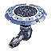

"Tide": Tech 1 Torpedo Launcher
----
<table align="right">
    <thead>
        <tr>
            <th align="left" colspan="2">
                Tide Tech 1 Torpedo Launcher
            </th>
        </tr>
    </thead>
    <tbody>
        <tr>
            <td align="right"><strong>Source:</strong></td>
            <td><a href="Forged Alliance Forever">Forged Alliance Forever</a></td>
        </tr>
        <tr>
            <td align="right"><strong>Unit ID:</strong></td>
            <td><a href="https://github.com/FAForever/fa/D:/faf-development/fa/units/UAB2109/UAB2109_unit.bp"><code>uab2109</code></a></td>
        </tr>
        <tr>
            <td align="right"><strong>Faction:</strong></td>
            <td><a href="_categories.AEON">Aeon</a></td>
        </tr>
        <tr>
            <td align="right"><strong>Tech level:</strong></td>
            <td> 1</td>
        </tr>
        <tr><td align="center" colspan="2"></td></tr>
        <tr>
            <td align="right"><strong>Health:</strong></td>
            <td> 1625</td>
        </tr>
        <tr>
            <td align="right"><strong>Armour:</strong></td>
            <td><code>Structure</code></td>
        </tr>
        <tr><td align="center" colspan="2"></td></tr>
        <tr>
            <td align="right"><strong>Energy cost:</strong></td>
            <td> 3600</td>
        </tr>
        <tr>
            <td align="right"><strong>Mass cost:</strong></td>
            <td> 450</td>
        </tr>
        <tr>
            <td align="right"><strong>Build time:</strong></td>
            <td>450 (<a href="#construction">Details</a>)</td>
        </tr>
        <tr><td align="center" colspan="2"></td></tr>
        <tr>
            <td align="right"><strong>Vision radius:</strong></td>
            <td> 12 (240 m)</td>
        </tr>
        <tr>
            <td align="right"><strong>Water vision radius:</strong></td>
            <td> 44 (0.88 km)</td>
        </tr>
        <tr>
            <td align="right"><strong>Sonar radius:</strong></td>
            <td> 36 (0.72 km)</td>
        </tr>
        <tr><td align="center" colspan="2"></td></tr>
        <tr>
            <td align="right"><strong>Motion type:</strong></td>
            <td><code>RULEUMT_None</code></td>
        </tr>
        <tr>
            <td align="right"><strong>Buildable layers:</strong></td>
            <td>water</td>
        </tr>
        <tr><td align="center" colspan="2"></td></tr>
        <tr>
            <td align="right"><strong>Weapons:</strong></td>
            <td>1 (<a href="#weapons">Details</a>)</td>
        </tr>
        <tr>
            <td align="right"><strong>Wreckage:</strong></td>
            <td> 1462.5  364.5</td>
        </tr>
    </tbody>
</table>

"Tide" is an Aeon structure unit included in *Forged Alliance Forever*.
It is classified as a tech 1 torpedo launcher unit.
The build description for this unit is:

<blockquote>Basic torpedo turret.</blockquote>

Contents

1. – <a href="#abilities">Abilities</a>
2. – <a href="#adjacency">Adjacency</a>
3. – <a href="#construction">Construction</a>
4. – <a href="#order-capabilities">Order capabilities</a>
5. – <a href="#weapons">Weapons</a>
6. – <a href="#veteran-levels">Veteran levels</a>

### Abilities
Hover over abilities to see effect descriptions.

* Sonar
* Torpedoes

### Adjacency
This unit counts as `SIZE4` for adjacency effects from other structures. This theoretically means that it can be surrounded by exactly 4 structures the size of a standard tech 1 power generator, which is accurate; meaning it can get the maximum intended buff effects. 

### Construction
Build times from the development branch of the game:
*  01:30 ‒  40/s ‒  5/s — Built by <a href="UAL0105">Tech 1 Engineer</a>
*  00:34 ‒  104/s ‒  13/s — Built by <a href="UAL0208">Tech 2 Engineer</a>
*  00:08 ‒  448/s ‒  56/s — Built by <a href="UAL0301">Tech 3 Support Armored Command Unit</a>
*  00:13 ‒  260/s ‒  33/s — Built by <a href="UAL0309">Tech 3 Engineer</a>
*  00:45 ‒  80/s ‒  10/s — Built by <a href="UAL0001">Armored Command Unit</a>

### Order capabilities
The following orders can be issued to the unit:
<table>
<td></td>
<td></td>
<td></td>
</table>

### Weapons

Chrono Torpedo

    <table>
        <tr>
            <td align="right"><strong>Target type:</strong></td>
            <td><code>RULEWTT_Unit</code> (Anti-Naval)</td>
        </tr>
        <tr>
            <td align="right"><strong>Projectile:</strong></td>
            <td><a href="Projectiles#aan-torpedo-01"><code>AANTorpedo01</code></a></td>
        </tr>
        <tr>
            <td align="right"><strong>DPS estimate:</strong></td>
            <td>90 (<u>?</u>)</td>
        </tr>
        <tr>
            <td align="right"><strong>Damage:</strong></td>
            <td>180 (<u>?</u>)</td>
        </tr>
        <tr>
            <td align="right"><strong>Damage instances:</strong></td>
            <td>2 projectiles</td>
        </tr>
        <tr>
            <td align="right"><strong>Damage type:</strong></td>
            <td><code>Normal</code></td>
        </tr>
        <tr>
            <td align="right"><strong>Max range:</strong></td>
            <td> 50 (1 km)</td>
        </tr>
        <tr>
            <td align="right"><strong>Firing cycle:</strong></td>
            <td>Once every 4.0s (<u>?</u>)</td>
        </tr>
    </table>

### Veteran levels
Note: Each veteran level buff replaces the previous by default; values are shown here as written.

1. 6 kills gives:  +162.5
2. 12 kills gives:  +325
3. 18 kills gives:  +487.5
4. 24 kills gives:  +650
5. 30 kills gives:  +812.5

<table align="center">
<td width="1215px">Categories : 
<a href="_categories.AEON">AEON</a> · 
<a href="_categories.TECH1">TECH1</a> · 
<a href="_categories.ANTINAVY">ANTINAVY</a> · 
<a href="_categories.STRUCTURE">STRUCTURE</a></td>
</table>
