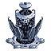
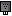

"Veil": Tech 2 Stealth Field Generator
----
<table align="right">
    <thead>
        <tr>
            <th align="left" colspan="2">
                Veil Tech 2 Stealth Field Generator
            </th>
        </tr>
    </thead>
    <tbody>
        <tr>
            <td align="right"><strong>Source:</strong></td>
            <td><a href="Forged Alliance Forever">Forged Alliance Forever</a></td>
        </tr>
        <tr>
            <td align="right"><strong>Unit ID:</strong></td>
            <td><a href="https://github.com/FAForever/fa/D:/faf-development/fa/units/UAB4203/UAB4203_unit.bp"><code>uab4203</code></a></td>
        </tr>
        <tr>
            <td align="right"><strong>Faction:</strong></td>
            <td><a href="_categories.AEON">Aeon</a></td>
        </tr>
        <tr>
            <td align="right"><strong>Tech level:</strong></td>
            <td> 2</td>
        </tr>
        <tr><td align="center" colspan="2"></td></tr>
        <tr>
            <td align="right"><strong>Health:</strong></td>
            <td> 175</td>
        </tr>
        <tr>
            <td align="right"><strong>Armour:</strong></td>
            <td><code>Structure</code></td>
        </tr>
        <tr><td align="center" colspan="2"></td></tr>
        <tr>
            <td align="right"><strong>Energy cost:</strong></td>
            <td> 6000</td>
        </tr>
        <tr>
            <td align="right"><strong>Mass cost:</strong></td>
            <td> 400</td>
        </tr>
        <tr>
            <td align="right"><strong>Build time:</strong></td>
            <td>726 (<a href="#construction">Details</a>)</td>
        </tr>
        <tr>
            <td align="right"><strong>Maintenance cost:</strong></td>
            <td> 125/s</td>
        </tr>
        <tr><td align="center" colspan="2"></td></tr>
        <tr>
            <td align="right"><strong>Vision radius:</strong></td>
            <td> 20 (400 m)</td>
        </tr>
        <tr>
            <td align="right"><strong>Water vision radius:</strong></td>
            <td> 10 (200 m)</td>
        </tr>
        <tr>
            <td align="right"><strong>Radar stealth radius:</strong></td>
            <td> 24 (480 m)</td>
        </tr>
        <tr>
            <td align="right"><strong>Sonar stealth radius:</strong></td>
            <td> 24 (480 m)</td>
        </tr>
        <tr><td align="center" colspan="2"></td></tr>
        <tr>
            <td align="right"><strong>Motion type:</strong></td>
            <td><code>RULEUMT_None</code></td>
        </tr>
        <tr>
            <td align="right"><strong>Buildable layers:</strong></td>
            <td>Land</td>
        </tr>
        <tr><td align="center" colspan="2"></td></tr>
        <tr>
            <td align="right"><strong>Wreckage:</strong></td>
            <td> 157.5  324</td>
        </tr>
    </tbody>
</table>

"Veil" is an Aeon structure unit included in *Forged Alliance Forever*.
It is classified as a tech 2 stealth field generator unit.
The build description for this unit is:

<blockquote>Stealth Field Generator which hides units and structures in range from enemy radar. Countered by optics and omni sensors.</blockquote>

Contents

1. – <a href="#abilities">Abilities</a>
2. – <a href="#adjacency">Adjacency</a>
3. – <a href="#construction">Construction</a>
4. – <a href="#order-capabilities">Order capabilities</a>

### Abilities
Hover over abilities to see effect descriptions.

* Radar Stealth Field

### Adjacency
This unit counts as `SIZE12` for adjacency effects from other structures. This theoretically means that it can be surrounded by exactly 12 structures the size of a standard tech 1 power generator, which is accurate; meaning it can get the maximum intended buff effects. 

### Construction
Build times from the development branch of the game:
*  00:55 ‒  107/s ‒  7/s — Built by <a href="UAL0208">Tech 2 Engineer</a>
*  00:12 ‒  463/s ‒  31/s — Built by <a href="UAL0301">Tech 3 Support Armored Command Unit</a>
*  00:22 ‒  269/s ‒  18/s — Built by <a href="UAL0309">Tech 3 Engineer</a>
*  01:12 ‒  83/s ‒  6/s — Built by <a href="UAL0001">Armored Command Unit</a>

### Order capabilities
The following orders can be issued to the unit:
<table>
<td></td>
</table>

<table align="center">
<td width="1215px">Categories : 
<a href="_categories.AEON">AEON</a> · 
<a href="_categories.TECH2">TECH2</a> · 
<a href="_categories.STRUCTURE">STRUCTURE</a></td>
</table>
