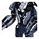
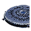

Armored Command Unit
----
<table align="right">
    <thead>
        <tr>
            <th align="left" colspan="2">
                <i>Unnamed</i> Armored Command Unit
            </th>
        </tr>
    </thead>
    <tbody>
        <tr>
            <td align="right"><strong>Source:</strong></td>
            <td><a href="Forged Alliance Forever">Forged Alliance Forever</a></td>
        </tr>
        <tr>
            <td align="right"><strong>Unit ID:</strong></td>
            <td><a href="https://github.com/FAForever/fa/D:/faf-development/fa/units/UAL0001/UAL0001_unit.bp"><code>ual0001</code></a></td>
        </tr>
        <tr>
            <td align="right"><strong>Faction:</strong></td>
            <td><a href="_categories.AEON">Aeon</a></td>
        </tr>
        <tr><td align="center" colspan="2"></td></tr>
        <tr>
            <td align="right"><strong>Health:</strong></td>
            <td> 11000 (+10/s)</td>
        </tr>
        <tr>
            <td align="right"><strong>Armour:</strong></td>
            <td><code>Commander</code></td>
        </tr>
        <tr><td align="center" colspan="2"></td></tr>
        <tr>
            <td align="right"><strong>Energy cost:</strong></td>
            <td> 5000000</td>
        </tr>
        <tr>
            <td align="right"><strong>Mass cost:</strong></td>
            <td> 2000</td>
        </tr>
        <tr>
            <td align="right"><strong>Build time:</strong></td>
            <td>6000000</td>
        </tr>
        <tr>
            <td align="right"><strong>Build rate:</strong></td>
            <td> 10</td>
        </tr>
        <tr>
            <td align="right"><strong>Energy production:</strong></td>
            <td> 20/s</td>
        </tr>
        <tr>
            <td align="right"><strong>Mass production:</strong></td>
            <td> 1/s</td>
        </tr>
        <tr>
            <td align="right"><strong>Energy storage:</strong></td>
            <td> 3900</td>
        </tr>
        <tr>
            <td align="right"><strong>Mass storage:</strong></td>
            <td> 650</td>
        </tr>
        <tr><td align="center" colspan="2"></td></tr>
        <tr>
            <td align="right"><strong>Vision radius:</strong></td>
            <td> 26 (0.52 km)</td>
        </tr>
        <tr>
            <td align="right"><strong>Water vision radius:</strong></td>
            <td> 24 (480 m)</td>
        </tr>
        <tr>
            <td align="right"><strong>Omni radius:</strong></td>
            <td> 24 (480 m)</td>
        </tr>
        <tr><td align="center" colspan="2"></td></tr>
        <tr>
            <td align="right"><strong>Motion type:</strong></td>
            <td><code>RULEUMT_Amphibious</code></td>
        </tr>
        <tr>
            <td align="right"><strong>Movement speed:</strong></td>
            <td> 1.7 (34 m/s)</td>
        </tr>
        <tr>
            <td align="right"><strong>Transport class:</strong></td>
            <td> Large</td>
        </tr>
        <tr><td align="center" colspan="2"></td></tr>
        <tr>
            <td align="right"><strong>Weapons:</strong></td>
            <td>6 (<a href="#weapons">Details</a>)</td>
        </tr>
    </tbody>
</table>

This unnamed unit is an Aeon seabed amphibious unit included in *Forged Alliance Forever*.
It is classified as a armored command unit unit with no defined tech level.
This unit has no categories to define common builders, however the build description for it is:

<blockquote>The Armored Command Unit (ACU) is a combination of barracks and command center. Contains all the blueprints necessary to build a basic army from scratch. Upgradeable with combat enhancements, advanced engineering suites, resource allocation system, and teleportation.</blockquote>

Contents

1. – <a href="#abilities">Abilities</a>
2. – <a href="#order-capabilities">Order capabilities</a>
3. – <a href="#engineering">Engineering</a>
4. – <a href="#enhancements">Enhancements</a>
5. – <a href="#weapons">Weapons</a>
6. – <a href="#veteran-levels">Veteran levels</a>

### Abilities
Hover over abilities to see effect descriptions.

* Amphibious
* Customizable
* Engineering Suite
* Not Capturable
* Omni Sensor
* Volatile

### Order capabilities
The following orders can be issued to the unit:
<table>
<td></td>
<td></td>
<td></td>
<td></td>
<td></td>
<td></td>
<tr>
<td></td>
<td></td>
<td></td>
<td></td>
<td></td>
<td></td>
</table>

### Engineering
The engineering capabilties of this unit consist of the ability to capture, reclaim, and repair.
It has the build categories:
* <code>BUILTBYCOMMANDER AEON</code>
* <code>BUILTBYTIER2COMMANDER AEON</code>
* <code>BUILTBYTIER3COMMANDER AEON</code>

These build categories allow it to build the following mod units:

<table>
    <tr>
        <td rowspan="2"></td>
        <td></td>
        <td></td>
        <td></td>
        <td></td>
        <td></td>
        <td></td>
        <td></td>
        <td></td>
    </tr>
    <tr>
        <td></td>
        <td></td>
        <td></td>
        <td></td>
        <td></td>
        <td></td>
        <td></td>
    </tr>
    <tr>
        <td rowspan="2"></td>
        <td></td>
        <td></td>
        <td></td>
        <td></td>
        <td></td>
        <td></td>
        <td></td>
        <td></td>
    </tr>
    <tr>
        <td></td>
        <td></td>
        <td></td>
        <td></td>
        <td></td>
        <td></td>
        <td></td>
        <td></td>
    </tr>
    <tr>
        <td rowspan="2"></td>
        <td></td>
        <td></td>
        <td></td>
        <td></td>
        <td></td>
        <td></td>
        <td></td>
        <td></td>
    </tr>
    <tr>
        <td></td>
        <td></td>
        <td></td>
        <td></td>
        <td></td>
        <td></td>
        <td></td>
    </tr>
    <tr>
        <td></td>
        <td></td>
        <td></td>
        <td></td>
        <td></td>
        <td></td>
    </tr>
</table>

### Enhancements

#### Back

Chrono Dampener

    <table>
        <tr>
            <td align="right"><strong>Description:</strong></td>
            <td>Creates a Quantum Stasis Field around the ACU. Immobilizes enemy units within the ACU's main cannon range.

+3000 Health</td>
        </tr>
        <tr>
            <td align="right"><strong>Energy cost:</strong></td>
            <td> 52500</td>
        </tr>
        <tr>
            <td align="right"><strong>Mass cost:</strong></td>
            <td> 1750</td>
        </tr>
        <tr>
            <td align="right"><strong>Build time:</strong></td>
            <td> 123 seconds</td>
        </tr>
        <tr>
            <td align="right"><strong>Prerequisite:</strong></td>
            <td>None</td>
        </tr>
    </table>

Resource Allocation System

    <table>
        <tr>
            <td align="right"><strong>Description:</strong></td>
            <td>Increases ACU's resource generation to 19 mass per second and 1720 energy per second.</td>
        </tr>
        <tr>
            <td align="right"><strong>Energy cost:</strong></td>
            <td> 175000</td>
        </tr>
        <tr>
            <td align="right"><strong>Mass cost:</strong></td>
            <td> 5000</td>
        </tr>
        <tr>
            <td align="right"><strong>Build time:</strong></td>
            <td> 280 seconds</td>
        </tr>
        <tr>
            <td align="right"><strong>Prerequisite:</strong></td>
            <td>None</td>
        </tr>
    </table>

Advanced Resource Allocation System

    <table>
        <tr>
            <td align="right"><strong>Description:</strong></td>
            <td>Increases ACU's resource generation to 37 mass per second and 3420 energy per second.</td>
        </tr>
        <tr>
            <td align="right"><strong>Energy cost:</strong></td>
            <td> 175000</td>
        </tr>
        <tr>
            <td align="right"><strong>Mass cost:</strong></td>
            <td> 5000</td>
        </tr>
        <tr>
            <td align="right"><strong>Build time:</strong></td>
            <td> 280 seconds</td>
        </tr>
        <tr>
            <td align="right"><strong>Prerequisite:</strong></td>
            <td>Resource Allocation System</td>
        </tr>
    </table>

Personal Shield Generator

    <table>
        <tr>
            <td align="right"><strong>Description:</strong></td>
            <td>Creates a rapidly-recharging, protective Personal Shield around the ACU. Requires energy to run.

Shield Regen Rate = 30 HP/s
Shield Recharge Time = 75 seconds</td>
        </tr>
        <tr>
            <td align="right"><strong>Energy cost:</strong></td>
            <td> 35000</td>
        </tr>
        <tr>
            <td align="right"><strong>Mass cost:</strong></td>
            <td> 1300</td>
        </tr>
        <tr>
            <td align="right"><strong>Build time:</strong></td>
            <td> 130 seconds</td>
        </tr>
        <tr>
            <td align="right"><strong>Prerequisite:</strong></td>
            <td>None</td>
        </tr>
    </table>

Heavy Personal Shield Generator

    <table>
        <tr>
            <td align="right"><strong>Description:</strong></td>
            <td>Greatly increases the Personal Shield's HP. Requires energy to run.

Shield Regen Rate = 32 HP/s
Shield Recharge Time = 160 seconds</td>
        </tr>
        <tr>
            <td align="right"><strong>Energy cost:</strong></td>
            <td> 123750</td>
        </tr>
        <tr>
            <td align="right"><strong>Mass cost:</strong></td>
            <td> 2300</td>
        </tr>
        <tr>
            <td align="right"><strong>Build time:</strong></td>
            <td> 245 seconds</td>
        </tr>
        <tr>
            <td align="right"><strong>Prerequisite:</strong></td>
            <td>Personal Shield Generator</td>
        </tr>
    </table>

Personal Teleporter

    <table>
        <tr>
            <td align="right"><strong>Description:</strong></td>
            <td>Adds Teleportation capability. Requires considerable energy to activate.</td>
        </tr>
        <tr>
            <td align="right"><strong>Energy cost:</strong></td>
            <td> 1500000</td>
        </tr>
        <tr>
            <td align="right"><strong>Mass cost:</strong></td>
            <td> 15000</td>
        </tr>
        <tr>
            <td align="right"><strong>Build time:</strong></td>
            <td> 420 seconds</td>
        </tr>
        <tr>
            <td align="right"><strong>Prerequisite:</strong></td>
            <td>None</td>
        </tr>
    </table>

#### Left Arm

Tech 2 Engineering Suite

    <table>
        <tr>
            <td align="right"><strong>Description:</strong></td>
            <td>Grants Tech 2 schematic access and increases the ACU's build speed and maximum health.

+32 Buildpower
+2000 Health
+10 Regen</td>
        </tr>
        <tr>
            <td align="right"><strong>Energy cost:</strong></td>
            <td> 21000</td>
        </tr>
        <tr>
            <td align="right"><strong>Mass cost:</strong></td>
            <td> 800</td>
        </tr>
        <tr>
            <td align="right"><strong>Build time:</strong></td>
            <td> 100 seconds</td>
        </tr>
        <tr>
            <td align="right"><strong>Prerequisite:</strong></td>
            <td>None</td>
        </tr>
    </table>

Tech 3 Engineering Suite

    <table>
        <tr>
            <td align="right"><strong>Description:</strong></td>
            <td>Grants Tech 3 and Experimental schematic access and further increases the ACU's build speed and maximum health.

+58 Buildpower
+1000 Health
+10 Regen</td>
        </tr>
        <tr>
            <td align="right"><strong>Energy cost:</strong></td>
            <td> 50000</td>
        </tr>
        <tr>
            <td align="right"><strong>Mass cost:</strong></td>
            <td> 2400</td>
        </tr>
        <tr>
            <td align="right"><strong>Build time:</strong></td>
            <td> 840 seconds</td>
        </tr>
        <tr>
            <td align="right"><strong>Prerequisite:</strong></td>
            <td>Tech 2 Engineering Suite</td>
        </tr>
    </table>

Enhanced Quantum Disruptor

    <table>
        <tr>
            <td align="right"><strong>Description:</strong></td>
            <td>Increases the range of the ACU's main cannon and that of Overcharge.

+8 Main cannon range</td>
        </tr>
        <tr>
            <td align="right"><strong>Energy cost:</strong></td>
            <td> 6000</td>
        </tr>
        <tr>
            <td align="right"><strong>Mass cost:</strong></td>
            <td> 300</td>
        </tr>
        <tr>
            <td align="right"><strong>Build time:</strong></td>
            <td> 35 seconds</td>
        </tr>
        <tr>
            <td align="right"><strong>Prerequisite:</strong></td>
            <td>None</td>
        </tr>
    </table>

Advanced Quantum Disruptor

    <table>
        <tr>
            <td align="right"><strong>Description:</strong></td>
            <td>Further increases the range of the ACU's main cannon and that of Overcharge.

+5 Main cannon range</td>
        </tr>
        <tr>
            <td align="right"><strong>Energy cost:</strong></td>
            <td> 31000</td>
        </tr>
        <tr>
            <td align="right"><strong>Mass cost:</strong></td>
            <td> 900</td>
        </tr>
        <tr>
            <td align="right"><strong>Build time:</strong></td>
            <td> 110 seconds</td>
        </tr>
        <tr>
            <td align="right"><strong>Prerequisite:</strong></td>
            <td>Enhanced Quantum Disruptor</td>
        </tr>
    </table>

#### Right Arm

Enhanced Sensor System

    <table>
        <tr>
            <td align="right"><strong>Description:</strong></td>
            <td>Grants the ACU a long range omni Sensor and increased optical range.

+54 Vision Radius
+54 Omni Radius</td>
        </tr>
        <tr>
            <td align="right"><strong>Energy cost:</strong></td>
            <td> 5000</td>
        </tr>
        <tr>
            <td align="right"><strong>Mass cost:</strong></td>
            <td> 350</td>
        </tr>
        <tr>
            <td align="right"><strong>Build time:</strong></td>
            <td> 50 seconds</td>
        </tr>
        <tr>
            <td align="right"><strong>Prerequisite:</strong></td>
            <td>None</td>
        </tr>
    </table>

Quantum Accelerator

    <table>
        <tr>
            <td align="right"><strong>Description:</strong></td>
            <td>Doubles the main cannon's rate of fire.

+100% Rate of fire</td>
        </tr>
        <tr>
            <td align="right"><strong>Energy cost:</strong></td>
            <td> 15000</td>
        </tr>
        <tr>
            <td align="right"><strong>Mass cost:</strong></td>
            <td> 500</td>
        </tr>
        <tr>
            <td align="right"><strong>Build time:</strong></td>
            <td> 50 seconds</td>
        </tr>
        <tr>
            <td align="right"><strong>Prerequisite:</strong></td>
            <td>None</td>
        </tr>
    </table>

### Weapons

Quantum Disruptor

    <table>
        <tr>
            <td align="right"><strong>Target type:</strong></td>
            <td><code>RULEWTT_Unit</code> (Anti-Surface)</td>
        </tr>
        <tr>
            <td align="right"><strong>Projectile:</strong></td>
            <td><a href="Projectiles#adf-quantum-disruptor-01"><code>ADFQuantumDisruptor01</code></a></td>
        </tr>
        <tr>
            <td align="right"><strong>DPS estimate:</strong></td>
            <td>100 (<u>?</u>)</td>
        </tr>
        <tr>
            <td align="right"><strong>Damage:</strong></td>
            <td>100 (<u>?</u>)</td>
        </tr>
        <tr>
            <td align="right"><strong>Damage type:</strong></td>
            <td><code>Normal</code></td>
        </tr>
        <tr>
            <td align="right"><strong>Max range:</strong></td>
            <td> 22 (440 m)</td>
        </tr>
        <tr>
            <td align="right"><strong>Min range:</strong></td>
            <td> 1 (20 m)</td>
        </tr>
        <tr>
            <td align="right"><strong>Firing cycle:</strong></td>
            <td>Once every 1.0s (<u>?</u>)</td>
        </tr>
    </table>

Overcharge Cannon

    <table>
        <tr>
            <td align="right"><strong>Target type:</strong></td>
            <td><code>RULEWTT_Unit</code> (Anti-Surface)</td>
        </tr>
        <tr>
            <td align="right"><strong>Projectile:</strong></td>
            <td><a href="Projectiles#adf-over-charge-01"><code>ADFOverCharge01</code></a></td>
        </tr>
        <tr>
            <td align="right"><strong>DPS estimate:</strong></td>
            <td>4545 (<u>?</u>)</td>
        </tr>
        <tr>
            <td align="right"><strong>Damage:</strong></td>
            <td>15000 (<u>?</u>)</td>
        </tr>
        <tr>
            <td align="right"><strong>Damage radius:</strong></td>
            <td> 2.5 (50 m)</td>
        </tr>
        <tr>
            <td align="right"><strong>Damage type:</strong></td>
            <td><code>Overcharge</code></td>
        </tr>
        <tr>
            <td align="right"><strong>Max range:</strong></td>
            <td> 22 (440 m)</td>
        </tr>
        <tr>
            <td align="right"><strong>Firing cycle:</strong></td>
            <td>Once every 3.3s (<u>?</u>)</td>
        </tr>
        <tr>
            <td align="right"><strong>Firing cost:</strong></td>
            <td> 7500</td>
        </tr>
    </table>

AutoOvercharge Cannon

    <table>
        <tr>
            <td align="right"><strong>Target type:</strong></td>
            <td><code>RULEWTT_Unit</code> (Anti-Surface)</td>
        </tr>
        <tr>
            <td align="right"><strong>Projectile:</strong></td>
            <td><a href="Projectiles#adf-over-charge-01"><code>ADFOverCharge01</code></a></td>
        </tr>
        <tr>
            <td align="right"><strong>DPS estimate:</strong></td>
            <td>3000 (<u>?</u>)</td>
        </tr>
        <tr>
            <td align="right"><strong>Damage:</strong></td>
            <td>15000 (<u>?</u>)</td>
        </tr>
        <tr>
            <td align="right"><strong>Damage radius:</strong></td>
            <td> 2.5 (50 m)</td>
        </tr>
        <tr>
            <td align="right"><strong>Damage type:</strong></td>
            <td><code>Overcharge</code></td>
        </tr>
        <tr>
            <td align="right"><strong>Max range:</strong></td>
            <td> 22 (440 m)</td>
        </tr>
        <tr>
            <td align="right"><strong>Firing cycle:</strong></td>
            <td>Once every 5.0s (<u>?</u>)</td>
        </tr>
        <tr>
            <td align="right"><strong>Firing cost:</strong></td>
            <td> 7500</td>
        </tr>
    </table>

Chrono Dampener

    <table>
        <tr>
            <td align="right"><strong>Target type:</strong></td>
            <td><code>RULEWTT_Unit</code> (Anti-Land &amp; Naval)</td>
        </tr>
        <tr>
            <td align="right"><strong>DPS estimate:</strong></td>
            <td>1 (<u>?</u>)</td>
        </tr>
        <tr>
            <td align="right"><strong>Damage:</strong></td>
            <td>1 (<u>?</u>)</td>
        </tr>
        <tr>
            <td align="right"><strong>Damage radius:</strong></td>
            <td>0</td>
        </tr>
        <tr>
            <td align="right"><strong>Damage type:</strong></td>
            <td><code>Normal</code></td>
        </tr>
        <tr>
            <td align="right"><strong>Max range:</strong></td>
            <td> 35 (0.7 km)</td>
        </tr>
        <tr>
            <td align="right"><strong>Firing cycle:</strong></td>
            <td>Once every 0.1s (<u>?</u>)</td>
        </tr>
        <tr>
            <td align="right"><strong>Firing cost:</strong></td>
            <td> 200 (200/s for 1s)</td>
        </tr>
        <tr>
            <td align="right"><strong>Buffs:</strong></td>
            <td><code>STUN</code></td>
        </tr>
    </table>

Death Nuke

    <table>
        <tr>
            <td align="right"><strong>Projectile:</strong></td>
            <td><a href="Projectiles#aif-quantum-warhead-02"><code>AIFQuantumWarhead02</code></a></td>
        </tr>
        <tr>
            <td align="right"><strong>Damage:</strong></td>
            <td>2000 (<u>?</u>)</td>
        </tr>
        <tr>
            <td align="right"><strong>Damage radius:</strong></td>
            <td> 30 (0.6 km)</td>
        </tr>
        <tr>
            <td align="right"><strong>Outer damage:</strong></td>
            <td>500</td>
        </tr>
        <tr>
            <td align="right"><strong>Outer radius:</strong></td>
            <td> 40 (0.8 km)</td>
        </tr>
        <tr>
            <td align="right"><strong>Damage type:</strong></td>
            <td><code>Deathnuke</code></td>
        </tr>
        <tr>
            <td align="right"><strong>Flags:</strong></td>
            <td>Damage friendly</td>
        </tr>
    </table>

Teleport in

    <table>
        <tr>
            <td align="right"><strong>Target type:</strong></td>
            <td>Untargeted</td>
        </tr>
        <tr>
            <td align="right"><strong>Damage:</strong></td>
            <td>100 (<u>?</u>)</td>
        </tr>
        <tr>
            <td align="right"><strong>Damage radius:</strong></td>
            <td> 4 (80 m)</td>
        </tr>
        <tr>
            <td align="right"><strong>Damage type:</strong></td>
            <td><code>Normal</code></td>
        </tr>
        <tr>
            <td align="right"><strong>Max range:</strong></td>
            <td> 1 (20 m)</td>
        </tr>
        <tr>
            <td align="right"><strong>Firing cycle:</strong></td>
            <td>Once every 1.0s (<u>?</u>)</td>
        </tr>
        <tr>
            <td align="right"><strong>Flags:</strong></td>
            <td>Damage friendly</td>
        </tr>
    </table>

### Veteran levels
Note: Each veteran level buff replaces the previous by default; values are shown here as written.

1. 20 kills gives:  +1100
2. 40 kills gives:  +2200
3. 65 kills gives:  +3300
4. 90 kills gives:  +4400
5. 120 kills gives:  +5500

<table align="center">
<td width="1215px">Categories : 
<a href="_categories.AEON">AEON</a> · 
<a href="_categories.MOBILE">MOBILE</a> · 
<a href="_categories.DIRECTFIRE">DIRECTFIRE</a> · 
<a href="_categories.LAND">LAND</a> · 
<a href="_categories.ECONOMIC">ECONOMIC</a> · 
<a href="_categories.COMMAND">COMMAND</a> · 
<a href="_categories.ENGINEER">ENGINEER</a></td>
</table>
