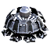
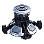
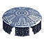
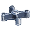
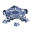
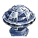

Tech 1 Engineer
----
<table align="right">
    <thead>
        <tr>
            <th align="left" colspan="2">
                <i>Unnamed</i> Tech 1 Engineer
            </th>
        </tr>
    </thead>
    <tbody>
        <tr>
            <td align="right"><strong>Source:</strong></td>
            <td><a href="Forged Alliance Forever">Forged Alliance Forever</a></td>
        </tr>
        <tr>
            <td align="right"><strong>Unit ID:</strong></td>
            <td><a href="https://github.com/FAForever/fa/D:/faf-development/fa/units/UAL0105/UAL0105_unit.bp"><code>ual0105</code></a></td>
        </tr>
        <tr>
            <td align="right"><strong>Faction:</strong></td>
            <td><a href="_categories.AEON">Aeon</a></td>
        </tr>
        <tr>
            <td align="right"><strong>Tech level:</strong></td>
            <td> 1</td>
        </tr>
        <tr><td align="center" colspan="2"></td></tr>
        <tr>
            <td align="right"><strong>Health:</strong></td>
            <td> 120</td>
        </tr>
        <tr>
            <td align="right"><strong>Armour:</strong></td>
            <td><code>Normal</code></td>
        </tr>
        <tr><td align="center" colspan="2"></td></tr>
        <tr>
            <td align="right"><strong>Energy cost:</strong></td>
            <td> 260</td>
        </tr>
        <tr>
            <td align="right"><strong>Mass cost:</strong></td>
            <td> 52</td>
        </tr>
        <tr>
            <td align="right"><strong>Build time:</strong></td>
            <td>260 (<a href="#construction">Details</a>)</td>
        </tr>
        <tr>
            <td align="right"><strong>Build rate:</strong></td>
            <td> 5</td>
        </tr>
        <tr>
            <td align="right"><strong>Energy storage:</strong></td>
            <td> 0</td>
        </tr>
        <tr>
            <td align="right"><strong>Mass storage:</strong></td>
            <td> 10</td>
        </tr>
        <tr><td align="center" colspan="2"></td></tr>
        <tr>
            <td align="right"><strong>Vision radius:</strong></td>
            <td> 18 (360 m)</td>
        </tr>
        <tr>
            <td align="right"><strong>Water vision radius:</strong></td>
            <td> 10 (200 m)</td>
        </tr>
        <tr><td align="center" colspan="2"></td></tr>
        <tr>
            <td align="right"><strong>Motion type:</strong></td>
            <td><code>RULEUMT_Hover</code></td>
        </tr>
        <tr>
            <td align="right"><strong>Movement speed:</strong></td>
            <td> 1.9 (38 m/s)</td>
        </tr>
        <tr>
            <td align="right"><strong>Transport class:</strong></td>
            <td> Small</td>
        </tr>
        <tr><td align="center" colspan="2"></td></tr>
        <tr>
            <td align="right"><strong>Wreckage:</strong></td>
            <td> 108  42.12</td>
        </tr>
    </tbody>
</table>

This unnamed unit is an Aeon hover unit included in *Forged Alliance Forever*.
It is classified as a tech 1 engineer unit.
The build description for this unit is:

<blockquote>Tech 1 amphibious construction, repair, capture and reclamation unit.</blockquote>

Contents

1. – <a href="#abilities">Abilities</a>
2. – <a href="#construction">Construction</a>
3. – <a href="#order-capabilities">Order capabilities</a>
4. – <a href="#engineering">Engineering</a>

### Abilities
Hover over abilities to see effect descriptions.

* Engineering Suite
* Hover
* Sacrifice

### Construction
Build times from the development branch of the game:
*  00:13 ‒  20/s ‒  4/s — Built by <a href="UAB0101">Tech 1 Land Factory</a>
*  00:13 ‒  20/s ‒  4/s — Built by <a href="UAB0102">Tech 1 Air Factory</a>
*  00:13 ‒  20/s ‒  4/s — Built by <a href="UAB0103">Tech 1 Naval Factory</a>
*  00:06 ‒  40/s ‒  8/s — Built by <a href="UAB0201">Tech 2 Land Factory HQ</a>
*  00:06 ‒  40/s ‒  8/s — Built by <a href="ZAB9501">Tech 2 Land Factory</a>
*  00:06 ‒  40/s ‒  8/s — Built by <a href="UAB0202">Tech 2 Air Factory HQ</a>
*  00:06 ‒  40/s ‒  8/s — Built by <a href="ZAB9502">Tech 2 Air Factory</a>
*  00:02 ‒  90/s ‒  18/s — Built by <a href="UAB0203">Tech 2 Naval Factory HQ</a>
*  00:02 ‒  90/s ‒  18/s — Built by <a href="ZAB9503">Tech 2 Naval Factory</a>
*  00:02 ‒  90/s ‒  18/s — Built by <a href="UAB0301">Tech 3 Land Factory HQ</a>
*  00:02 ‒  90/s ‒  18/s — Built by <a href="ZAB9601">Tech 3 Land Factory</a>
*  00:02 ‒  120/s ‒  24/s — Built by <a href="UAB0302">Tech 3 Air Factory HQ</a>
*  00:02 ‒  120/s ‒  24/s — Built by <a href="ZAB9602">Tech 3 Air Factory</a>
*  00:01 ‒  150/s ‒  30/s — Built by <a href="UAB0303">Tech 3 Naval Factory HQ</a>
*  00:01 ‒  150/s ‒  30/s — Built by <a href="ZAB9603">Tech 3 Naval Factory</a>
*  00:01 ‒  225/s ‒  45/s — Built by <a href="UAS0401">Experimental Battleship</a>

### Order capabilities
The following orders can be issued to the unit:
<table>
<td></td>
<td></td>
<td></td>
<td></td>
<tr>
<td></td>
<td></td>
<td></td>
<td></td>
<td></td>
<td></td>
</table>

### Engineering
The engineering capabilties of this unit consist of the ability to capture, reclaim, repair, and sacrifice.
It has the build category <code>BUILTBYTIER1ENGINEER AEON</code>. 

This build category allows it to build the following mod units:

<table>
    <tr>
        <td rowspan="2"></td>
        <td></td>
        <td></td>
        <td></td>
        <td></td>
        <td></td>
        <td></td>
        <td></td>
        <td></td>
    </tr>
    <tr>
        <td></td>
        <td></td>
        <td></td>
        <td></td>
        <td></td>
        <td></td>
        <td></td>
    </tr>
</table>

<table align="center">
<td width="1215px">Categories : 
<a href="_categories.AEON">AEON</a> · 
<a href="_categories.TECH1">TECH1</a> · 
<a href="_categories.MOBILE">MOBILE</a> · 
<a href="_categories.LAND">LAND</a> · 
<a href="_categories.HOVER">HOVER</a> · 
<a href="_categories.ENGINEER">ENGINEER</a></td>
</table>
