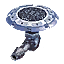
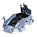
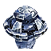
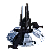

Tech 3 Support Armored Command Unit
----
<table align="right">
    <thead>
        <tr>
            <th align="left" colspan="2">
                <i>Unnamed</i> Tech 3 Support Armored Command Unit
            </th>
        </tr>
    </thead>
    <tbody>
        <tr>
            <td align="right"><strong>Source:</strong></td>
            <td><a href="Forged Alliance Forever">Forged Alliance Forever</a></td>
        </tr>
        <tr>
            <td align="right"><strong>Unit ID:</strong></td>
            <td><a href="https://github.com/FAForever/fa/D:/faf-development/fa/units/UAL0301/UAL0301_unit.bp"><code>ual0301</code></a></td>
        </tr>
        <tr>
            <td align="right"><strong>Faction:</strong></td>
            <td><a href="_categories.AEON">Aeon</a></td>
        </tr>
        <tr>
            <td align="right"><strong>Tech level:</strong></td>
            <td> 3</td>
        </tr>
        <tr><td align="center" colspan="2"></td></tr>
        <tr>
            <td align="right"><strong>Health:</strong></td>
            <td> 15000 (+17/s)</td>
        </tr>
        <tr>
            <td align="right"><strong>Armour:</strong></td>
            <td><code>Normal</code></td>
        </tr>
        <tr><td align="center" colspan="2"></td></tr>
        <tr>
            <td align="right"><strong>Energy cost:</strong></td>
            <td> 27100</td>
        </tr>
        <tr>
            <td align="right"><strong>Mass cost:</strong></td>
            <td> 1950</td>
        </tr>
        <tr>
            <td align="right"><strong>Build time:</strong></td>
            <td>14400 (<a href="#construction">Details</a>)</td>
        </tr>
        <tr>
            <td align="right"><strong>Build rate:</strong></td>
            <td> 56</td>
        </tr>
        <tr>
            <td align="right"><strong>Energy production:</strong></td>
            <td> 20/s</td>
        </tr>
        <tr>
            <td align="right"><strong>Mass production:</strong></td>
            <td> 1/s</td>
        </tr>
        <tr>
            <td align="right"><strong>Energy storage:</strong></td>
            <td> 500</td>
        </tr>
        <tr>
            <td align="right"><strong>Mass storage:</strong></td>
            <td> 275</td>
        </tr>
        <tr><td align="center" colspan="2"></td></tr>
        <tr>
            <td align="right"><strong>Vision radius:</strong></td>
            <td> 26 (0.52 km)</td>
        </tr>
        <tr>
            <td align="right"><strong>Water vision radius:</strong></td>
            <td> 24 (480 m)</td>
        </tr>
        <tr>
            <td align="right"><strong>Omni radius:</strong></td>
            <td> 16 (320 m)</td>
        </tr>
        <tr><td align="center" colspan="2"></td></tr>
        <tr>
            <td align="right"><strong>Motion type:</strong></td>
            <td><code>RULEUMT_Amphibious</code></td>
        </tr>
        <tr>
            <td align="right"><strong>Movement speed:</strong></td>
            <td> 2.2 (44 m/s)</td>
        </tr>
        <tr>
            <td align="right"><strong>Transport class:</strong></td>
            <td> Large</td>
        </tr>
        <tr><td align="center" colspan="2"></td></tr>
        <tr>
            <td align="right"><strong>Weapons:</strong></td>
            <td>3 (<a href="#weapons">Details</a>)</td>
        </tr>
        <tr>
            <td align="right"><strong>Wreckage:</strong></td>
            <td> 13500  1579.5</td>
        </tr>
    </tbody>
</table>

This unnamed unit is an Aeon seabed amphibious unit included in *Forged Alliance Forever*.
It is classified as a tech 3 support armored command unit unit.
The build description for this unit is:

<blockquote>A highly versatile combat and engineering unit useful on late-stage battlefields.</blockquote>

Contents

1. – <a href="#abilities">Abilities</a>
2. – <a href="#construction">Construction</a>
3. – <a href="#order-capabilities">Order capabilities</a>
4. – <a href="#engineering">Engineering</a>
5. – <a href="#enhancements">Enhancements</a>
6. – <a href="#weapons">Weapons</a>
7. – <a href="#veteran-levels">Veteran levels</a>

### Abilities
Hover over abilities to see effect descriptions.

* Amphibious
* Customizable
* Engineering Suite
* Not Capturable
* Omni Sensor
* Volatile

### Construction
Build times from the development branch of the game:
*  02:00 ‒  226/s ‒  16/s — Built by <a href="UAB0304">Tech 3 Quantum Gateway</a>

### Order capabilities
The following orders can be issued to the unit:
<table>
<td></td>
<td></td>
<td></td>
<td></td>
<td></td>
<td></td>
<tr>
<td></td>
<td></td>
<td></td>
<td></td>
<td></td>
</table>

### Engineering
The engineering capabilties of this unit consist of the ability to capture, reclaim, and repair.
It has the build category <code>BUILTBYTIER3ENGINEER AEON</code>. 

This build category allows it to build the following mod units:

<table>
    <tr>
        <td rowspan="2"></td>
        <td></td>
        <td></td>
        <td></td>
        <td></td>
        <td></td>
        <td></td>
        <td></td>
        <td></td>
    </tr>
    <tr>
        <td></td>
        <td></td>
        <td></td>
        <td></td>
        <td></td>
        <td></td>
        <td></td>
    </tr>
    <tr>
        <td rowspan="2"></td>
        <td></td>
        <td></td>
        <td></td>
        <td></td>
        <td></td>
        <td></td>
        <td></td>
        <td></td>
    </tr>
    <tr>
        <td></td>
        <td></td>
        <td></td>
        <td></td>
        <td></td>
        <td></td>
        <td></td>
        <td></td>
    </tr>
    <tr>
        <td rowspan="2"></td>
        <td></td>
        <td></td>
        <td></td>
        <td></td>
        <td></td>
        <td></td>
        <td></td>
        <td></td>
    </tr>
    <tr>
        <td></td>
        <td></td>
        <td></td>
        <td></td>
        <td></td>
        <td></td>
        <td></td>
    </tr>
    <tr>
        <td></td>
        <td></td>
        <td></td>
        <td></td>
        <td></td>
        <td></td>
    </tr>
</table>

### Enhancements

#### Back

Personal Shield Generator

    <table>
        <tr>
            <td align="right"><strong>Description:</strong></td>
            <td>Creates a protective Personal Shield around the SACU. Requires energy to run.

Shield Regen Rate = 40 HP/s
Shield Recharge Time = 190 seconds</td>
        </tr>
        <tr>
            <td align="right"><strong>Energy cost:</strong></td>
            <td> 64950</td>
        </tr>
        <tr>
            <td align="right"><strong>Mass cost:</strong></td>
            <td> 1200</td>
        </tr>
        <tr>
            <td align="right"><strong>Build time:</strong></td>
            <td> 90 seconds</td>
        </tr>
        <tr>
            <td align="right"><strong>Prerequisite:</strong></td>
            <td>None</td>
        </tr>
    </table>

Heavy Personal Shield Generator

    <table>
        <tr>
            <td align="right"><strong>Description:</strong></td>
            <td>Greatly improves Personal Shield HP and regeneration. Requires energy to run.

+20000 Personal Shield Health
+80 Personal Shield Regen
-10 Personal Shield Recharge Time</td>
        </tr>
        <tr>
            <td align="right"><strong>Energy cost:</strong></td>
            <td> 100000</td>
        </tr>
        <tr>
            <td align="right"><strong>Mass cost:</strong></td>
            <td> 1800</td>
        </tr>
        <tr>
            <td align="right"><strong>Build time:</strong></td>
            <td> 125 seconds</td>
        </tr>
        <tr>
            <td align="right"><strong>Prerequisite:</strong></td>
            <td>Personal Shield Generator</td>
        </tr>
    </table>

Nano-Repair System

    <table>
        <tr>
            <td align="right"><strong>Description:</strong></td>
            <td>Massively increases the rate at which the SACU repairs its armour.

+283 Regen</td>
        </tr>
        <tr>
            <td align="right"><strong>Energy cost:</strong></td>
            <td> 74000</td>
        </tr>
        <tr>
            <td align="right"><strong>Mass cost:</strong></td>
            <td> 1500</td>
        </tr>
        <tr>
            <td align="right"><strong>Build time:</strong></td>
            <td> 120 seconds</td>
        </tr>
        <tr>
            <td align="right"><strong>Prerequisite:</strong></td>
            <td>None</td>
        </tr>
    </table>

Personal Teleporter

    <table>
        <tr>
            <td align="right"><strong>Description:</strong></td>
            <td>Adds Teleportation capability. Requires considerable energy to activate.</td>
        </tr>
        <tr>
            <td align="right"><strong>Energy cost:</strong></td>
            <td> 1500000</td>
        </tr>
        <tr>
            <td align="right"><strong>Mass cost:</strong></td>
            <td> 15000</td>
        </tr>
        <tr>
            <td align="right"><strong>Build time:</strong></td>
            <td> 375 seconds</td>
        </tr>
        <tr>
            <td align="right"><strong>Prerequisite:</strong></td>
            <td>None</td>
        </tr>
    </table>

#### Left Arm

Rapid Fabricator

    <table>
        <tr>
            <td align="right"><strong>Description:</strong></td>
            <td>Massively increases SACU build speed.

+42 Buildpower</td>
        </tr>
        <tr>
            <td align="right"><strong>Energy cost:</strong></td>
            <td> 50500</td>
        </tr>
        <tr>
            <td align="right"><strong>Mass cost:</strong></td>
            <td> 800</td>
        </tr>
        <tr>
            <td align="right"><strong>Build time:</strong></td>
            <td> 75 seconds</td>
        </tr>
        <tr>
            <td align="right"><strong>Prerequisite:</strong></td>
            <td>None</td>
        </tr>
    </table>

Sacrificial System

    <table>
        <tr>
            <td align="right"><strong>Description:</strong></td>
            <td>Grants the Sacrifice ability, allowing the SACU to sacrifice itself to add its mass and energy to another construction project instantly at 90% efficiency.</td>
        </tr>
        <tr>
            <td align="right"><strong>Energy cost:</strong></td>
            <td> 2500</td>
        </tr>
        <tr>
            <td align="right"><strong>Mass cost:</strong></td>
            <td> 150</td>
        </tr>
        <tr>
            <td align="right"><strong>Build time:</strong></td>
            <td> 13 seconds</td>
        </tr>
        <tr>
            <td align="right"><strong>Prerequisite:</strong></td>
            <td>None</td>
        </tr>
    </table>

#### Right Arm

Resource Allocation System

    <table>
        <tr>
            <td align="right"><strong>Description:</strong></td>
            <td>Increases SACU's resource generation by 10 mass per second and 1000 energy per second.</td>
        </tr>
        <tr>
            <td align="right"><strong>Energy cost:</strong></td>
            <td> 90000</td>
        </tr>
        <tr>
            <td align="right"><strong>Mass cost:</strong></td>
            <td> 4500</td>
        </tr>
        <tr>
            <td align="right"><strong>Build time:</strong></td>
            <td> 150 seconds</td>
        </tr>
        <tr>
            <td align="right"><strong>Prerequisite:</strong></td>
            <td>None</td>
        </tr>
    </table>

Reacton Refractor

    <table>
        <tr>
            <td align="right"><strong>Description:</strong></td>
            <td>Increases main cannon range and grants Area-Of-Effect damage radius.

+10 Main cannon range
+3.5 Main cannon damage radius</td>
        </tr>
        <tr>
            <td align="right"><strong>Energy cost:</strong></td>
            <td> 46200</td>
        </tr>
        <tr>
            <td align="right"><strong>Mass cost:</strong></td>
            <td> 1250</td>
        </tr>
        <tr>
            <td align="right"><strong>Build time:</strong></td>
            <td> 108 seconds</td>
        </tr>
        <tr>
            <td align="right"><strong>Prerequisite:</strong></td>
            <td>None</td>
        </tr>
    </table>

### Weapons

Reacton Cannon

    <table>
        <tr>
            <td align="right"><strong>Target type:</strong></td>
            <td><code>RULEWTT_Unit</code> (Anti-Surface)</td>
        </tr>
        <tr>
            <td align="right"><strong>Projectile:</strong></td>
            <td><a href="Projectiles#adf-reacton-cannon-01"><code>ADFReactonCannon01</code></a></td>
        </tr>
        <tr>
            <td align="right"><strong>DPS estimate:</strong></td>
            <td>300 (<u>?</u>)</td>
        </tr>
        <tr>
            <td align="right"><strong>Damage:</strong></td>
            <td>300 (<u>?</u>)</td>
        </tr>
        <tr>
            <td align="right"><strong>Damage type:</strong></td>
            <td><code>Normal</code></td>
        </tr>
        <tr>
            <td align="right"><strong>Max range:</strong></td>
            <td> 30 (0.6 km)</td>
        </tr>
        <tr>
            <td align="right"><strong>Min range:</strong></td>
            <td> 1 (20 m)</td>
        </tr>
        <tr>
            <td align="right"><strong>Firing cycle:</strong></td>
            <td>Once every 1.0s (<u>?</u>)</td>
        </tr>
    </table>

Death Nuke

    <table>
        <tr>
            <td align="right"><strong>Projectile:</strong></td>
            <td><a href="Projectiles#scu-death-01"><code>SCUDeath01</code></a></td>
        </tr>
        <tr>
            <td align="right"><strong>Damage:</strong></td>
            <td>1000 (<u>?</u>)</td>
        </tr>
        <tr>
            <td align="right"><strong>Damage radius:</strong></td>
            <td> 10 (200 m)</td>
        </tr>
        <tr>
            <td align="right"><strong>Damage type:</strong></td>
            <td><code>DeathExplosion</code></td>
        </tr>
        <tr>
            <td align="right"><strong>Flags:</strong></td>
            <td>Damage friendly</td>
        </tr>
    </table>

Teleport in

    <table>
        <tr>
            <td align="right"><strong>Target type:</strong></td>
            <td>Untargeted</td>
        </tr>
        <tr>
            <td align="right"><strong>Damage:</strong></td>
            <td>100 (<u>?</u>)</td>
        </tr>
        <tr>
            <td align="right"><strong>Damage radius:</strong></td>
            <td> 4 (80 m)</td>
        </tr>
        <tr>
            <td align="right"><strong>Damage type:</strong></td>
            <td><code>Normal</code></td>
        </tr>
        <tr>
            <td align="right"><strong>Max range:</strong></td>
            <td> 1 (20 m)</td>
        </tr>
        <tr>
            <td align="right"><strong>Firing cycle:</strong></td>
            <td>Once every 1.0s (<u>?</u>)</td>
        </tr>
        <tr>
            <td align="right"><strong>Flags:</strong></td>
            <td>Damage friendly</td>
        </tr>
    </table>

### Veteran levels
Note: Each veteran level buff replaces the previous by default; values are shown here as written.

1. 25 kills gives:  +1500
2. 50 kills gives:  +3000
3. 75 kills gives:  +4500
4. 100 kills gives:  +6000
5. 125 kills gives:  +7500

<table align="center">
<td width="1215px">Categories : 
<a href="_categories.AEON">AEON</a> · 
<a href="_categories.TECH3">TECH3</a> · 
<a href="_categories.MOBILE">MOBILE</a> · 
<a href="_categories.LAND">LAND</a> · 
<a href="_categories.SUBCOMMANDER">SUBCOMMANDER</a> · 
<a href="_categories.ENGINEER">ENGINEER</a></td>
</table>
