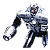

"Galactic Colossus": Experimental Assault Bot
----
<table align="right">
    <thead>
        <tr>
            <th align="left" colspan="2">
                Galactic Colossus Experimental Assault Bot
            </th>
        </tr>
    </thead>
    <tbody>
        <tr>
            <td align="right"><strong>Source:</strong></td>
            <td><a href="Forged Alliance Forever">Forged Alliance Forever</a></td>
        </tr>
        <tr>
            <td align="right"><strong>Unit ID:</strong></td>
            <td><a href="https://github.com/FAForever/fa/D:/faf-development/fa/units/UAL0401/UAL0401_unit.bp"><code>ual0401</code></a></td>
        </tr>
        <tr>
            <td align="right"><strong>Faction:</strong></td>
            <td><a href="_categories.AEON">Aeon</a></td>
        </tr>
        <tr>
            <td align="right"><strong>Tech level:</strong></td>
            <td> 4 (Experimental)</td>
        </tr>
        <tr><td align="center" colspan="2"></td></tr>
        <tr>
            <td align="right"><strong>Health:</strong></td>
            <td> 99999 (+10/s)</td>
        </tr>
        <tr>
            <td align="right"><strong>Armour:</strong></td>
            <td><code>Experimental</code></td>
        </tr>
        <tr><td align="center" colspan="2"></td></tr>
        <tr>
            <td align="right"><strong>Energy cost:</strong></td>
            <td> 343750</td>
        </tr>
        <tr>
            <td align="right"><strong>Mass cost:</strong></td>
            <td> 27500</td>
        </tr>
        <tr>
            <td align="right"><strong>Build time:</strong></td>
            <td>51500 (<a href="#construction">Details</a>)</td>
        </tr>
        <tr><td align="center" colspan="2"></td></tr>
        <tr>
            <td align="right"><strong>Vision radius:</strong></td>
            <td> 50 (1 km)</td>
        </tr>
        <tr>
            <td align="right"><strong>Water vision radius:</strong></td>
            <td> 48 (0.96 km)</td>
        </tr>
        <tr><td align="center" colspan="2"></td></tr>
        <tr>
            <td align="right"><strong>Motion type:</strong></td>
            <td><code>RULEUMT_Amphibious</code></td>
        </tr>
        <tr>
            <td align="right"><strong>Movement speed:</strong></td>
            <td> 2.4 (48 m/s)</td>
        </tr>
        <tr><td align="center" colspan="2"></td></tr>
        <tr>
            <td align="right"><strong>Weapons:</strong></td>
            <td>4 (<a href="#weapons">Details</a>)</td>
        </tr>
        <tr>
            <td align="right"><strong>Wreckage:</strong></td>
            <td> 89999.1  22275</td>
        </tr>
    </tbody>
</table>

"Galactic Colossus" is an Aeon seabed amphibious unit included in *Forged Alliance Forever*.
It is classified as a experimental assault bot unit.
The build description for this unit is:

<blockquote>Experimental Sacred Assault robot. Armed with a laser and magnetic grapple claws which crush enemy units.</blockquote>

Contents

1. – <a href="#abilities">Abilities</a>
2. – <a href="#construction">Construction</a>
3. – <a href="#order-capabilities">Order capabilities</a>
4. – <a href="#weapons">Weapons</a>
5. – <a href="#veteran-levels">Veteran levels</a>

### Abilities
Hover over abilities to see effect descriptions.

* Amphibious
* Massive
* Volatile

### Construction
Build times from the development branch of the game:
*  15:19 ‒  374/s ‒  30/s — Built by <a href="UAL0301">Tech 3 Support Armored Command Unit</a>
*  26:24 ‒  217/s ‒  17/s — Built by <a href="UAL0309">Tech 3 Engineer</a>
*  1:25:50 ‒  67/s ‒  5/s — Built by <a href="UAL0001">Armored Command Unit</a>

### Order capabilities
The following orders can be issued to the unit:
<table>
<td></td>
<td></td>
<td></td>
<td></td>
<td></td>
<td></td>
</table>

### Weapons

Phason Laser

    <table>
        <tr>
            <td align="right"><strong>Target type:</strong></td>
            <td><code>RULEWTT_Unit</code> (Anti-Surface)</td>
        </tr>
        <tr>
            <td align="right"><strong>DPS estimate:</strong></td>
            <td>2500 (<u>?</u>)</td>
        </tr>
        <tr>
            <td align="right"><strong>Damage:</strong></td>
            <td>250 (<u>?</u>)</td>
        </tr>
        <tr>
            <td align="right"><strong>Damage radius:</strong></td>
            <td> 0.5 (10 m)</td>
        </tr>
        <tr>
            <td align="right"><strong>Damage type:</strong></td>
            <td><code>Normal</code></td>
        </tr>
        <tr>
            <td align="right"><strong>Max range:</strong></td>
            <td> 40 (0.8 km)</td>
        </tr>
        <tr>
            <td align="right"><strong>Min range:</strong></td>
            <td> 2 (40 m)</td>
        </tr>
        <tr>
            <td align="right"><strong>Firing arc:</strong></td>
            <td>140°</td>
        </tr>
        <tr>
            <td align="right"><strong>Firing cycle:</strong></td>
            <td>Continuous beam Once every 0.1s (<u>?</u>)</td>
        </tr>
    </table>

Right Tractor Claw (×2)

    <table>
        <tr><td align="center" colspan="2">Note: Stats are per instance of the weapon.</td></tr>
        <tr>
            <td align="right"><strong>Target type:</strong></td>
            <td><code>RULEWTT_Unit</code> (Anti-Surface)</td>
        </tr>
        <tr>
            <td align="right"><strong>Damage:</strong></td>
            <td>0.01 (<u>?</u>)</td>
        </tr>
        <tr>
            <td align="right"><strong>Damage radius:</strong></td>
            <td>0</td>
        </tr>
        <tr>
            <td align="right"><strong>Damage type:</strong></td>
            <td><code>Normal</code></td>
        </tr>
        <tr>
            <td align="right"><strong>Max range:</strong></td>
            <td> 41 (0.82 km)</td>
        </tr>
        <tr>
            <td align="right"><strong>Min range:</strong></td>
            <td> 2 (40 m)</td>
        </tr>
        <tr>
            <td align="right"><strong>Firing arc:</strong></td>
            <td>82°</td>
        </tr>
        <tr>
            <td align="right"><strong>Firing cycle:</strong></td>
            <td>Continuous beam Once every 0.2s (<u>?</u>)</td>
        </tr>
    </table>

Collossus Death

    <table>
        <tr>
            <td align="right"><strong>Damage:</strong></td>
            <td>8000</td>
        </tr>
        <tr>
            <td align="right"><strong>Damage radius:</strong></td>
            <td> 7 (140 m)</td>
        </tr>
        <tr>
            <td align="right"><strong>Damage type:</strong></td>
            <td><code>DeathExplosion</code></td>
        </tr>
        <tr>
            <td align="right"><strong>Flags:</strong></td>
            <td>Damage friendly</td>
        </tr>
    </table>

### Veteran levels
Note: Each veteran level buff replaces the previous by default; values are shown here as written.

1. 90 kills gives:  +9999.9
2. 180 kills gives:  +19999.8
3. 270 kills gives:  +29999.7
4. 360 kills gives:  +39999.6
5. 450 kills gives:  +49999.5

<table align="center">
<td width="1215px">Categories : 
<a href="_categories.AEON">AEON</a> · 
<a href="_categories.EXPERIMENTAL">EXPERIMENTAL</a> · 
<a href="_categories.MOBILE">MOBILE</a> · 
<a href="_categories.DIRECTFIRE">DIRECTFIRE</a> · 
<a href="_categories.LAND">LAND</a></td>
</table>
