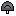

"Shard": Tech 1 Attack Boat
----
<table align="right">
    <thead>
        <tr>
            <th align="left" colspan="2">
                Shard Tech 1 Attack Boat
            </th>
        </tr>
    </thead>
    <tbody>
        <tr>
            <td align="right"><strong>Source:</strong></td>
            <td><a href="Forged Alliance Forever">Forged Alliance Forever</a></td>
        </tr>
        <tr>
            <td align="right"><strong>Unit ID:</strong></td>
            <td><a href="https://github.com/FAForever/fa/D:/faf-development/fa/units/UAS0102/UAS0102_unit.bp"><code>uas0102</code></a></td>
        </tr>
        <tr>
            <td align="right"><strong>Faction:</strong></td>
            <td><a href="_categories.AEON">Aeon</a></td>
        </tr>
        <tr>
            <td align="right"><strong>Tech level:</strong></td>
            <td> 1</td>
        </tr>
        <tr><td align="center" colspan="2"></td></tr>
        <tr>
            <td align="right"><strong>Health:</strong></td>
            <td> 800</td>
        </tr>
        <tr>
            <td align="right"><strong>Armour:</strong></td>
            <td><code>Normal</code></td>
        </tr>
        <tr><td align="center" colspan="2"></td></tr>
        <tr>
            <td align="right"><strong>Energy cost:</strong></td>
            <td> 1200</td>
        </tr>
        <tr>
            <td align="right"><strong>Mass cost:</strong></td>
            <td> 120</td>
        </tr>
        <tr>
            <td align="right"><strong>Build time:</strong></td>
            <td>600 (<a href="#construction">Details</a>)</td>
        </tr>
        <tr><td align="center" colspan="2"></td></tr>
        <tr>
            <td align="right"><strong>Vision radius:</strong></td>
            <td> 32 (0.64 km)</td>
        </tr>
        <tr>
            <td align="right"><strong>Water vision radius:</strong></td>
            <td> 10 (200 m)</td>
        </tr>
        <tr><td align="center" colspan="2"></td></tr>
        <tr>
            <td align="right"><strong>Motion type:</strong></td>
            <td><code>RULEUMT_Water</code></td>
        </tr>
        <tr>
            <td align="right"><strong>Movement speed:</strong></td>
            <td> 8 (160 m/s)</td>
        </tr>
        <tr><td align="center" colspan="2"></td></tr>
        <tr>
            <td align="right"><strong>Weapons:</strong></td>
            <td>1 (<a href="#weapons">Details</a>)</td>
        </tr>
    </tbody>
</table>

"Shard" is an Aeon naval unit included in *Forged Alliance Forever*.
It is classified as a tech 1 attack boat unit.
The build description for this unit is:

<blockquote>Anti-Air support ship.</blockquote>

Contents

1. – <a href="#abilities">Abilities</a>
2. – <a href="#construction">Construction</a>
3. – <a href="#order-capabilities">Order capabilities</a>
4. – <a href="#weapons">Weapons</a>
5. – <a href="#veteran-levels">Veteran levels</a>

### Abilities
Hover over abilities to see effect descriptions.

* Anti-Air

### Construction
Build times from the development branch of the game:
*  00:30 ‒  40/s ‒  4/s — Built by <a href="UAB0103">Tech 1 Naval Factory</a>
*  00:06 ‒  180/s ‒  18/s — Built by <a href="UAB0203">Tech 2 Naval Factory HQ</a>
*  00:06 ‒  180/s ‒  18/s — Built by <a href="ZAB9503">Tech 2 Naval Factory</a>
*  00:04 ‒  300/s ‒  30/s — Built by <a href="UAB0303">Tech 3 Naval Factory HQ</a>
*  00:04 ‒  300/s ‒  30/s — Built by <a href="ZAB9603">Tech 3 Naval Factory</a>
*  00:02 ‒  450/s ‒  45/s — Built by <a href="UAS0401">Experimental Battleship</a>

### Order capabilities
The following orders can be issued to the unit:
<table>
<td></td>
<td></td>
<td></td>
<td></td>
<td></td>
<td></td>
</table>

### Weapons

Sonic Pulse Battery

    <table>
        <tr>
            <td align="right"><strong>Target type:</strong></td>
            <td><code>RULEWTT_Unit</code> (Anti-Air)</td>
        </tr>
        <tr>
            <td align="right"><strong>Projectile:</strong></td>
            <td><a href="Projectiles#aaa-sonic-pulse-01"><code>AAASonicPulse01</code></a></td>
        </tr>
        <tr>
            <td align="right"><strong>DPS estimate:</strong></td>
            <td>38 (<u>?</u>)</td>
        </tr>
        <tr>
            <td align="right"><strong>Damage:</strong></td>
            <td>7.5 (<u>?</u>)</td>
        </tr>
        <tr>
            <td align="right"><strong>Damage instances:</strong></td>
            <td>3 projectiles</td>
        </tr>
        <tr>
            <td align="right"><strong>Damage type:</strong></td>
            <td><code>Normal</code></td>
        </tr>
        <tr>
            <td align="right"><strong>Max range:</strong></td>
            <td> 48 (0.96 km)</td>
        </tr>
        <tr>
            <td align="right"><strong>Firing cycle:</strong></td>
            <td>Once every 0.6s (<u>?</u>)</td>
        </tr>
    </table>

### Veteran levels
Note: Each veteran level buff replaces the previous by default; values are shown here as written.

1. 2 kills gives:  +80
2. 4 kills gives:  +160
3. 6 kills gives:  +240
4. 8 kills gives:  +320
5. 10 kills gives:  +400

<table align="center">
<td width="1215px">Categories : 
<a href="_categories.AEON">AEON</a> · 
<a href="_categories.TECH1">TECH1</a> · 
<a href="_categories.MOBILE">MOBILE</a> · 
<a href="_categories.ANTIAIR">ANTIAIR</a> · 
<a href="_categories.NAVAL">NAVAL</a></td>
</table>
