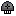

"Omen Class": Tech 3 Battleship
----
<table align="right">
    <thead>
        <tr>
            <th align="left" colspan="2">
                Omen Class Tech 3 Battleship
            </th>
        </tr>
    </thead>
    <tbody>
        <tr>
            <td align="right"><strong>Source:</strong></td>
            <td><a href="Forged Alliance Forever">Forged Alliance Forever</a></td>
        </tr>
        <tr>
            <td align="right"><strong>Unit ID:</strong></td>
            <td><a href="https://github.com/FAForever/fa/D:/faf-development/fa/units/UAS0302/UAS0302_unit.bp"><code>uas0302</code></a></td>
        </tr>
        <tr>
            <td align="right"><strong>Faction:</strong></td>
            <td><a href="_categories.AEON">Aeon</a></td>
        </tr>
        <tr>
            <td align="right"><strong>Tech level:</strong></td>
            <td> 3</td>
        </tr>
        <tr><td align="center" colspan="2"></td></tr>
        <tr>
            <td align="right"><strong>Health:</strong></td>
            <td> 48000</td>
        </tr>
        <tr>
            <td align="right"><strong>Armour:</strong></td>
            <td><code>Normal</code></td>
        </tr>
        <tr><td align="center" colspan="2"></td></tr>
        <tr>
            <td align="right"><strong>Energy cost:</strong></td>
            <td> 54000</td>
        </tr>
        <tr>
            <td align="right"><strong>Mass cost:</strong></td>
            <td> 9000</td>
        </tr>
        <tr>
            <td align="right"><strong>Build time:</strong></td>
            <td>28800 (<a href="#construction">Details</a>)</td>
        </tr>
        <tr><td align="center" colspan="2"></td></tr>
        <tr>
            <td align="right"><strong>Vision radius:</strong></td>
            <td> 50 (1 km)</td>
        </tr>
        <tr>
            <td align="right"><strong>Water vision radius:</strong></td>
            <td> 48 (0.96 km)</td>
        </tr>
        <tr>
            <td align="right"><strong>Radar radius:</strong></td>
            <td> 48 (0.96 km)</td>
        </tr>
        <tr>
            <td align="right"><strong>Sonar radius:</strong></td>
            <td> 20 (400 m)</td>
        </tr>
        <tr><td align="center" colspan="2"></td></tr>
        <tr>
            <td align="right"><strong>Motion type:</strong></td>
            <td><code>RULEUMT_Water</code></td>
        </tr>
        <tr>
            <td align="right"><strong>Movement speed:</strong></td>
            <td> 3.7 (74 m/s)</td>
        </tr>
        <tr><td align="center" colspan="2"></td></tr>
        <tr>
            <td align="right"><strong>Weapons:</strong></td>
            <td>4 (<a href="#weapons">Details</a>)</td>
        </tr>
    </tbody>
</table>

"Omen Class" is an Aeon naval unit included in *Forged Alliance Forever*.
It is classified as a tech 3 battleship unit.
The build description for this unit is:

<blockquote>Direct-fire surface bombardment ship. Armed with three powerful direct fire cannons. Equipped with a tactical missile defense system.</blockquote>

Contents

1. – <a href="#abilities">Abilities</a>
2. – <a href="#construction">Construction</a>
3. – <a href="#order-capabilities">Order capabilities</a>
4. – <a href="#weapons">Weapons</a>
5. – <a href="#veteran-levels">Veteran levels</a>

### Abilities
Hover over abilities to see effect descriptions.

* Radar
* Sonar
* Tactical Missile Defense

### Construction
Build times from the development branch of the game:
*  03:12 ‒  281/s ‒  47/s — Built by <a href="UAB0303">Tech 3 Naval Factory HQ</a>
*  03:12 ‒  281/s ‒  47/s — Built by <a href="ZAB9603">Tech 3 Naval Factory</a>

### Order capabilities
The following orders can be issued to the unit:
<table>
<td></td>
<td></td>
<td></td>
<td></td>
<td></td>
<td></td>
</table>

### Weapons

Oblivion Cannon (×3)

    <table>
        <tr><td align="center" colspan="2">Note: Stats are per instance of the weapon.</td></tr>
        <tr>
            <td align="right"><strong>Target type:</strong></td>
            <td><code>RULEWTT_Unit</code> (Anti-Surface)</td>
        </tr>
        <tr>
            <td align="right"><strong>Projectile:</strong></td>
            <td><a href="Projectiles#adf-oblivion-cannon-02"><code>ADFOblivionCannon02</code></a></td>
        </tr>
        <tr>
            <td align="right"><strong>DPS estimate:</strong></td>
            <td>169 (<u>?</u>)</td>
        </tr>
        <tr>
            <td align="right"><strong>Damage:</strong></td>
            <td>1000 (<u>?</u>)</td>
        </tr>
        <tr>
            <td align="right"><strong>Damage radius:</strong></td>
            <td> 2 (40 m)</td>
        </tr>
        <tr>
            <td align="right"><strong>Damage type:</strong></td>
            <td><code>Normal</code></td>
        </tr>
        <tr>
            <td align="right"><strong>Max range:</strong></td>
            <td> 110 (2.2 km)</td>
        </tr>
        <tr>
            <td align="right"><strong>Firing arc:</strong></td>
            <td>320°</td>
        </tr>
        <tr>
            <td align="right"><strong>Firing cycle:</strong></td>
            <td>Once every 5.9s (<u>?</u>)</td>
        </tr>
    </table>

Will O Wisp Anti Missile

    <table>
        <tr>
            <td align="right"><strong>Target type:</strong></td>
            <td><code>RULEWTT_Projectile</code> (Anti-tactical)</td>
        </tr>
        <tr>
            <td align="right"><strong>Projectile:</strong></td>
            <td><a href="Projectiles#aim-anti-missile-01"><code>AIMAntiMissile01</code></a></td>
        </tr>
        <tr>
            <td align="right"><strong>Damage:</strong></td>
            <td>30 (<u>?</u>)</td>
        </tr>
        <tr>
            <td align="right"><strong>Damage instances:</strong></td>
            <td>2 projectiles</td>
        </tr>
        <tr>
            <td align="right"><strong>Damage type:</strong></td>
            <td><code>Normal</code></td>
        </tr>
        <tr>
            <td align="right"><strong>Max range:</strong></td>
            <td> 20 (400 m)</td>
        </tr>
        <tr>
            <td align="right"><strong>Firing cycle:</strong></td>
            <td>Once every 2.0s (<u>?</u>)</td>
        </tr>
    </table>

### Veteran levels
Note: Each veteran level buff replaces the previous by default; values are shown here as written.

1. 32 kills gives:  +4800
2. 64 kills gives:  +9600
3. 96 kills gives:  +14400
4. 128 kills gives:  +19200
5. 160 kills gives:  +24000

<table align="center">
<td width="1215px">Categories : 
<a href="_categories.AEON">AEON</a> · 
<a href="_categories.TECH3">TECH3</a> · 
<a href="_categories.MOBILE">MOBILE</a> · 
<a href="_categories.DIRECTFIRE">DIRECTFIRE</a> · 
<a href="_categories.NAVAL">NAVAL</a></td>
</table>
