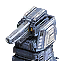

"C-D1 "Rover"": Tech 1 Engineering Drone
----
<table align="right">
    <thead>
        <tr>
            <th align="left" colspan="2">
                C-D1 "Rover" Tech 1 Engineering Drone
            </th>
        </tr>
    </thead>
    <tbody>
        <tr>
            <td align="right"><strong>Source:</strong></td>
            <td><a href="Forged Alliance Forever">Forged Alliance Forever</a></td>
        </tr>
        <tr>
            <td align="right"><strong>Unit ID:</strong></td>
            <td><a href="https://github.com/FAForever/fa/D:/faf-development/fa/units/UEA0001/UEA0001_unit.bp"><code>uea0001</code></a></td>
        </tr>
        <tr>
            <td align="right"><strong>Faction:</strong></td>
            <td><a href="_categories.UEF">UEF</a></td>
        </tr>
        <tr>
            <td align="right"><strong>Tech level:</strong></td>
            <td> 1</td>
        </tr>
        <tr><td align="center" colspan="2"></td></tr>
        <tr>
            <td align="right"><strong>Health:</strong></td>
            <td> 50</td>
        </tr>
        <tr>
            <td align="right"><strong>Armour:</strong></td>
            <td><code>Light</code></td>
        </tr>
        <tr><td align="center" colspan="2"></td></tr>
        <tr>
            <td align="right"><strong>Population cost:</strong></td>
            <td> 0</td>
        </tr>
        <tr>
            <td align="right"><strong>Energy cost:</strong></td>
            <td> 1600</td>
        </tr>
        <tr>
            <td align="right"><strong>Mass cost:</strong></td>
            <td> 160</td>
        </tr>
        <tr>
            <td align="right"><strong>Build time:</strong></td>
            <td>400</td>
        </tr>
        <tr>
            <td align="right"><strong>Build rate:</strong></td>
            <td> 5</td>
        </tr>
        <tr><td align="center" colspan="2"></td></tr>
        <tr>
            <td align="right"><strong>Vision radius:</strong></td>
            <td> 12 (240 m)</td>
        </tr>
        <tr>
            <td align="right"><strong>Water vision radius:</strong></td>
            <td> 10 (200 m)</td>
        </tr>
        <tr><td align="center" colspan="2"></td></tr>
        <tr>
            <td align="right"><strong>Motion type:</strong></td>
            <td><code>RULEUMT_Air</code></td>
        </tr>
        <tr>
            <td align="right"><strong>Movement speed:</strong></td>
            <td> 4 (80 m/s)</td>
        </tr>
        <tr>
            <td align="right"><strong>Elevation:</strong></td>
            <td>3</td>
        </tr>
        <tr>
            <td align="right"><strong>Transport class:</strong></td>
            <td> Drone</td>
        </tr>
        <tr><td align="center" colspan="2"></td></tr>
        <tr>
            <td align="right"><strong>Weapons:</strong></td>
            <td>1 (<a href="#weapons">Details</a>)</td>
        </tr>
        <tr>
            <td align="right"><strong>Wreckage:</strong></td>
            <td> 45  129.6</td>
        </tr>
    </tbody>
</table>

"C-D1 "Rover"" is a UEF aircraft unit included in *Forged Alliance Forever*.
It is classified as a tech 1 engineering drone unit.
This unit has no categories to define common builders, however the build description for it is:

<blockquote>Flying Drone, which can assist, repair, and reclaim any unit. Can be ordered to initiate the construction of T1 structures. Vulnerable to any air fighters or anti-air units.</blockquote>

Contents

1. – <a href="#abilities">Abilities</a>
2. – <a href="#order-capabilities">Order capabilities</a>
3. – <a href="#engineering">Engineering</a>
4. – <a href="#weapons">Weapons</a>

### Abilities
Hover over abilities to see effect descriptions.

* Engineering Suite

### Order capabilities
The following orders can be issued to the unit:
<table>
<td></td>
<td></td>
<td></td>
<td></td>
<tr>
<td></td>
<td></td>
<td></td>
<td></td>
<td></td>
<td></td>
</table>

### Engineering
The engineering capabilties of this unit consist of the ability to capture, reclaim, and repair.
It has the build category <code>BUILTBYCOMMANDER UEF</code>. 

This build category allows it to build the following mod units:

<table>
    <tr>
        <td rowspan="2"></td>
        <td></td>
        <td></td>
        <td></td>
        <td></td>
        <td></td>
    </tr>
    <tr>
        <td></td>
        <td></td>
        <td></td>
        <td></td>
    </tr>
</table>

### Weapons

Air Crash

    <table>
        <tr>
            <td align="right"><strong>Damage:</strong></td>
            <td>10</td>
        </tr>
        <tr>
            <td align="right"><strong>Damage radius:</strong></td>
            <td> 1 (20 m)</td>
        </tr>
        <tr>
            <td align="right"><strong>Damage type:</strong></td>
            <td><code>Normal</code></td>
        </tr>
        <tr>
            <td align="right"><strong>Flags:</strong></td>
            <td>Damage friendly</td>
        </tr>
    </table>

<table align="center">
<td width="1215px">Categories : 
<a href="_categories.UEF">UEF</a> · 
<a href="_categories.TECH1">TECH1</a> · 
<a href="_categories.MOBILE">MOBILE</a> · 
<a href="_categories.AIR">AIR</a> · 
<a href="_categories.ENGINEER">ENGINEER</a></td>
</table>
