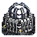

"EG 900 Fusion Reactor": Tech 3 Power Generator
----
<table align="right">
    <thead>
        <tr>
            <th align="left" colspan="2">
                EG 900 Fusion Reactor Tech 3 Power Generator
            </th>
        </tr>
    </thead>
    <tbody>
        <tr>
            <td align="right"><strong>Source:</strong></td>
            <td><a href="Forged Alliance Forever">Forged Alliance Forever</a></td>
        </tr>
        <tr>
            <td align="right"><strong>Unit ID:</strong></td>
            <td><a href="https://github.com/FAForever/fa/D:/faf-development/fa/units/UEB1301/UEB1301_unit.bp"><code>ueb1301</code></a></td>
        </tr>
        <tr>
            <td align="right"><strong>Faction:</strong></td>
            <td><a href="_categories.UEF">UEF</a></td>
        </tr>
        <tr>
            <td align="right"><strong>Tech level:</strong></td>
            <td> 3</td>
        </tr>
        <tr><td align="center" colspan="2"></td></tr>
        <tr>
            <td align="right"><strong>Health:</strong></td>
            <td> 9000</td>
        </tr>
        <tr>
            <td align="right"><strong>Armour:</strong></td>
            <td><code>Structure</code></td>
        </tr>
        <tr><td align="center" colspan="2"></td></tr>
        <tr>
            <td align="right"><strong>Energy cost:</strong></td>
            <td> 57600</td>
        </tr>
        <tr>
            <td align="right"><strong>Mass cost:</strong></td>
            <td> 3240</td>
        </tr>
        <tr>
            <td align="right"><strong>Build time:</strong></td>
            <td>6824 (<a href="#construction">Details</a>)</td>
        </tr>
        <tr>
            <td align="right"><strong>Energy production:</strong></td>
            <td> 2500/s</td>
        </tr>
        <tr><td align="center" colspan="2"></td></tr>
        <tr>
            <td align="right"><strong>Vision radius:</strong></td>
            <td> 20 (400 m)</td>
        </tr>
        <tr>
            <td align="right"><strong>Water vision radius:</strong></td>
            <td> 10 (200 m)</td>
        </tr>
        <tr><td align="center" colspan="2"></td></tr>
        <tr>
            <td align="right"><strong>Motion type:</strong></td>
            <td><code>RULEUMT_None</code></td>
        </tr>
        <tr>
            <td align="right"><strong>Buildable layers:</strong></td>
            <td>Land</td>
        </tr>
        <tr><td align="center" colspan="2"></td></tr>
        <tr>
            <td align="right"><strong>Weapons:</strong></td>
            <td>1 (<a href="#weapons">Details</a>)</td>
        </tr>
        <tr>
            <td align="right"><strong>Wreckage:</strong></td>
            <td> 8100  2624.4</td>
        </tr>
    </tbody>
</table>

"EG 900 Fusion Reactor" is a UEF structure unit included in *Forged Alliance Forever*.
It is classified as a tech 3 power generator unit.
The build description for this unit is:

<blockquote>Generates 2500 energy per second. Construct next to other energy consuming structures for adjacency bonus.</blockquote>

Contents

1. – <a href="#abilities">Abilities</a>
2. – <a href="#adjacency">Adjacency</a>
3. – <a href="#construction">Construction</a>
4. – <a href="#weapons">Weapons</a>

### Abilities
Hover over abilities to see effect descriptions.

* Volatile

### Adjacency
This unit counts as `SIZE16` for adjacency effects from other structures. This theoretically means that it can be surrounded by exactly 16 structures the size of a standard tech 1 power generator, which is accurate; meaning it can get the maximum intended buff effects. 

The adjacency bonus `T3PowerGeneratorAdjacencyBuffs` is given by this unit. This affects energy build costs, energy maintenance costs, weapon energy drain, and weapon rate of fire.

<code>STRUCTURE SIZE4</code>

    <table>
        <tr>
            <td align="right"><strong>Energy build costs:</strong></td>
            <td>-3⁄16</td>
        </tr>
        <tr>
            <td align="right"><strong>Energy maintenance costs:</strong></td>
            <td>-3⁄16</td>
        </tr>
        <tr>
            <td align="right"><strong>Weapon energy drain:</strong></td>
            <td>-3⁄40</td>
        </tr>
    </table>

<code>STRUCTURE SIZE8</code>

    <table>
        <tr>
            <td align="right"><strong>Energy build costs:</strong></td>
            <td>-3⁄16</td>
        </tr>
        <tr>
            <td align="right"><strong>Energy maintenance costs:</strong></td>
            <td>-3⁄16</td>
        </tr>
        <tr>
            <td align="right"><strong>Weapon energy drain:</strong></td>
            <td>-3⁄40</td>
        </tr>
        <tr>
            <td align="right"><strong>Weapon rate of fire:</strong></td>
            <td>-1⁄10</td>
        </tr>
    </table>

<code>STRUCTURE SIZE12</code>

    <table>
        <tr>
            <td align="right"><strong>Energy build costs:</strong></td>
            <td>-3⁄16</td>
        </tr>
        <tr>
            <td align="right"><strong>Energy maintenance costs:</strong></td>
            <td>-3⁄16</td>
        </tr>
        <tr>
            <td align="right"><strong>Weapon energy drain:</strong></td>
            <td>-3⁄40</td>
        </tr>
        <tr>
            <td align="right"><strong>Weapon rate of fire:</strong></td>
            <td>-1⁄10</td>
        </tr>
    </table>

<code>STRUCTURE SIZE16</code>

    <table>
        <tr>
            <td align="right"><strong>Energy build costs:</strong></td>
            <td>-1⁄6.4</td>
        </tr>
        <tr>
            <td align="right"><strong>Energy maintenance costs:</strong></td>
            <td>-3⁄16</td>
        </tr>
        <tr>
            <td align="right"><strong>Weapon energy drain:</strong></td>
            <td>-3⁄40</td>
        </tr>
        <tr>
            <td align="right"><strong>Weapon rate of fire:</strong></td>
            <td>-1⁄10</td>
        </tr>
    </table>

<code>STRUCTURE SIZE20</code>

    <table>
        <tr>
            <td align="right"><strong>Energy build costs:</strong></td>
            <td>-1⁄20</td>
        </tr>
        <tr>
            <td align="right"><strong>Energy maintenance costs:</strong></td>
            <td>-3⁄16</td>
        </tr>
        <tr>
            <td align="right"><strong>Weapon energy drain:</strong></td>
            <td>-3⁄40</td>
        </tr>
        <tr>
            <td align="right"><strong>Weapon rate of fire:</strong></td>
            <td>-1⁄22.22</td>
        </tr>
    </table>

<code>STRUCTURE SIZE4 ARTILLERY</code>

    <table>
        <tr>
            <td align="right"><strong>Weapon rate of fire:</strong></td>
            <td>-1⁄10</td>
        </tr>
    </table>

### Construction
Build times from the development branch of the game:
*  02:01 ‒  473/s ‒  27/s — Built by <a href="UEL0301">Tech 3 Support Armored Command Unit</a>
*  03:29 ‒  274/s ‒  15/s — Built by <a href="UEL0309">Tech 3 Engineer</a>
*  03:14 ‒  295/s ‒  17/s — Built by <a href="UEA0003">Tech 3 Engineering Drone</a>
*  11:22 ‒  84/s ‒  5/s — Built by <a href="UEL0001">Armored Command Unit</a>

### Weapons

Death Weapon

    <table>
        <tr>
            <td align="right"><strong>Damage:</strong></td>
            <td>5500</td>
        </tr>
        <tr>
            <td align="right"><strong>Damage radius:</strong></td>
            <td> 10 (200 m)</td>
        </tr>
        <tr>
            <td align="right"><strong>Damage type:</strong></td>
            <td><code>DeathExplosion</code></td>
        </tr>
        <tr>
            <td align="right"><strong>Flags:</strong></td>
            <td>Damage friendly</td>
        </tr>
    </table>

<table align="center">
<td width="1215px">Categories : 
<a href="_categories.UEF">UEF</a> · 
<a href="_categories.TECH3">TECH3</a> · 
<a href="_categories.ECONOMIC">ECONOMIC</a> · 
<a href="_categories.STRUCTURE">STRUCTURE</a></td>
</table>
