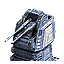

"DA1 Railgun": Tech 1 Anti-Air Turret
----
<table align="right">
    <thead>
        <tr>
            <th align="left" colspan="2">
                DA1 Railgun Tech 1 Anti-Air Turret
            </th>
        </tr>
    </thead>
    <tbody>
        <tr>
            <td align="right"><strong>Source:</strong></td>
            <td><a href="Forged Alliance Forever">Forged Alliance Forever</a></td>
        </tr>
        <tr>
            <td align="right"><strong>Unit ID:</strong></td>
            <td><a href="https://github.com/FAForever/fa/D:/faf-development/fa/units/UEB2104/UEB2104_unit.bp"><code>ueb2104</code></a></td>
        </tr>
        <tr>
            <td align="right"><strong>Faction:</strong></td>
            <td><a href="_categories.UEF">UEF</a></td>
        </tr>
        <tr>
            <td align="right"><strong>Tech level:</strong></td>
            <td> 1</td>
        </tr>
        <tr><td align="center" colspan="2"></td></tr>
        <tr>
            <td align="right"><strong>Health:</strong></td>
            <td> 800</td>
        </tr>
        <tr>
            <td align="right"><strong>Armour:</strong></td>
            <td><code>Structure</code></td>
        </tr>
        <tr><td align="center" colspan="2"></td></tr>
        <tr>
            <td align="right"><strong>Energy cost:</strong></td>
            <td> 1500</td>
        </tr>
        <tr>
            <td align="right"><strong>Mass cost:</strong></td>
            <td> 150</td>
        </tr>
        <tr>
            <td align="right"><strong>Build time:</strong></td>
            <td>188 (<a href="#construction">Details</a>)</td>
        </tr>
        <tr><td align="center" colspan="2"></td></tr>
        <tr>
            <td align="right"><strong>Vision radius:</strong></td>
            <td> 24 (480 m)</td>
        </tr>
        <tr>
            <td align="right"><strong>Water vision radius:</strong></td>
            <td> 10 (200 m)</td>
        </tr>
        <tr><td align="center" colspan="2"></td></tr>
        <tr>
            <td align="right"><strong>Motion type:</strong></td>
            <td><code>RULEUMT_None</code></td>
        </tr>
        <tr>
            <td align="right"><strong>Buildable layers:</strong></td>
            <td>Land water</td>
        </tr>
        <tr><td align="center" colspan="2"></td></tr>
        <tr>
            <td align="right"><strong>Weapons:</strong></td>
            <td>1 (<a href="#weapons">Details</a>)</td>
        </tr>
        <tr>
            <td align="right"><strong>Wreckage:</strong></td>
            <td> 720  121.5</td>
        </tr>
    </tbody>
</table>

"DA1 Railgun" is a UEF structure unit included in *Forged Alliance Forever*.
It is classified as a tech 1 anti-air turret unit.
The build description for this unit is:

<blockquote>Basic anti-air turret.</blockquote>

Contents

1. – <a href="#abilities">Abilities</a>
2. – <a href="#adjacency">Adjacency</a>
3. – <a href="#construction">Construction</a>
4. – <a href="#order-capabilities">Order capabilities</a>
5. – <a href="#weapons">Weapons</a>
6. – <a href="#veteran-levels">Veteran levels</a>

### Abilities
Hover over abilities to see effect descriptions.

* Anti-Air
* Aquatic

### Adjacency
This unit counts as `SIZE4` for adjacency effects from other structures. This theoretically means that it can be surrounded by exactly 4 structures the size of a standard tech 1 power generator, which is accurate; meaning it can get the maximum intended buff effects. 

### Construction
Build times from the development branch of the game:
*  00:37 ‒  40/s ‒  4/s — Built by <a href="UEL0105">Tech 1 Engineer</a>
*  00:37 ‒  40/s ‒  4/s — Built by <a href="UEA0001">Tech 1 Engineering Drone</a>
*  00:14 ‒  104/s ‒  10/s — Built by <a href="UEL0208">Tech 2 Engineer</a>
*  00:10 ‒  140/s ‒  14/s — Built by <a href="XEL0209">Tech 2 Field Engineer</a>
*  00:03 ‒  447/s ‒  45/s — Built by <a href="UEL0301">Tech 3 Support Armored Command Unit</a>
*  00:05 ‒  259/s ‒  26/s — Built by <a href="UEL0309">Tech 3 Engineer</a>
*  00:05 ‒  279/s ‒  28/s — Built by <a href="UEA0003">Tech 3 Engineering Drone</a>
*  00:18 ‒  80/s ‒  8/s — Built by <a href="UEL0001">Armored Command Unit</a>

### Order capabilities
The following orders can be issued to the unit:
<table>
<td></td>
<td></td>
<td></td>
</table>

### Weapons

Linked Railgun

    <table>
        <tr>
            <td align="right"><strong>Target type:</strong></td>
            <td><code>RULEWTT_Unit</code> (Anti-Air)</td>
        </tr>
        <tr>
            <td align="right"><strong>Projectile:</strong></td>
            <td><a href="Projectiles#taa-railgun-01"><code>TAARailgun01</code></a></td>
        </tr>
        <tr>
            <td align="right"><strong>DPS estimate:</strong></td>
            <td>66 (<u>?</u>)</td>
        </tr>
        <tr>
            <td align="right"><strong>Damage:</strong></td>
            <td>23 (<u>?</u>)</td>
        </tr>
        <tr>
            <td align="right"><strong>Damage instances:</strong></td>
            <td>2 projectiles</td>
        </tr>
        <tr>
            <td align="right"><strong>Damage type:</strong></td>
            <td><code>Normal</code></td>
        </tr>
        <tr>
            <td align="right"><strong>Max range:</strong></td>
            <td> 44 (0.88 km)</td>
        </tr>
        <tr>
            <td align="right"><strong>Firing cycle:</strong></td>
            <td>Once every 0.7s (<u>?</u>)</td>
        </tr>
    </table>

### Veteran levels
Note: Each veteran level buff replaces the previous by default; values are shown here as written.

1. 4 kills gives:  +80
2. 8 kills gives:  +160
3. 12 kills gives:  +240
4. 16 kills gives:  +320
5. 20 kills gives:  +400

<table align="center">
<td width="1215px">Categories : 
<a href="_categories.UEF">UEF</a> · 
<a href="_categories.TECH1">TECH1</a> · 
<a href="_categories.ANTIAIR">ANTIAIR</a> · 
<a href="_categories.STRUCTURE">STRUCTURE</a></td>
</table>
