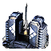

"Aloha": Tech 2 Tactical Missile Launcher
----
<table align="right">
    <thead>
        <tr>
            <th align="left" colspan="2">
                Aloha Tech 2 Tactical Missile Launcher
            </th>
        </tr>
    </thead>
    <tbody>
        <tr>
            <td align="right"><strong>Source:</strong></td>
            <td><a href="Forged Alliance Forever">Forged Alliance Forever</a></td>
        </tr>
        <tr>
            <td align="right"><strong>Unit ID:</strong></td>
            <td><a href="https://github.com/FAForever/fa/D:/faf-development/fa/units/UEB2108/UEB2108_unit.bp"><code>ueb2108</code></a></td>
        </tr>
        <tr>
            <td align="right"><strong>Faction:</strong></td>
            <td><a href="_categories.UEF">UEF</a></td>
        </tr>
        <tr>
            <td align="right"><strong>Tech level:</strong></td>
            <td> 2</td>
        </tr>
        <tr><td align="center" colspan="2"></td></tr>
        <tr>
            <td align="right"><strong>Health:</strong></td>
            <td> 900</td>
        </tr>
        <tr>
            <td align="right"><strong>Armour:</strong></td>
            <td><code>Structure</code></td>
        </tr>
        <tr><td align="center" colspan="2"></td></tr>
        <tr>
            <td align="right"><strong>Energy cost:</strong></td>
            <td> 4000</td>
        </tr>
        <tr>
            <td align="right"><strong>Mass cost:</strong></td>
            <td> 800</td>
        </tr>
        <tr>
            <td align="right"><strong>Build time:</strong></td>
            <td>800 (<a href="#construction">Details</a>)</td>
        </tr>
        <tr>
            <td align="right"><strong>Build rate:</strong></td>
            <td> 80</td>
        </tr>
        <tr><td align="center" colspan="2"></td></tr>
        <tr>
            <td align="right"><strong>Vision radius:</strong></td>
            <td> 24 (480 m)</td>
        </tr>
        <tr>
            <td align="right"><strong>Water vision radius:</strong></td>
            <td> 10 (200 m)</td>
        </tr>
        <tr><td align="center" colspan="2"></td></tr>
        <tr>
            <td align="right"><strong>Motion type:</strong></td>
            <td><code>RULEUMT_None</code></td>
        </tr>
        <tr>
            <td align="right"><strong>Buildable layers:</strong></td>
            <td>Land</td>
        </tr>
        <tr><td align="center" colspan="2"></td></tr>
        <tr>
            <td align="right"><strong>Weapons:</strong></td>
            <td>2 (<a href="#weapons">Details</a>)</td>
        </tr>
        <tr>
            <td align="right"><strong>Wreckage:</strong></td>
            <td> 810  648</td>
        </tr>
    </tbody>
</table>

"Aloha" is a UEF structure unit included in *Forged Alliance Forever*.
It is classified as a tech 2 tactical missile launcher unit.
The build description for this unit is:

<blockquote>Tactical Missile Launcher. Automatically constructs missiles for 8.3 mass per second and 120 energy per second. Toggleable missile production.</blockquote>

Contents

1. – <a href="#abilities">Abilities</a>
2. – <a href="#adjacency">Adjacency</a>
3. – <a href="#construction">Construction</a>
4. – <a href="#order-capabilities">Order capabilities</a>
5. – <a href="#weapons">Weapons</a>
6. – <a href="#veteran-levels">Veteran levels</a>

### Abilities
Hover over abilities to see effect descriptions.

* Manual Launch
* Volatile

### Adjacency
This unit counts as `SIZE4` for adjacency effects from other structures. This theoretically means that it can be surrounded by exactly 4 structures the size of a standard tech 1 power generator, which is accurate; meaning it can get the maximum intended buff effects. 

### Construction
Build times from the development branch of the game:
*  01:01 ‒  65/s ‒  13/s — Built by <a href="UEL0208">Tech 2 Engineer</a>
*  00:45 ‒  88/s ‒  18/s — Built by <a href="XEL0209">Tech 2 Field Engineer</a>
*  00:14 ‒  280/s ‒  56/s — Built by <a href="UEL0301">Tech 3 Support Armored Command Unit</a>
*  00:24 ‒  163/s ‒  33/s — Built by <a href="UEL0309">Tech 3 Engineer</a>
*  00:22 ‒  175/s ‒  35/s — Built by <a href="UEA0003">Tech 3 Engineering Drone</a>
*  01:20 ‒  50/s ‒  10/s — Built by <a href="UEL0001">Armored Command Unit</a>

### Order capabilities
The following orders can be issued to the unit:
<table>
<td></td>
<td></td>
<tr>
<td></td>
<td></td>
<td></td>
</table>

### Weapons

Long Range Cruise Missile

    <table>
        <tr>
            <td align="right"><strong>Target type:</strong></td>
            <td><code>RULEWTT_Unit</code> (Anti-Surface)</td>
        </tr>
        <tr>
            <td align="right"><strong>Projectile:</strong></td>
            <td><a href="Projectiles#tif-missile-cruise-01"><code>TIFMissileCruise01</code></a></td>
        </tr>
        <tr>
            <td align="right"><strong>DPS estimate:</strong></td>
            <td>20000 (<u>?</u>)</td>
        </tr>
        <tr>
            <td align="right"><strong>Damage:</strong></td>
            <td>6000 (<u>?</u>)</td>
        </tr>
        <tr>
            <td align="right"><strong>Damage radius:</strong></td>
            <td> 2 (40 m)</td>
        </tr>
        <tr>
            <td align="right"><strong>Damage type:</strong></td>
            <td><code>Normal</code></td>
        </tr>
        <tr>
            <td align="right"><strong>Max range:</strong></td>
            <td> 256 (5.12 km)</td>
        </tr>
        <tr>
            <td align="right"><strong>Min range:</strong></td>
            <td> 25 (0.5 km)</td>
        </tr>
        <tr>
            <td align="right"><strong>Firing cycle:</strong></td>
            <td>Once every 0.3s (<u>?</u>)</td>
        </tr>
        <tr>
            <td align="right"><strong>Projectile storage:</strong></td>
            <td>0/6</td>
        </tr>
    </table>

Death Weapon

    <table>
        <tr>
            <td align="right"><strong>Damage:</strong></td>
            <td>750</td>
        </tr>
        <tr>
            <td align="right"><strong>Damage radius:</strong></td>
            <td> 2 (40 m)</td>
        </tr>
        <tr>
            <td align="right"><strong>Damage type:</strong></td>
            <td><code>DeathExplosion</code></td>
        </tr>
        <tr>
            <td align="right"><strong>Flags:</strong></td>
            <td>Damage friendly</td>
        </tr>
    </table>

### Veteran levels
Note: Each veteran level buff replaces the previous by default; values are shown here as written.

1. 9 kills gives:  +90
2. 18 kills gives:  +180
3. 27 kills gives:  +270
4. 36 kills gives:  +360
5. 45 kills gives:  +450

<table align="center">
<td width="1215px">Categories : 
<a href="_categories.UEF">UEF</a> · 
<a href="_categories.TECH2">TECH2</a> · 
<a href="_categories.SILO">SILO</a> · 
<a href="_categories.STRUCTURE">STRUCTURE</a></td>
</table>
