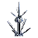

"SA3 - Omni": Tech 3 Omni Sensor Array
----
<table align="right">
    <thead>
        <tr>
            <th align="left" colspan="2">
                SA3 - Omni Tech 3 Omni Sensor Array
            </th>
        </tr>
    </thead>
    <tbody>
        <tr>
            <td align="right"><strong>Source:</strong></td>
            <td><a href="Forged Alliance Forever">Forged Alliance Forever</a></td>
        </tr>
        <tr>
            <td align="right"><strong>Unit ID:</strong></td>
            <td><a href="https://github.com/FAForever/fa/D:/faf-development/fa/units/UEB3104/UEB3104_unit.bp"><code>ueb3104</code></a></td>
        </tr>
        <tr>
            <td align="right"><strong>Faction:</strong></td>
            <td><a href="_categories.UEF">UEF</a></td>
        </tr>
        <tr>
            <td align="right"><strong>Tech level:</strong></td>
            <td> 3</td>
        </tr>
        <tr><td align="center" colspan="2"></td></tr>
        <tr>
            <td align="right"><strong>Health:</strong></td>
            <td> 100</td>
        </tr>
        <tr>
            <td align="right"><strong>Armour:</strong></td>
            <td><code>Structure</code></td>
        </tr>
        <tr><td align="center" colspan="2"></td></tr>
        <tr>
            <td align="right"><strong>Energy cost:</strong></td>
            <td> 30000</td>
        </tr>
        <tr>
            <td align="right"><strong>Mass cost:</strong></td>
            <td> 2400</td>
        </tr>
        <tr>
            <td align="right"><strong>Build time:</strong></td>
            <td>2400 (<a href="#construction">Details</a>)</td>
        </tr>
        <tr>
            <td align="right"><strong>Maintenance cost:</strong></td>
            <td> 2000/s</td>
        </tr>
        <tr><td align="center" colspan="2"></td></tr>
        <tr>
            <td align="right"><strong>Vision radius:</strong></td>
            <td> 30 (0.6 km)</td>
        </tr>
        <tr>
            <td align="right"><strong>Water vision radius:</strong></td>
            <td> 10 (200 m)</td>
        </tr>
        <tr>
            <td align="right"><strong>Radar radius:</strong></td>
            <td> 600 (12 km)</td>
        </tr>
        <tr>
            <td align="right"><strong>Omni radius:</strong></td>
            <td> 200 (4 km)</td>
        </tr>
        <tr><td align="center" colspan="2"></td></tr>
        <tr>
            <td align="right"><strong>Motion type:</strong></td>
            <td><code>RULEUMT_None</code></td>
        </tr>
        <tr>
            <td align="right"><strong>Buildable layers:</strong></td>
            <td>Land</td>
        </tr>
        <tr><td align="center" colspan="2"></td></tr>
        <tr>
            <td align="right"><strong>Wreckage:</strong></td>
            <td> 90  1944</td>
        </tr>
    </tbody>
</table>

"SA3 - Omni" is a UEF structure unit included in *Forged Alliance Forever*.
It is classified as a tech 3 omni sensor array unit.
The build description for this unit is:

<blockquote>Long range Radar system with shorter range omni Sensor. Radar cannot detect submerged or stealth units, and confused by radar jamming. Omni counters stealth, cloaking or jamming and acts as sonar.</blockquote>

Contents

1. – <a href="#abilities">Abilities</a>
2. – <a href="#adjacency">Adjacency</a>
3. – <a href="#construction">Construction</a>
4. – <a href="#order-capabilities">Order capabilities</a>

### Abilities
Hover over abilities to see effect descriptions.

* Omni Sensor
* Radar

### Adjacency
This unit counts as `SIZE4` for adjacency effects from other structures. This theoretically means that it can be surrounded by exactly 4 structures the size of a standard tech 1 power generator, which is accurate; meaning it can get the maximum intended buff effects. 

### Construction
Build times from the development branch of the game:
*  02:00 ‒  250/s ‒  20/s — Upgrade from <a href="UEB3201">Tech 2 Radar System</a>
*  00:42 ‒  700/s ‒  56/s — Built by <a href="UEL0301">Tech 3 Support Armored Command Unit</a>
*  01:13 ‒  406/s ‒  33/s — Built by <a href="UEL0309">Tech 3 Engineer</a>
*  01:08 ‒  438/s ‒  35/s — Built by <a href="UEA0003">Tech 3 Engineering Drone</a>
*  04:00 ‒  125/s ‒  10/s — Built by <a href="UEL0001">Armored Command Unit</a>

### Order capabilities
The following orders can be issued to the unit:
<table>
<td></td>
</table>

<table align="center">
<td width="1215px">Categories : 
<a href="_categories.UEF">UEF</a> · 
<a href="_categories.TECH3">TECH3</a> · 
<a href="_categories.STRUCTURE">STRUCTURE</a></td>
</table>
