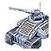

"Archer": Tech 1 Mobile Anti-Air Gun
----
<table align="right">
    <thead>
        <tr>
            <th align="left" colspan="2">
                Archer Tech 1 Mobile Anti-Air Gun
            </th>
        </tr>
    </thead>
    <tbody>
        <tr>
            <td align="right"><strong>Source:</strong></td>
            <td><a href="Forged Alliance Forever">Forged Alliance Forever</a></td>
        </tr>
        <tr>
            <td align="right"><strong>Unit ID:</strong></td>
            <td><a href="https://github.com/FAForever/fa/D:/faf-development/fa/units/UEL0104/UEL0104_unit.bp"><code>uel0104</code></a></td>
        </tr>
        <tr>
            <td align="right"><strong>Faction:</strong></td>
            <td><a href="_categories.UEF">UEF</a></td>
        </tr>
        <tr>
            <td align="right"><strong>Tech level:</strong></td>
            <td> 1</td>
        </tr>
        <tr><td align="center" colspan="2"></td></tr>
        <tr>
            <td align="right"><strong>Health:</strong></td>
            <td> 310</td>
        </tr>
        <tr>
            <td align="right"><strong>Armour:</strong></td>
            <td><code>Normal</code></td>
        </tr>
        <tr><td align="center" colspan="2"></td></tr>
        <tr>
            <td align="right"><strong>Energy cost:</strong></td>
            <td> 275</td>
        </tr>
        <tr>
            <td align="right"><strong>Mass cost:</strong></td>
            <td> 55</td>
        </tr>
        <tr>
            <td align="right"><strong>Build time:</strong></td>
            <td>220 (<a href="#construction">Details</a>)</td>
        </tr>
        <tr><td align="center" colspan="2"></td></tr>
        <tr>
            <td align="right"><strong>Vision radius:</strong></td>
            <td> 20 (400 m)</td>
        </tr>
        <tr>
            <td align="right"><strong>Water vision radius:</strong></td>
            <td> 10 (200 m)</td>
        </tr>
        <tr><td align="center" colspan="2"></td></tr>
        <tr>
            <td align="right"><strong>Motion type:</strong></td>
            <td><code>RULEUMT_Land</code></td>
        </tr>
        <tr>
            <td align="right"><strong>Movement speed:</strong></td>
            <td> 3.3 (66 m/s)</td>
        </tr>
        <tr>
            <td align="right"><strong>Transport class:</strong></td>
            <td> Small</td>
        </tr>
        <tr><td align="center" colspan="2"></td></tr>
        <tr>
            <td align="right"><strong>Weapons:</strong></td>
            <td>2 (<a href="#weapons">Details</a>)</td>
        </tr>
        <tr>
            <td align="right"><strong>Wreckage:</strong></td>
            <td> 279  44.55</td>
        </tr>
    </tbody>
</table>

"Archer" is a UEF land unit included in *Forged Alliance Forever*.
It is classified as a tech 1 mobile anti-air gun unit.
The build description for this unit is:

<blockquote>Mobile Anti-Air, effective against low-end enemy air units.</blockquote>

Contents

1. – <a href="#abilities">Abilities</a>
2. – <a href="#construction">Construction</a>
3. – <a href="#order-capabilities">Order capabilities</a>
4. – <a href="#weapons">Weapons</a>
5. – <a href="#veteran-levels">Veteran levels</a>

### Abilities
Hover over abilities to see effect descriptions.

* Anti-Air

### Construction
Build times from the development branch of the game:
*  00:11 ‒  25/s ‒  5/s — Built by <a href="UEB0101">Tech 1 Land Factory</a>
*  00:05 ‒  50/s ‒  10/s — Built by <a href="UEB0201">Tech 2 Land Factory HQ</a>
*  00:05 ‒  50/s ‒  10/s — Built by <a href="ZEB9501">Tech 2 Land Factory</a>
*  00:02 ‒  112/s ‒  22/s — Built by <a href="UEB0301">Tech 3 Land Factory HQ</a>
*  00:02 ‒  112/s ‒  22/s — Built by <a href="ZEB9601">Tech 3 Land Factory</a>
*  00:01 ‒  169/s ‒  34/s — Built by <a href="UEL0401">Experimental Mobile Factory</a>

### Order capabilities
The following orders can be issued to the unit:
<table>
<td></td>
<td></td>
<td></td>
<td></td>
<td></td>
<td></td>
<tr>
<td></td>
</table>

### Weapons

<i>Dummy Weapon</i>

    <table>
        <tr>
            <td align="right"><strong>Target type:</strong></td>
            <td><code>RULEWTT_Unit</code><error:Weapon hits high alt air and other stuff></td>
        </tr>
        <tr>
            <td align="right"><strong>Damage:</strong></td>
            <td>0 (<u>?</u>)</td>
        </tr>
        <tr>
            <td align="right"><strong>Max range:</strong></td>
            <td> 28 (0.56 km)</td>
        </tr>
        <tr>
            <td align="right"><strong>Firing cycle:</strong></td>
            <td>Once every 2.0s (<u>?</u>)</td>
        </tr>
    </table>

Linked Railgun

    <table>
        <tr>
            <td align="right"><strong>Target type:</strong></td>
            <td><code>RULEWTT_Unit</code> (Anti-Air)</td>
        </tr>
        <tr>
            <td align="right"><strong>Projectile:</strong></td>
            <td><a href="Projectiles#taa-railgun-01"><code>TAARailgun01</code></a></td>
        </tr>
        <tr>
            <td align="right"><strong>DPS estimate:</strong></td>
            <td>26 (<u>?</u>)</td>
        </tr>
        <tr>
            <td align="right"><strong>Damage:</strong></td>
            <td>13 (<u>?</u>)</td>
        </tr>
        <tr>
            <td align="right"><strong>Damage instances:</strong></td>
            <td>2 projectiles</td>
        </tr>
        <tr>
            <td align="right"><strong>Damage type:</strong></td>
            <td><code>Normal</code></td>
        </tr>
        <tr>
            <td align="right"><strong>Max range:</strong></td>
            <td> 32 (0.64 km)</td>
        </tr>
        <tr>
            <td align="right"><strong>Firing cycle:</strong></td>
            <td>Once every 1.0s (<u>?</u>)</td>
        </tr>
    </table>

### Veteran levels
Note: Each veteran level buff replaces the previous by default; values are shown here as written.

1. 2 kills gives:  +31
2. 4 kills gives:  +62
3. 6 kills gives:  +93
4. 8 kills gives:  +124
5. 10 kills gives:  +155

<table align="center">
<td width="1215px">Categories : 
<a href="_categories.UEF">UEF</a> · 
<a href="_categories.TECH1">TECH1</a> · 
<a href="_categories.MOBILE">MOBILE</a> · 
<a href="_categories.ANTIAIR">ANTIAIR</a> · 
<a href="_categories.LAND">LAND</a></td>
</table>
