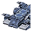
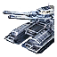
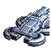
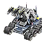

"Fatboy": Experimental Mobile Factory
----
<table align="right">
    <thead>
        <tr>
            <th align="left" colspan="2">
                Fatboy Experimental Mobile Factory
            </th>
        </tr>
    </thead>
    <tbody>
        <tr>
            <td align="right"><strong>Source:</strong></td>
            <td><a href="Forged Alliance Forever">Forged Alliance Forever</a></td>
        </tr>
        <tr>
            <td align="right"><strong>Unit ID:</strong></td>
            <td><a href="https://github.com/FAForever/fa/D:/faf-development/fa/units/UEL0401/UEL0401_unit.bp"><code>uel0401</code></a></td>
        </tr>
        <tr>
            <td align="right"><strong>Faction:</strong></td>
            <td><a href="_categories.UEF">UEF</a></td>
        </tr>
        <tr>
            <td align="right"><strong>Tech level:</strong></td>
            <td> 4 (Experimental)</td>
        </tr>
        <tr><td align="center" colspan="2"></td></tr>
        <tr>
            <td align="right"><strong>Health:</strong></td>
            <td> 12500 (+20/s)</td>
        </tr>
        <tr>
            <td align="right"><strong>Armour:</strong></td>
            <td><code>Experimental</code></td>
        </tr>
        <tr>
            <td align="right"><strong>Shield health:</strong></td>
            <td> 20000 (+100/s)</td>
        </tr>
        <tr>
            <td align="right"><strong>Shield radius:</strong></td>
            <td> 12.5 (250 m)</td>
        </tr>
        <tr><td align="center" colspan="2"></td></tr>
        <tr>
            <td align="right"><strong>Energy cost:</strong></td>
            <td> 350000</td>
        </tr>
        <tr>
            <td align="right"><strong>Mass cost:</strong></td>
            <td> 28000</td>
        </tr>
        <tr>
            <td align="right"><strong>Build time:</strong></td>
            <td>47500 (<a href="#construction">Details</a>)</td>
        </tr>
        <tr>
            <td align="right"><strong>Maintenance cost:</strong></td>
            <td> 600/s</td>
        </tr>
        <tr>
            <td align="right"><strong>Build rate:</strong></td>
            <td> 135</td>
        </tr>
        <tr>
            <td align="right"><strong>Energy storage:</strong></td>
            <td> 1000</td>
        </tr>
        <tr>
            <td align="right"><strong>Mass storage:</strong></td>
            <td> 200</td>
        </tr>
        <tr><td align="center" colspan="2"></td></tr>
        <tr>
            <td align="right"><strong>Vision radius:</strong></td>
            <td> 32 (0.64 km)</td>
        </tr>
        <tr>
            <td align="right"><strong>Water vision radius:</strong></td>
            <td> 32 (0.64 km)</td>
        </tr>
        <tr><td align="center" colspan="2"></td></tr>
        <tr>
            <td align="right"><strong>Motion type:</strong></td>
            <td><code>RULEUMT_Amphibious</code></td>
        </tr>
        <tr>
            <td align="right"><strong>Movement speed:</strong></td>
            <td> 1.75 (35 m/s)</td>
        </tr>
        <tr><td align="center" colspan="2"></td></tr>
        <tr>
            <td align="right"><strong>Misc radius:</strong></td>
            <td> 300 (6 km) (<u>?</u>)</td>
        </tr>
        <tr>
            <td align="right"><strong>Weapons:</strong></td>
            <td>10 (<a href="#weapons">Details</a>)</td>
        </tr>
        <tr>
            <td align="right"><strong>Wreckage:</strong></td>
            <td> 11250  22680</td>
        </tr>
    </tbody>
</table>

"Fatboy" is a UEF seabed amphibious unit included in *Forged Alliance Forever*.
It is classified as a experimental mobile factory unit.
The build description for this unit is:

<blockquote>Experimental Amphibious Mobile Factory. Equipped with battleship-level weaponry, a bubble shield, air staging and a land factory.</blockquote>

Contents

1. – <a href="#abilities">Abilities</a>
2. – <a href="#construction">Construction</a>
3. – <a href="#order-capabilities">Order capabilities</a>
4. – <a href="#engineering">Engineering</a>
5. – <a href="#transport-capacity">Transport capacity</a>
6. – <a href="#weapons">Weapons</a>
7. – <a href="#veteran-levels">Veteran levels</a>

### Abilities
Hover over abilities to see effect descriptions.

* Air Staging
* Amphibious
* Anti-Air
* Factory
* Shield Dome
* Torpedoes
* Volatile

### Construction
Build times from the development branch of the game:
*  14:08 ‒  413/s ‒  33/s — Built by <a href="UEL0301">Tech 3 Support Armored Command Unit</a>
*  24:21 ‒  239/s ‒  19/s — Built by <a href="UEL0309">Tech 3 Engineer</a>
*  22:37 ‒  258/s ‒  21/s — Built by <a href="UEA0003">Tech 3 Engineering Drone</a>
*  1:19:10 ‒  74/s ‒  6/s — Built by <a href="UEL0001">Armored Command Unit</a>

### Order capabilities
The following orders can be issued to the unit:
<table>
<td></td>
<td></td>
<td></td>
<td></td>
<td></td>
<td></td>
<tr>
<td></td>
<td></td>
<td></td>
</table>

### Engineering
It has the build categories:
* <code>BUILTBYTIER3FACTORY UEF MOBILE LAND</code>
* <code>BUILTBYTIER2FACTORY UEF MOBILE LAND</code>
* <code>BUILTBYLANDTIER2FACTORY UEF MOBILE LAND</code>

These build categories allow it to build the following mod units:

<table>
    <tr>
        <td></td>
        <td></td>
        <td></td>
        <td></td>
        <td></td>
        <td></td>
        <td></td>
    </tr>
    <tr>
        <td></td>
        <td></td>
        <td></td>
        <td></td>
        <td></td>
        <td></td>
        <td></td>
        <td></td>
        <td></td>
    </tr>
    <tr>
        <td></td>
        <td></td>
        <td></td>
        <td></td>
        <td></td>
        <td></td>
        <td></td>
    </tr>
</table>

### Transport capacity
This unit has 4 docking slots consisting of 4 small attach points. 

### Weapons

Gauss Cannon (×4)

    <table>
        <tr><td align="center" colspan="2">Note: Stats are per instance of the weapon.</td></tr>
        <tr>
            <td align="right"><strong>Target type:</strong></td>
            <td><code>RULEWTT_Unit</code> (Anti-Surface)</td>
        </tr>
        <tr>
            <td align="right"><strong>Projectile:</strong></td>
            <td><a href="Projectiles#tdf-gauss-04"><code>TDFGauss04</code></a></td>
        </tr>
        <tr>
            <td align="right"><strong>DPS estimate:</strong></td>
            <td>750 (<u>?</u>)</td>
        </tr>
        <tr>
            <td align="right"><strong>Damage:</strong></td>
            <td>250 (<u>?</u>)</td>
        </tr>
        <tr>
            <td align="right"><strong>Damage radius:</strong></td>
            <td> 1.5 (30 m)</td>
        </tr>
        <tr>
            <td align="right"><strong>Damage instances:</strong></td>
            <td>3 projectiles</td>
        </tr>
        <tr>
            <td align="right"><strong>Damage type:</strong></td>
            <td><code>Normal</code></td>
        </tr>
        <tr>
            <td align="right"><strong>Max range:</strong></td>
            <td> 100 (2 km)</td>
        </tr>
        <tr>
            <td align="right"><strong>Firing arc:</strong></td>
            <td>200°, 220°, 200°, 220°</td>
        </tr>
        <tr>
            <td align="right"><strong>Firing cycle:</strong></td>
            <td>Once every 1.0s (<u>?</u>)</td>
        </tr>
    </table>

Hells Fury Riot Gun (×2)

    <table>
        <tr><td align="center" colspan="2">Note: Stats are per instance of the weapon.</td></tr>
        <tr>
            <td align="right"><strong>Target type:</strong></td>
            <td><code>RULEWTT_Unit</code> (Anti-Surface)</td>
        </tr>
        <tr>
            <td align="right"><strong>Projectile:</strong></td>
            <td><a href="Projectiles#tdf-riot-02"><code>TDFRiot02</code></a></td>
        </tr>
        <tr>
            <td align="right"><strong>DPS estimate:</strong></td>
            <td>500 (<u>?</u>)</td>
        </tr>
        <tr>
            <td align="right"><strong>Damage:</strong></td>
            <td>150 (<u>?</u>)</td>
        </tr>
        <tr>
            <td align="right"><strong>Damage type:</strong></td>
            <td><code>Normal</code></td>
        </tr>
        <tr>
            <td align="right"><strong>Max range:</strong></td>
            <td> 45 (0.9 km)</td>
        </tr>
        <tr>
            <td align="right"><strong>Firing arc:</strong></td>
            <td>180°</td>
        </tr>
        <tr>
            <td align="right"><strong>Firing cycle:</strong></td>
            <td>Once every 0.3s (<u>?</u>)</td>
        </tr>
    </table>

Linked Railgun (×2)

    <table>
        <tr><td align="center" colspan="2">Note: Stats are per instance of the weapon.</td></tr>
        <tr>
            <td align="right"><strong>Target type:</strong></td>
            <td><code>RULEWTT_Unit</code> (Anti-Air)</td>
        </tr>
        <tr>
            <td align="right"><strong>Projectile:</strong></td>
            <td><a href="Projectiles#taa-railgun-01"><code>TAARailgun01</code></a></td>
        </tr>
        <tr>
            <td align="right"><strong>DPS estimate:</strong></td>
            <td>57 (<u>?</u>)</td>
        </tr>
        <tr>
            <td align="right"><strong>Damage:</strong></td>
            <td>20 (<u>?</u>)</td>
        </tr>
        <tr>
            <td align="right"><strong>Damage instances:</strong></td>
            <td>2 projectiles</td>
        </tr>
        <tr>
            <td align="right"><strong>Damage type:</strong></td>
            <td><code>Normal</code></td>
        </tr>
        <tr>
            <td align="right"><strong>Max range:</strong></td>
            <td> 45 (0.9 km)</td>
        </tr>
        <tr>
            <td align="right"><strong>Firing cycle:</strong></td>
            <td>Once every 0.7s (<u>?</u>)</td>
        </tr>
    </table>

Angler Torpedo

    <table>
        <tr>
            <td align="right"><strong>Target type:</strong></td>
            <td><code>RULEWTT_Unit</code> (Anti-Naval)</td>
        </tr>
        <tr>
            <td align="right"><strong>Projectile:</strong></td>
            <td><a href="Projectiles#tan-angler-torpedo-02"><code>TANAnglerTorpedo02</code></a></td>
        </tr>
        <tr>
            <td align="right"><strong>DPS estimate:</strong></td>
            <td>75 (<u>?</u>)</td>
        </tr>
        <tr>
            <td align="right"><strong>Damage:</strong></td>
            <td>75 (<u>?</u>)</td>
        </tr>
        <tr>
            <td align="right"><strong>Damage instances:</strong></td>
            <td>4 projectiles</td>
        </tr>
        <tr>
            <td align="right"><strong>Damage type:</strong></td>
            <td><code>Normal</code></td>
        </tr>
        <tr>
            <td align="right"><strong>Max range:</strong></td>
            <td> 40 (0.8 km)</td>
        </tr>
        <tr>
            <td align="right"><strong>Firing cycle:</strong></td>
            <td>Once every 4.0s (<u>?</u>)</td>
        </tr>
    </table>

Death Weapon

    <table>
        <tr>
            <td align="right"><strong>Damage:</strong></td>
            <td>4000</td>
        </tr>
        <tr>
            <td align="right"><strong>Damage radius:</strong></td>
            <td> 7 (140 m)</td>
        </tr>
        <tr>
            <td align="right"><strong>Damage type:</strong></td>
            <td><code>DeathExplosion</code></td>
        </tr>
        <tr>
            <td align="right"><strong>Flags:</strong></td>
            <td>Damage friendly</td>
        </tr>
    </table>

### Veteran levels
Note: Each veteran level buff replaces the previous by default; values are shown here as written.

1. 40 kills gives:  +1250
2. 80 kills gives:  +2500
3. 120 kills gives:  +3750
4. 160 kills gives:  +5000
5. 200 kills gives:  +6250

<table align="center">
<td width="1215px">Categories : 
<a href="_categories.UEF">UEF</a> · 
<a href="_categories.EXPERIMENTAL">EXPERIMENTAL</a> · 
<a href="_categories.MOBILE">MOBILE</a> · 
<a href="_categories.LAND">LAND</a> · 
<a href="_categories.SHIELD">SHIELD</a> · 
<a href="_categories.AIRSTAGINGPLATFORM">AIRSTAGINGPLATFORM</a> · 
<a href="_categories.ARTILLERY">ARTILLERY</a></td>
</table>
