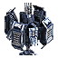

"SP3 - 3000": Tech 3 Sonar Platform
----
<table align="right">
    <thead>
        <tr>
            <th align="left" colspan="2">
                SP3 - 3000 Tech 3 Sonar Platform
            </th>
        </tr>
    </thead>
    <tbody>
        <tr>
            <td align="right"><strong>Source:</strong></td>
            <td><a href="Forged Alliance Forever">Forged Alliance Forever</a></td>
        </tr>
        <tr>
            <td align="right"><strong>Unit ID:</strong></td>
            <td><a href="https://github.com/FAForever/fa/D:/faf-development/fa/units/UES0305/UES0305_unit.bp"><code>ues0305</code></a></td>
        </tr>
        <tr>
            <td align="right"><strong>Faction:</strong></td>
            <td><a href="_categories.UEF">UEF</a></td>
        </tr>
        <tr>
            <td align="right"><strong>Tech level:</strong></td>
            <td> 3</td>
        </tr>
        <tr><td align="center" colspan="2"></td></tr>
        <tr>
            <td align="right"><strong>Health:</strong></td>
            <td> 2000</td>
        </tr>
        <tr>
            <td align="right"><strong>Armour:</strong></td>
            <td><code>Normal</code></td>
        </tr>
        <tr><td align="center" colspan="2"></td></tr>
        <tr>
            <td align="right"><strong>Energy cost:</strong></td>
            <td> 12000</td>
        </tr>
        <tr>
            <td align="right"><strong>Mass cost:</strong></td>
            <td> 1000</td>
        </tr>
        <tr>
            <td align="right"><strong>Build time:</strong></td>
            <td>1200 (<a href="#construction">Details</a>)</td>
        </tr>
        <tr>
            <td align="right"><strong>Maintenance cost:</strong></td>
            <td> 500/s</td>
        </tr>
        <tr><td align="center" colspan="2"></td></tr>
        <tr>
            <td align="right"><strong>Vision radius:</strong></td>
            <td> 32 (0.64 km)</td>
        </tr>
        <tr>
            <td align="right"><strong>Water vision radius:</strong></td>
            <td> 24 (480 m)</td>
        </tr>
        <tr>
            <td align="right"><strong>Sonar radius:</strong></td>
            <td> 448 (8.96 km)</td>
        </tr>
        <tr>
            <td align="right"><strong>Jammer blips (radii):</strong></td>
            <td>20 (70‒70)</td>
        </tr>
        <tr><td align="center" colspan="2"></td></tr>
        <tr>
            <td align="right"><strong>Motion type:</strong></td>
            <td><code>RULEUMT_Water</code></td>
        </tr>
        <tr>
            <td align="right"><strong>Movement speed:</strong></td>
            <td> 4.5 (90 m/s)</td>
        </tr>
        <tr><td align="center" colspan="2"></td></tr>
        <tr>
            <td align="right"><strong>Weapons:</strong></td>
            <td>1 (<a href="#weapons">Details</a>)</td>
        </tr>
    </tbody>
</table>

"SP3 - 3000" is a UEF naval unit included in *Forged Alliance Forever*.
It is classified as a tech 3 sonar platform unit.
The build description for this unit is:

<blockquote>Long range Sonar system which detects submerged and surface units. Cannot detect hovering or stealth units. Armed with a weak torpedo launcher.</blockquote>

Contents

1. – <a href="#abilities">Abilities</a>
2. – <a href="#construction">Construction</a>
3. – <a href="#order-capabilities">Order capabilities</a>
4. – <a href="#weapons">Weapons</a>
5. – <a href="#veteran-levels">Veteran levels</a>

### Abilities
Hover over abilities to see effect descriptions.

* Sonar
* Torpedoes
* Jamming

### Construction
Build times from the development branch of the game:
*  01:00 ‒  200/s ‒  17/s — Upgrade from <a href="UEB3202">Tech 2 Sonar System</a>
*  00:21 ‒  560/s ‒  47/s — Built by <a href="UEL0301">Tech 3 Support Armored Command Unit</a>
*  00:36 ‒  325/s ‒  27/s — Built by <a href="UEL0309">Tech 3 Engineer</a>
*  00:34 ‒  350/s ‒  29/s — Built by <a href="UEA0003">Tech 3 Engineering Drone</a>
*  02:00 ‒  100/s ‒  8/s — Built by <a href="UEL0001">Armored Command Unit</a>

### Order capabilities
The following orders can be issued to the unit:
<table>
<td></td>
<td></td>
<td></td>
<td></td>
<td></td>
<td></td>
<tr>
<td></td>
</table>

### Weapons

Angler Torpedo

    <table>
        <tr>
            <td align="right"><strong>Target type:</strong></td>
            <td><code>RULEWTT_Unit</code> (Anti-Naval)</td>
        </tr>
        <tr>
            <td align="right"><strong>Projectile:</strong></td>
            <td><a href="Projectiles#tan-angler-torpedo-03"><code>TANAnglerTorpedo03</code></a></td>
        </tr>
        <tr>
            <td align="right"><strong>DPS estimate:</strong></td>
            <td>38 (<u>?</u>)</td>
        </tr>
        <tr>
            <td align="right"><strong>Damage:</strong></td>
            <td>75 (<u>?</u>)</td>
        </tr>
        <tr>
            <td align="right"><strong>Damage instances:</strong></td>
            <td>2 projectiles</td>
        </tr>
        <tr>
            <td align="right"><strong>Damage type:</strong></td>
            <td><code>Normal</code></td>
        </tr>
        <tr>
            <td align="right"><strong>Max range:</strong></td>
            <td> 45 (0.9 km)</td>
        </tr>
        <tr>
            <td align="right"><strong>Firing cycle:</strong></td>
            <td>Once every 4.0s (<u>?</u>)</td>
        </tr>
    </table>

### Veteran levels
Note: Each veteran level buff replaces the previous by default; values are shown here as written.

1. 16 kills gives:  +200
2. 32 kills gives:  +400
3. 48 kills gives:  +600
4. 64 kills gives:  +800
5. 80 kills gives:  +1000

<table align="center">
<td width="1215px">Categories : 
<a href="_categories.UEF">UEF</a> · 
<a href="_categories.TECH3">TECH3</a> · 
<a href="_categories.MOBILE">MOBILE</a> · 
<a href="_categories.NAVAL">NAVAL</a></td>
</table>
