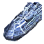
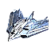
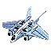
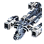

"Atlantis": Experimental Aircraft Carrier
----
<table align="right">
    <thead>
        <tr>
            <th align="left" colspan="2">
                Atlantis Experimental Aircraft Carrier
            </th>
        </tr>
    </thead>
    <tbody>
        <tr>
            <td align="right"><strong>Source:</strong></td>
            <td><a href="Forged Alliance Forever">Forged Alliance Forever</a></td>
        </tr>
        <tr>
            <td align="right"><strong>Unit ID:</strong></td>
            <td><a href="https://github.com/FAForever/fa/D:/faf-development/fa/units/UES0401/UES0401_unit.bp"><code>ues0401</code></a></td>
        </tr>
        <tr>
            <td align="right"><strong>Faction:</strong></td>
            <td><a href="_categories.UEF">UEF</a></td>
        </tr>
        <tr>
            <td align="right"><strong>Tech level:</strong></td>
            <td> 4 (Experimental)</td>
        </tr>
        <tr><td align="center" colspan="2"></td></tr>
        <tr>
            <td align="right"><strong>Health:</strong></td>
            <td> 40000</td>
        </tr>
        <tr>
            <td align="right"><strong>Armour:</strong></td>
            <td><code>Experimental</code></td>
        </tr>
        <tr><td align="center" colspan="2"></td></tr>
        <tr>
            <td align="right"><strong>Energy cost:</strong></td>
            <td> 150000</td>
        </tr>
        <tr>
            <td align="right"><strong>Mass cost:</strong></td>
            <td> 12000</td>
        </tr>
        <tr>
            <td align="right"><strong>Build time:</strong></td>
            <td>20500 (<a href="#construction">Details</a>)</td>
        </tr>
        <tr>
            <td align="right"><strong>Build rate:</strong></td>
            <td> 180</td>
        </tr>
        <tr><td align="center" colspan="2"></td></tr>
        <tr>
            <td align="right"><strong>Vision radius:</strong></td>
            <td> 100 (2 km)</td>
        </tr>
        <tr>
            <td align="right"><strong>Water vision radius:</strong></td>
            <td> 100 (2 km)</td>
        </tr>
        <tr>
            <td align="right"><strong>Radar radius:</strong></td>
            <td> 256 (5.12 km)</td>
        </tr>
        <tr>
            <td align="right"><strong>Sonar radius:</strong></td>
            <td> 252 (5.04 km)</td>
        </tr>
        <tr><td align="center" colspan="2"></td></tr>
        <tr>
            <td align="right"><strong>Motion type:</strong></td>
            <td><code>RULEUMT_SurfacingSub</code></td>
        </tr>
        <tr>
            <td align="right"><strong>Movement speed:</strong></td>
            <td> 3.3 (66 m/s)</td>
        </tr>
        <tr><td align="center" colspan="2"></td></tr>
        <tr>
            <td align="right"><strong>Misc radius:</strong></td>
            <td> 300 (6 km) (<u>?</u>)</td>
        </tr>
        <tr>
            <td align="right"><strong>Weapons:</strong></td>
            <td>5 (<a href="#weapons">Details</a>)</td>
        </tr>
    </tbody>
</table>

"Atlantis" is a UEF submarine unit included in *Forged Alliance Forever*.
It is classified as a experimental aircraft carrier unit.
The build description for this unit is:

<blockquote>Experimental, Submersible Aircraft Carrier. Armed with powerful torpedoes and, while surfaced, anti-air SAMs. Equipped with air staging, a full sensor suite and an air factory.</blockquote>

Contents

1. – <a href="#abilities">Abilities</a>
2. – <a href="#construction">Construction</a>
3. – <a href="#order-capabilities">Order capabilities</a>
4. – <a href="#engineering">Engineering</a>
5. – <a href="#transport-capacity">Transport capacity</a>
6. – <a href="#weapons">Weapons</a>
7. – <a href="#veteran-levels">Veteran levels</a>

### Abilities
Hover over abilities to see effect descriptions.

* Anti-Air
* Carrier
* Factory
* Radar
* Sonar
* Submersible
* Torpedoes

### Construction
Build times from the development branch of the game:
*  06:06 ‒  410/s ‒  33/s — Built by <a href="UEL0301">Tech 3 Support Armored Command Unit</a>
*  10:30 ‒  238/s ‒  19/s — Built by <a href="UEL0309">Tech 3 Engineer</a>
*  09:45 ‒  256/s ‒  20/s — Built by <a href="UEA0003">Tech 3 Engineering Drone</a>
*  34:10 ‒  73/s ‒  6/s — Built by <a href="UEL0001">Armored Command Unit</a>

### Order capabilities
The following orders can be issued to the unit:
<table>
<td></td>
<td></td>
<td></td>
<td></td>
<td></td>
<td></td>
<tr>
<td></td>
<td></td>
<td></td>
</table>

### Engineering
It has the build category <code>BUILTBYTIER3FACTORY UEF MOBILE AIR</code>. 

This build category allows it to build the following mod units:

<table>
    <tr>
        <td></td>
        <td></td>
        <td></td>
        <td></td>
    </tr>
    <tr>
        <td></td>
        <td></td>
        <td></td>
        <td></td>
    </tr>
    <tr>
        <td></td>
        <td></td>
        <td></td>
        <td></td>
        <td></td>
    </tr>
</table>

### Transport capacity
This unit has 8 small attach points. 

### Weapons

Angler Torpedo

    <table>
        <tr>
            <td align="right"><strong>Target type:</strong></td>
            <td><code>RULEWTT_Unit</code> (Anti-Naval)</td>
        </tr>
        <tr>
            <td align="right"><strong>Projectile:</strong></td>
            <td><a href="Projectiles#tan-angler-torpedo-02"><code>TANAnglerTorpedo02</code></a></td>
        </tr>
        <tr>
            <td align="right"><strong>DPS estimate:</strong></td>
            <td>400 (<u>?</u>)</td>
        </tr>
        <tr>
            <td align="right"><strong>Damage:</strong></td>
            <td>200 (<u>?</u>)</td>
        </tr>
        <tr>
            <td align="right"><strong>Damage instances:</strong></td>
            <td>4 projectiles</td>
        </tr>
        <tr>
            <td align="right"><strong>Damage type:</strong></td>
            <td><code>Normal</code></td>
        </tr>
        <tr>
            <td align="right"><strong>Max range:</strong></td>
            <td> 80 (1.6 km)</td>
        </tr>
        <tr>
            <td align="right"><strong>Firing cycle:</strong></td>
            <td>Once every 2.0s (<u>?</u>)</td>
        </tr>
    </table>

Flayer SAM Launcher (×4)

    <table>
        <tr><td align="center" colspan="2">Note: Stats are per instance of the weapon.</td></tr>
        <tr>
            <td align="right"><strong>Target type:</strong></td>
            <td><code>RULEWTT_Unit</code> (Anti-Air)</td>
        </tr>
        <tr>
            <td align="right"><strong>Projectile:</strong></td>
            <td><a href="Projectiles#taa-missile-flayer-01"><code>TAAMissileFlayer01</code></a></td>
        </tr>
        <tr>
            <td align="right"><strong>DPS estimate:</strong></td>
            <td>140 (<u>?</u>)</td>
        </tr>
        <tr>
            <td align="right"><strong>Damage:</strong></td>
            <td>280 (<u>?</u>)</td>
        </tr>
        <tr>
            <td align="right"><strong>Damage radius:</strong></td>
            <td> 1.5 (30 m)</td>
        </tr>
        <tr>
            <td align="right"><strong>Damage type:</strong></td>
            <td><code>Normal</code></td>
        </tr>
        <tr>
            <td align="right"><strong>Max range:</strong></td>
            <td> 100 (2 km)</td>
        </tr>
        <tr>
            <td align="right"><strong>Firing arc:</strong></td>
            <td>30°</td>
        </tr>
        <tr>
            <td align="right"><strong>Firing cycle:</strong></td>
            <td>Once every 2.0s (<u>?</u>)</td>
        </tr>
    </table>

### Veteran levels
Note: Each veteran level buff replaces the previous by default; values are shown here as written.

1. 30 kills gives:  +4000
2. 60 kills gives:  +8000
3. 90 kills gives:  +12000
4. 120 kills gives:  +16000
5. 150 kills gives:  +20000

<table align="center">
<td width="1215px">Categories : 
<a href="_categories.UEF">UEF</a> · 
<a href="_categories.EXPERIMENTAL">EXPERIMENTAL</a> · 
<a href="_categories.MOBILE">MOBILE</a> · 
<a href="_categories.ANTIAIR">ANTIAIR</a> · 
<a href="_categories.ANTINAVY">ANTINAVY</a> · 
<a href="_categories.NAVAL">NAVAL</a> · 
<a href="_categories.AIRSTAGINGPLATFORM">AIRSTAGINGPLATFORM</a></td>
</table>
