<table align="right">
    <thead>
        <tr>
            <th align="left" colspan="2">
                <i>Unnamed</i> <i>No description</i>
            </th>
        </tr>
    </thead>
    <tbody>
        <tr>
            <td align="right"><strong>Source:</strong></td>
            <td><a href="Forged Alliance Forever">Forged Alliance Forever</a></td>
        </tr>
        <tr>
            <td align="right"><strong>Unit ID:</strong></td>
            <td><a href="https://github.com/FAForever/fa/D:/faf-development/fa/units/URA0003O/URA0003O_unit.bp"><code>ura0003o</code></a></td>
        </tr>
        <tr><td align="center" colspan="2"></td></tr>
        <tr>
            <td align="right"><strong>Health:</strong></td>
            <td>Invulnerable</td>
        </tr>
        <tr>
            <td align="right"><strong>Flags:</strong></td>
            <td>Untargetable Unselectable</td>
        </tr>
        <tr><td align="center" colspan="2"></td></tr>
        <tr>
            <td align="right"><strong>Population cost:</strong></td>
            <td> 0</td>
        </tr>
        <tr>
            <td align="right"><strong>Energy cost:</strong></td>
            <td> 0</td>
        </tr>
        <tr>
            <td align="right"><strong>Mass cost:</strong></td>
            <td> 0</td>
        </tr>
        <tr>
            <td align="right"><strong>Build time:</strong></td>
            <td>0 (<a href="#construction">Details</a>)</td>
        </tr>
        <tr>
            <td align="right"><strong>Build rate:</strong></td>
            <td> 0.0001</td>
        </tr>
        <tr><td align="center" colspan="2"></td></tr>
        <tr>
            <td align="right"><strong>Vision radius:</strong></td>
            <td>0</td>
        </tr>
        <tr>
            <td align="right"><strong>Water vision radius:</strong></td>
            <td> 10 (200 m)</td>
        </tr>
        <tr><td align="center" colspan="2"></td></tr>
        <tr>
            <td align="right"><strong>Motion type:</strong></td>
            <td><code>RULEUMT_Air</code></td>
        </tr>
        <tr>
            <td align="right"><strong>Movement speed:</strong></td>
            <td> 8 (160 m/s)</td>
        </tr>
        <tr>
            <td align="right"><strong>Elevation:</strong></td>
            <td>10</td>
        </tr>
        <tr>
            <td align="right"><strong>Transport class:</strong></td>
            <td> Small</td>
        </tr>
    </tbody>
</table>

This unnamed unit is a factionless aircraft unit included in *Forged Alliance Forever*.
It is an unclassified unit with no defined tech level. It has no defined build description, and no categories to define common builders.

Contents

1. – <a href="#construction">Construction</a>
2. – <a href="#order-capabilities">Order capabilities</a>
3. – <a href="#engineering">Engineering</a>

### Construction
Build times from the development branch of the game:
* <error:buildrate 0>Built by <a href="ZXA0001">Dummy Drone</a>

### Order capabilities
The following orders can be issued to the unit:
<table>
<td></td>
<td></td>
<td></td>
<td></td>
<tr>
<td></td>
<td></td>
<td></td>
</table>

### Engineering
The engineering capabilties of this unit consist of the ability to reclaim, and repair.
It has the build category <code>BUILTBYTIER1ENGINEER CYBRAN</code>. 

This build category allows it to build the following mod units:

<table>
    <tr>
        <td rowspan="2"></td>
        <td></td>
        <td></td>
        <td></td>
        <td><a href="URB1103">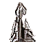</a></td>
        <td><a href="URB1106">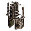</a></td>
        <td><a href="URB1101">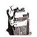</a></td>
        <td><a href="URB1102">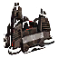</a></td>
        <td><a href="URB1105">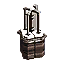</a></td>
    </tr>
    <tr>
        <td><a href="URB2101">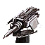</a></td>
        <td><a href="URB2104">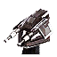</a></td>
        <td><a href="URB2109">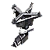</a></td>
        <td><a href="URB5101">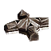</a></td>
        <td><a href="URB5202">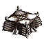</a></td>
        <td><a href="URB3101">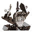</a></td>
        <td><a href="URB3102">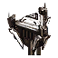</a></td>
    </tr>
</table>

<table align="center">
<td width="1215px">Categories : 
<a href="_categories.ENGINEER">ENGINEER</a></td>
</table>
