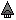

"Gemini": Tech 3 Air Superiority Fighter
----
<table align="right">
    <thead>
        <tr>
            <th align="left" colspan="2">
                Gemini Tech 3 Air Superiority Fighter
            </th>
        </tr>
    </thead>
    <tbody>
        <tr>
            <td align="right"><strong>Source:</strong></td>
            <td><a href="Forged Alliance Forever">Forged Alliance Forever</a></td>
        </tr>
        <tr>
            <td align="right"><strong>Unit ID:</strong></td>
            <td><a href="https://github.com/FAForever/fa/D:/faf-development/fa/units/URA0303/URA0303_unit.bp"><code>ura0303</code></a></td>
        </tr>
        <tr>
            <td align="right"><strong>Faction:</strong></td>
            <td><a href="categories.CYBRAN">Cybran</a></td>
        </tr>
        <tr>
            <td align="right"><strong>Tech level:</strong></td>
            <td> 3</td>
        </tr>
        <tr><td align="center" colspan="2"></td></tr>
        <tr>
            <td align="right"><strong>Health:</strong></td>
            <td> 2225</td>
        </tr>
        <tr>
            <td align="right"><strong>Armour:</strong></td>
            <td><code>ASF</code></td>
        </tr>
        <tr><td align="center" colspan="2"></td></tr>
        <tr>
            <td align="right"><strong>Energy cost:</strong></td>
            <td> 51200</td>
        </tr>
        <tr>
            <td align="right"><strong>Mass cost:</strong></td>
            <td> 450</td>
        </tr>
        <tr>
            <td align="right"><strong>Build time:</strong></td>
            <td>3840 (<a href="#construction">Details</a>)</td>
        </tr>
        <tr>
            <td align="right"><strong>Maintenance cost:</strong></td>
            <td> 30/s</td>
        </tr>
        <tr><td align="center" colspan="2"></td></tr>
        <tr>
            <td align="right"><strong>Vision radius:</strong></td>
            <td> 32 (0.64 km)</td>
        </tr>
        <tr>
            <td align="right"><strong>Water vision radius:</strong></td>
            <td> 10 (200 m)</td>
        </tr>
        <tr>
            <td align="right"><strong>Flags:</strong></td>
            <td>Radar stealth</td>
        </tr>
        <tr><td align="center" colspan="2"></td></tr>
        <tr>
            <td align="right"><strong>Motion type:</strong></td>
            <td><code>RULEUMT_Air</code></td>
        </tr>
        <tr>
            <td align="right"><strong>Movement speed:</strong></td>
            <td> 22 (440 m/s)</td>
        </tr>
        <tr>
            <td align="right"><strong>Fuel:</strong></td>
            <td> 16:40</td>
        </tr>
        <tr>
            <td align="right"><strong>Elevation:</strong></td>
            <td>18</td>
        </tr>
        <tr>
            <td align="right"><strong>Transport class:</strong></td>
            <td> Small</td>
        </tr>
        <tr><td align="center" colspan="2"></td></tr>
        <tr>
            <td align="right"><strong>Weapons:</strong></td>
            <td>2 (<a href="#weapons">Details</a>)</td>
        </tr>
        <tr>
            <td align="right"><strong>Wreckage:</strong></td>
            <td> 2002.5  182.25</td>
        </tr>
    </tbody>
</table>

"Gemini" is a Cybran aircraft unit included in *Forged Alliance Forever*.
It is classified as a tech 3 air superiority fighter unit.
The build description for this unit is:

<blockquote>High-end air fighter. Designed to engage air units of any type. Equipped with a personal stealth generator. Costs energy to run.</blockquote>

Contents

1. – <a href="#abilities">Abilities</a>
2. – <a href="#construction">Construction</a>
3. – <a href="#order-capabilities">Order capabilities</a>
4. – <a href="#weapons">Weapons</a>
5. – <a href="#veteran-levels">Veteran levels</a>

### Abilities
Hover over abilities to see effect descriptions.

* Anti-Air
* Personal Radar Stealth

### Construction
Build times from the development branch of the game:
*  00:32 ‒  1600/s ‒  14/s — Built by <a href="URB0302">Tech 3 Air Factory HQ</a>
*  00:32 ‒  1600/s ‒  14/s — Built by <a href="ZRB9602">Tech 3 Air Factory</a>
*  00:32 ‒  1600/s ‒  14/s — Built by <a href="URS0303">Tech 3 Aircraft Carrier</a>

### Order capabilities
The following orders can be issued to the unit:
<table>
<td></td>
<td></td>
<td></td>
<td></td>
<td></td>
<td></td>
<tr>
<td></td>
<td></td>
<td></td>
</table>

### Weapons

Nanite Missile System

    <table>
        <tr>
            <td align="right"><strong>Target type:</strong></td>
            <td><code>RULEWTT_Unit</code> (Anti-Air)</td>
        </tr>
        <tr>
            <td align="right"><strong>Projectile:</strong></td>
            <td><a href="Projectiles#caa-missile-nanite-03"><code>CAAMissileNanite03</code></a></td>
        </tr>
        <tr>
            <td align="right"><strong>DPS estimate:</strong></td>
            <td>500 (<u>?</u>)</td>
        </tr>
        <tr>
            <td align="right"><strong>Damage:</strong></td>
            <td>250 (<u>?</u>)</td>
        </tr>
        <tr>
            <td align="right"><strong>Damage instances:</strong></td>
            <td>2 projectiles</td>
        </tr>
        <tr>
            <td align="right"><strong>Damage type:</strong></td>
            <td><code>Normal</code></td>
        </tr>
        <tr>
            <td align="right"><strong>Max range:</strong></td>
            <td> 30 (0.6 km)</td>
        </tr>
        <tr>
            <td align="right"><strong>Firing arc:</strong></td>
            <td>110°</td>
        </tr>
        <tr>
            <td align="right"><strong>Firing cycle:</strong></td>
            <td>Once every 1.0s (<u>?</u>)</td>
        </tr>
    </table>

Air Crash

    <table>
        <tr>
            <td align="right"><strong>Damage:</strong></td>
            <td>200</td>
        </tr>
        <tr>
            <td align="right"><strong>Damage radius:</strong></td>
            <td> 2 (40 m)</td>
        </tr>
        <tr>
            <td align="right"><strong>Damage type:</strong></td>
            <td><code>Normal</code></td>
        </tr>
        <tr>
            <td align="right"><strong>Flags:</strong></td>
            <td>Damage friendly</td>
        </tr>
    </table>

### Veteran levels
Note: Each veteran level buff replaces the previous by default; values are shown here as written.

1. 12 kills gives:  +222.5
2. 24 kills gives:  +445
3. 36 kills gives:  +667.5
4. 48 kills gives:  +890
5. 60 kills gives:  +1112.5

<table align="center">
<td width="1215px">Categories : 
<a href="categories.CYBRAN">CYBRAN</a> · 
<a href="_categories.TECH3">TECH3</a> · 
<a href="_categories.MOBILE">MOBILE</a> · 
<a href="_categories.ANTIAIR">ANTIAIR</a> · 
<a href="_categories.AIR">AIR</a></td>
</table>
