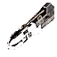
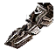
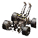
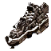
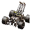
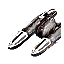
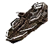

Tech 3 Naval Factory HQ
----
<table align="right">
    <thead>
        <tr>
            <th align="left" colspan="2">
                <i>Unnamed</i> Tech 3 Naval Factory HQ
            </th>
        </tr>
    </thead>
    <tbody>
        <tr>
            <td align="right"><strong>Source:</strong></td>
            <td><a href="Forged Alliance Forever">Forged Alliance Forever</a></td>
        </tr>
        <tr>
            <td align="right"><strong>Unit ID:</strong></td>
            <td><a href="https://github.com/FAForever/fa/D:/faf-development/fa/units/URB0303/URB0303_unit.bp"><code>urb0303</code></a></td>
        </tr>
        <tr>
            <td align="right"><strong>Faction:</strong></td>
            <td><a href="categories.CYBRAN">Cybran</a></td>
        </tr>
        <tr>
            <td align="right"><strong>Tech level:</strong></td>
            <td> 3</td>
        </tr>
        <tr><td align="center" colspan="2"></td></tr>
        <tr>
            <td align="right"><strong>Health:</strong></td>
            <td> 17000 (+60/s)</td>
        </tr>
        <tr>
            <td align="right"><strong>Armour:</strong></td>
            <td><code>Structure</code></td>
        </tr>
        <tr><td align="center" colspan="2"></td></tr>
        <tr>
            <td align="right"><strong>Energy cost:</strong></td>
            <td> 45000</td>
        </tr>
        <tr>
            <td align="right"><strong>Mass cost:</strong></td>
            <td> 9500</td>
        </tr>
        <tr>
            <td align="right"><strong>Build time:</strong></td>
            <td>21600 (<a href="#construction">Details</a>)</td>
        </tr>
        <tr>
            <td align="right"><strong>Build rate:</strong></td>
            <td> 150</td>
        </tr>
        <tr>
            <td align="right"><strong>Energy storage:</strong></td>
            <td> 0</td>
        </tr>
        <tr>
            <td align="right"><strong>Mass storage:</strong></td>
            <td> 320</td>
        </tr>
        <tr><td align="center" colspan="2"></td></tr>
        <tr>
            <td align="right"><strong>Vision radius:</strong></td>
            <td> 20 (400 m)</td>
        </tr>
        <tr>
            <td align="right"><strong>Water vision radius:</strong></td>
            <td> 10 (200 m)</td>
        </tr>
        <tr><td align="center" colspan="2"></td></tr>
        <tr>
            <td align="right"><strong>Motion type:</strong></td>
            <td><code>RULEUMT_None</code></td>
        </tr>
        <tr>
            <td align="right"><strong>Buildable layers:</strong></td>
            <td>water</td>
        </tr>
        <tr><td align="center" colspan="2"></td></tr>
        <tr>
            <td align="right"><strong>Wreckage:</strong></td>
            <td> 15300  7695</td>
        </tr>
    </tbody>
</table>

This unnamed unit is a Cybran structure unit included in *Forged Alliance Forever*.
It is classified as a tech 3 naval factory hq unit.
The build description for this unit is:

<blockquote>Constructs Tech 3 Naval units. Allows you to upgrade other T2 factories to T3 support factories for a much cheaper cost.</blockquote>

Contents

1. – <a href="#adjacency">Adjacency</a>
2. – <a href="#construction">Construction</a>
3. – <a href="#order-capabilities">Order capabilities</a>
4. – <a href="#engineering">Engineering</a>

### Adjacency
This unit counts as `SIZE16` for adjacency effects from other structures. This theoretically means that it can be surrounded by exactly 16 structures the size of a standard tech 1 power generator, however it is actually larger; meaning it receives 37.5% better buffs than would normally be afforded it. 

### Construction
Build times from the development branch of the game:
*  04:00 ‒  146/s ‒  31/s — Upgrade from <a href="URB0203">Tech 2 Naval Factory HQ</a>

### Order capabilities
The following orders can be issued to the unit:
<table>
<td></td>
<td></td>
<td></td>
<td></td>
<td></td>
<tr>
<td></td>
</table>

### Engineering
It has the build categories:
* <code>BUILTBYTIER3FACTORY CYBRAN MOBILE CONSTRUCTION</code>
* <code>BUILTBYTIER3FACTORY CYBRAN STRUCTURE NAVAL</code>
* <code>BUILTBYTIER3FACTORY CYBRAN MOBILE NAVAL</code>

These build categories allow it to build the following mod units:

<table>
    <tr>
        <td></td>
        <td></td>
        <td></td>
        <td></td>
    </tr>
    <tr>
        <td></td>
        <td></td>
        <td></td>
        <td></td>
        <td></td>
        <td></td>
    </tr>
    <tr>
        <td></td>
        <td></td>
        <td></td>
        <td></td>
        <td></td>
    </tr>
</table>

<table align="center">
<td width="1215px">Categories : 
<a href="categories.CYBRAN">CYBRAN</a> · 
<a href="_categories.TECH3">TECH3</a> · 
<a href="_categories.NAVAL">NAVAL</a> · 
<a href="_categories.FACTORY">FACTORY</a> · 
<a href="_categories.STRUCTURE">STRUCTURE</a></td>
</table>
