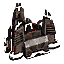

Tech 1 Hydrocarbon Power Plant
----
<table align="right">
    <thead>
        <tr>
            <th align="left" colspan="2">
                <i>Unnamed</i> Tech 1 Hydrocarbon Power Plant
            </th>
        </tr>
    </thead>
    <tbody>
        <tr>
            <td align="right"><strong>Source:</strong></td>
            <td><a href="Forged Alliance Forever">Forged Alliance Forever</a></td>
        </tr>
        <tr>
            <td align="right"><strong>Unit ID:</strong></td>
            <td><a href="https://github.com/FAForever/fa/D:/faf-development/fa/units/URB1102/URB1102_unit.bp"><code>urb1102</code></a></td>
        </tr>
        <tr>
            <td align="right"><strong>Faction:</strong></td>
            <td><a href="categories.CYBRAN">Cybran</a></td>
        </tr>
        <tr>
            <td align="right"><strong>Tech level:</strong></td>
            <td> 1</td>
        </tr>
        <tr><td align="center" colspan="2"></td></tr>
        <tr>
            <td align="right"><strong>Health:</strong></td>
            <td> 1400 (+5/s)</td>
        </tr>
        <tr>
            <td align="right"><strong>Armour:</strong></td>
            <td><code>Structure</code></td>
        </tr>
        <tr><td align="center" colspan="2"></td></tr>
        <tr>
            <td align="right"><strong>Build restriction:</strong></td>
            <td> Hydrocarbon</td>
        </tr>
        <tr>
            <td align="right"><strong>Energy cost:</strong></td>
            <td> 800</td>
        </tr>
        <tr>
            <td align="right"><strong>Mass cost:</strong></td>
            <td> 160</td>
        </tr>
        <tr>
            <td align="right"><strong>Build time:</strong></td>
            <td>400 (<a href="#construction">Details</a>)</td>
        </tr>
        <tr>
            <td align="right"><strong>Energy production:</strong></td>
            <td> 100/s</td>
        </tr>
        <tr><td align="center" colspan="2"></td></tr>
        <tr>
            <td align="right"><strong>Vision radius:</strong></td>
            <td> 10 (200 m)</td>
        </tr>
        <tr>
            <td align="right"><strong>Water vision radius:</strong></td>
            <td> 10 (200 m)</td>
        </tr>
        <tr><td align="center" colspan="2"></td></tr>
        <tr>
            <td align="right"><strong>Motion type:</strong></td>
            <td><code>RULEUMT_None</code></td>
        </tr>
        <tr>
            <td align="right"><strong>Buildable layers:</strong></td>
            <td>Land Seabed</td>
        </tr>
        <tr><td align="center" colspan="2"></td></tr>
        <tr>
            <td align="right"><strong>Wreckage:</strong></td>
            <td> 1260  129.6</td>
        </tr>
    </tbody>
</table>

This unnamed unit is a Cybran structure unit included in *Forged Alliance Forever*.
It is classified as a tech 1 hydrocarbon power plant unit.
The build description for this unit is:

<blockquote>Generates 100 energy per second. Must be constructed on hydrocarbon deposits. Construct structures next to Hydrocarbon Power Plant for adjacency bonus.</blockquote>

### Adjacency
This unit counts as `SIZE12` for adjacency effects from other structures. This theoretically means that it can be surrounded by exactly 12 structures the size of a standard tech 1 power generator, which is accurate; meaning it can get the maximum intended buff effects. 

The adjacency bonus `HydrocarbonAdjacencyBuffs` is given by this unit. This affects energy build costs, energy maintenance costs, weapon energy drain, and weapon rate of fire.

<code>STRUCTURE SIZE4</code>

    <table>
        <tr>
            <td align="right"><strong>Energy build costs:</strong></td>
            <td>-1⁄8</td>
        </tr>
        <tr>
            <td align="right"><strong>Energy maintenance costs:</strong></td>
            <td>-1⁄8</td>
        </tr>
        <tr>
            <td align="right"><strong>Weapon energy drain:</strong></td>
            <td>-1⁄20</td>
        </tr>
    </table>

<code>STRUCTURE SIZE8</code>

    <table>
        <tr>
            <td align="right"><strong>Energy build costs:</strong></td>
            <td>-1⁄8</td>
        </tr>
        <tr>
            <td align="right"><strong>Energy maintenance costs:</strong></td>
            <td>-1⁄8</td>
        </tr>
        <tr>
            <td align="right"><strong>Weapon energy drain:</strong></td>
            <td>-1⁄20</td>
        </tr>
        <tr>
            <td align="right"><strong>Weapon rate of fire:</strong></td>
            <td>-1⁄16</td>
        </tr>
    </table>

<code>STRUCTURE SIZE12</code>

    <table>
        <tr>
            <td align="right"><strong>Energy build costs:</strong></td>
            <td>-1⁄8</td>
        </tr>
        <tr>
            <td align="right"><strong>Energy maintenance costs:</strong></td>
            <td>-1⁄8</td>
        </tr>
        <tr>
            <td align="right"><strong>Weapon energy drain:</strong></td>
            <td>-1⁄20</td>
        </tr>
        <tr>
            <td align="right"><strong>Weapon rate of fire:</strong></td>
            <td>-1⁄16</td>
        </tr>
    </table>

<code>STRUCTURE SIZE16</code>

    <table>
        <tr>
            <td align="right"><strong>Energy build costs:</strong></td>
            <td>-1⁄8</td>
        </tr>
        <tr>
            <td align="right"><strong>Energy maintenance costs:</strong></td>
            <td>-1⁄8</td>
        </tr>
        <tr>
            <td align="right"><strong>Weapon energy drain:</strong></td>
            <td>-1⁄20</td>
        </tr>
        <tr>
            <td align="right"><strong>Weapon rate of fire:</strong></td>
            <td>-1⁄16</td>
        </tr>
    </table>

<code>STRUCTURE SIZE20</code>

    <table>
        <tr>
            <td align="right"><strong>Energy build costs:</strong></td>
            <td>-1⁄8</td>
        </tr>
        <tr>
            <td align="right"><strong>Energy maintenance costs:</strong></td>
            <td>-1⁄8</td>
        </tr>
        <tr>
            <td align="right"><strong>Weapon energy drain:</strong></td>
            <td>-1⁄20</td>
        </tr>
        <tr>
            <td align="right"><strong>Weapon rate of fire:</strong></td>
            <td>-1⁄40</td>
        </tr>
    </table>

<code>STRUCTURE SIZE4 ARTILLERY</code>

    <table>
        <tr>
            <td align="right"><strong>Weapon rate of fire:</strong></td>
            <td>-1⁄16</td>
        </tr>
    </table>

### Construction
Build times from the development branch of the game:
*  01:20 ‒  10/s ‒  2/s — Built by <a href="URL0105">Tech 1 Engineer</a>
*  00:30 ‒  26/s ‒  5/s — Built by <a href="URL0208">Tech 2 Engineer</a>
*  00:07 ‒  112/s ‒  22/s — Built by <a href="URL0301">Tech 3 Support Armored Command Unit</a>
*  00:12 ‒  65/s ‒  13/s — Built by <a href="URL0309">Tech 3 Engineer</a>
*  00:40 ‒  20/s ‒  4/s — Built by <a href="URL0001">Armored Command Unit</a>
*  1111:06:40 ‒  0/s ‒  0/s — Built by <a href="URA0001">Build Bot Effect</a>

<table align="center">
<td width="1215px">Categories : 
<a href="categories.CYBRAN">CYBRAN</a> · 
<a href="_categories.TECH1">TECH1</a> · 
<a href="_categories.ECONOMIC">ECONOMIC</a> · 
<a href="_categories.STRUCTURE">STRUCTURE</a></td>
</table>
