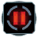

"Noah": Tech 1 Sonar System
----
<table align="right">
    <thead>
        <tr>
            <th align="left" colspan="2">
                Noah Tech 1 Sonar System
            </th>
        </tr>
    </thead>
    <tbody>
        <tr>
            <td align="right"><strong>Source:</strong></td>
            <td><a href="Forged Alliance Forever">Forged Alliance Forever</a></td>
        </tr>
        <tr>
            <td align="right"><strong>Unit ID:</strong></td>
            <td><a href="https://github.com/FAForever/fa/D:/faf-development/fa/units/URB3102/URB3102_unit.bp"><code>urb3102</code></a></td>
        </tr>
        <tr>
            <td align="right"><strong>Faction:</strong></td>
            <td><a href="categories.CYBRAN">Cybran</a></td>
        </tr>
        <tr>
            <td align="right"><strong>Tech level:</strong></td>
            <td> 1</td>
        </tr>
        <tr><td align="center" colspan="2"></td></tr>
        <tr>
            <td align="right"><strong>Health:</strong></td>
            <td> 400</td>
        </tr>
        <tr>
            <td align="right"><strong>Armour:</strong></td>
            <td><code>Structure</code></td>
        </tr>
        <tr><td align="center" colspan="2"></td></tr>
        <tr>
            <td align="right"><strong>Energy cost:</strong></td>
            <td> 1250</td>
        </tr>
        <tr>
            <td align="right"><strong>Mass cost:</strong></td>
            <td> 150</td>
        </tr>
        <tr>
            <td align="right"><strong>Build time:</strong></td>
            <td>125 (<a href="#construction">Details</a>)</td>
        </tr>
        <tr>
            <td align="right"><strong>Maintenance cost:</strong></td>
            <td> 20/s</td>
        </tr>
        <tr>
            <td align="right"><strong>Build rate:</strong></td>
            <td> 13</td>
        </tr>
        <tr><td align="center" colspan="2"></td></tr>
        <tr>
            <td align="right"><strong>Vision radius:</strong></td>
            <td> 20 (400 m)</td>
        </tr>
        <tr>
            <td align="right"><strong>Water vision radius:</strong></td>
            <td> 10 (200 m)</td>
        </tr>
        <tr>
            <td align="right"><strong>Sonar radius:</strong></td>
            <td> 160 (3.2 km)</td>
        </tr>
        <tr><td align="center" colspan="2"></td></tr>
        <tr>
            <td align="right"><strong>Motion type:</strong></td>
            <td><code>RULEUMT_None</code></td>
        </tr>
        <tr>
            <td align="right"><strong>Buildable layers:</strong></td>
            <td>water</td>
        </tr>
        <tr><td align="center" colspan="2"></td></tr>
        <tr>
            <td align="right"><strong>Wreckage:</strong></td>
            <td> 360  121.5</td>
        </tr>
    </tbody>
</table>

"Noah" is a Cybran structure unit included in *Forged Alliance Forever*.
It is classified as a tech 1 sonar system unit.
The build description for this unit is:

<blockquote>Short range Sonar system which detects submerged and surface units. Cannot detect hovering or stealth units.</blockquote>

Contents

1. – <a href="#abilities">Abilities</a>
2. – <a href="#adjacency">Adjacency</a>
3. – <a href="#construction">Construction</a>
4. – <a href="#order-capabilities">Order capabilities</a>
5. – <a href="#engineering">Engineering</a>

### Abilities
Hover over abilities to see effect descriptions.

* Sonar
* Upgradable

### Adjacency
This unit counts as `SIZE4` for adjacency effects from other structures. This theoretically means that it can be surrounded by exactly 4 structures the size of a standard tech 1 power generator, which is accurate; meaning it can get the maximum intended buff effects. 

### Construction
Build times from the development branch of the game:
*  00:25 ‒  50/s ‒  6/s — Built by <a href="URL0105">Tech 1 Engineer</a>
*  00:09 ‒  130/s ‒  16/s — Built by <a href="URL0208">Tech 2 Engineer</a>
*  00:02 ‒  560/s ‒  67/s — Built by <a href="URL0301">Tech 3 Support Armored Command Unit</a>
*  00:03 ‒  325/s ‒  39/s — Built by <a href="URL0309">Tech 3 Engineer</a>
*  00:12 ‒  100/s ‒  12/s — Built by <a href="URL0001">Armored Command Unit</a>
*  347:13:20 ‒  0/s ‒  0/s — Built by <a href="URA0001">Build Bot Effect</a>

### Order capabilities
The following orders can be issued to the unit:
<table>
<td></td>
<td></td>
</table>

### Engineering
It can be upgraded into the <a href="URB3202">Tech 2 Sonar System</a>.

<table align="center">
<td width="1215px">Categories : 
<a href="categories.CYBRAN">CYBRAN</a> · 
<a href="_categories.TECH1">TECH1</a> · 
<a href="_categories.STRUCTURE">STRUCTURE</a></td>
</table>
