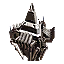

"Flood": Tech 2 Sonar System
----
<table align="right">
    <thead>
        <tr>
            <th align="left" colspan="2">
                Flood Tech 2 Sonar System
            </th>
        </tr>
    </thead>
    <tbody>
        <tr>
            <td align="right"><strong>Source:</strong></td>
            <td><a href="Forged Alliance Forever">Forged Alliance Forever</a></td>
        </tr>
        <tr>
            <td align="right"><strong>Unit ID:</strong></td>
            <td><a href="https://github.com/FAForever/fa/D:/faf-development/fa/units/URB3202/URB3202_unit.bp"><code>urb3202</code></a></td>
        </tr>
        <tr>
            <td align="right"><strong>Faction:</strong></td>
            <td><a href="_categories.CYBRAN">Cybran</a></td>
        </tr>
        <tr>
            <td align="right"><strong>Tech level:</strong></td>
            <td> 2</td>
        </tr>
        <tr><td align="center" colspan="2"></td></tr>
        <tr>
            <td align="right"><strong>Health:</strong></td>
            <td> 800</td>
        </tr>
        <tr>
            <td align="right"><strong>Armour:</strong></td>
            <td><code>Structure</code></td>
        </tr>
        <tr><td align="center" colspan="2"></td></tr>
        <tr>
            <td align="right"><strong>Energy cost:</strong></td>
            <td> 7200</td>
        </tr>
        <tr>
            <td align="right"><strong>Mass cost:</strong></td>
            <td> 300</td>
        </tr>
        <tr>
            <td align="right"><strong>Build time:</strong></td>
            <td>780 (<a href="#construction">Details</a>)</td>
        </tr>
        <tr>
            <td align="right"><strong>Maintenance cost:</strong></td>
            <td> 100/s</td>
        </tr>
        <tr>
            <td align="right"><strong>Build rate:</strong></td>
            <td> 20</td>
        </tr>
        <tr><td align="center" colspan="2"></td></tr>
        <tr>
            <td align="right"><strong>Vision radius:</strong></td>
            <td> 24 (480 m)</td>
        </tr>
        <tr>
            <td align="right"><strong>Water vision radius:</strong></td>
            <td> 10 (200 m)</td>
        </tr>
        <tr>
            <td align="right"><strong>Sonar radius:</strong></td>
            <td> 288 (5.76 km)</td>
        </tr>
        <tr><td align="center" colspan="2"></td></tr>
        <tr>
            <td align="right"><strong>Motion type:</strong></td>
            <td><code>RULEUMT_None</code></td>
        </tr>
        <tr>
            <td align="right"><strong>Buildable layers:</strong></td>
            <td>water</td>
        </tr>
        <tr><td align="center" colspan="2"></td></tr>
        <tr>
            <td align="right"><strong>Wreckage:</strong></td>
            <td> 720  243</td>
        </tr>
    </tbody>
</table>

"Flood" is a Cybran structure unit included in *Forged Alliance Forever*.
It is classified as a tech 2 sonar system unit.
The build description for this unit is:

<blockquote>Medium range Sonar system which detects submerged and surface units. Cannot detect hovering or stealth units.</blockquote>

Contents

1. – <a href="#abilities">Abilities</a>
2. – <a href="#adjacency">Adjacency</a>
3. – <a href="#construction">Construction</a>
4. – <a href="#order-capabilities">Order capabilities</a>
5. – <a href="#engineering">Engineering</a>

### Abilities
Hover over abilities to see effect descriptions.

* Sonar
* Upgradable

### Adjacency
This unit counts as `SIZE4` for adjacency effects from other structures. This theoretically means that it can be surrounded by exactly 4 structures the size of a standard tech 1 power generator, which is accurate; meaning it can get the maximum intended buff effects. 

### Construction
Build times from the development branch of the game:
*  01:00 ‒  120/s ‒  5/s — Upgrade from <a href="URB3102">Tech 1 Sonar System</a>
*  01:00 ‒  120/s ‒  5/s — Built by <a href="URL0208">Tech 2 Engineer</a>
*  00:13 ‒  517/s ‒  22/s — Built by <a href="URL0301">Tech 3 Support Armored Command Unit</a>
*  00:24 ‒  300/s ‒  13/s — Built by <a href="URL0309">Tech 3 Engineer</a>
*  01:18 ‒  92/s ‒  4/s — Built by <a href="URL0001">Armored Command Unit</a>

### Order capabilities
The following orders can be issued to the unit:
<table>
<td></td>
<td></td>
</table>

### Engineering
It can be upgraded into the <a href="URS0305">Tech 3 Sonar Platform</a>.

<table align="center">
<td width="1215px">Categories : 
<a href="_categories.CYBRAN">CYBRAN</a> · 
<a href="_categories.TECH2">TECH2</a> · 
<a href="_categories.STRUCTURE">STRUCTURE</a></td>
</table>
