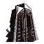

"Guardian": Tech 3 Strategic Missile Defense
----
<table align="right">
    <thead>
        <tr>
            <th align="left" colspan="2">
                Guardian Tech 3 Strategic Missile Defense
            </th>
        </tr>
    </thead>
    <tbody>
        <tr>
            <td align="right"><strong>Source:</strong></td>
            <td><a href="Forged Alliance Forever">Forged Alliance Forever</a></td>
        </tr>
        <tr>
            <td align="right"><strong>Unit ID:</strong></td>
            <td><a href="https://github.com/FAForever/fa/D:/faf-development/fa/units/URB4302/URB4302_unit.bp"><code>urb4302</code></a></td>
        </tr>
        <tr>
            <td align="right"><strong>Faction:</strong></td>
            <td><a href="categories.CYBRAN">Cybran</a></td>
        </tr>
        <tr>
            <td align="right"><strong>Tech level:</strong></td>
            <td> 3</td>
        </tr>
        <tr><td align="center" colspan="2"></td></tr>
        <tr>
            <td align="right"><strong>Health:</strong></td>
            <td> 3800</td>
        </tr>
        <tr>
            <td align="right"><strong>Armour:</strong></td>
            <td><code>Structure</code></td>
        </tr>
        <tr><td align="center" colspan="2"></td></tr>
        <tr>
            <td align="right"><strong>Energy cost:</strong></td>
            <td> 105000</td>
        </tr>
        <tr>
            <td align="right"><strong>Mass cost:</strong></td>
            <td> 7500</td>
        </tr>
        <tr>
            <td align="right"><strong>Build time:</strong></td>
            <td>5841 (<a href="#construction">Details</a>)</td>
        </tr>
        <tr>
            <td align="right"><strong>Build rate:</strong></td>
            <td> 1080</td>
        </tr>
        <tr><td align="center" colspan="2"></td></tr>
        <tr>
            <td align="right"><strong>Vision radius:</strong></td>
            <td> 20 (400 m)</td>
        </tr>
        <tr>
            <td align="right"><strong>Water vision radius:</strong></td>
            <td> 10 (200 m)</td>
        </tr>
        <tr><td align="center" colspan="2"></td></tr>
        <tr>
            <td align="right"><strong>Motion type:</strong></td>
            <td><code>RULEUMT_None</code></td>
        </tr>
        <tr>
            <td align="right"><strong>Buildable layers:</strong></td>
            <td>Land</td>
        </tr>
        <tr><td align="center" colspan="2"></td></tr>
        <tr>
            <td align="right"><strong>Weapons:</strong></td>
            <td>1 (<a href="#weapons">Details</a>)</td>
        </tr>
        <tr>
            <td align="right"><strong>Wreckage:</strong></td>
            <td> 3420  6075</td>
        </tr>
    </tbody>
</table>

"Guardian" is a Cybran structure unit included in *Forged Alliance Forever*.
It is classified as a tech 3 strategic missile defense unit.
The build description for this unit is:

<blockquote>Strategic Missile defense Silo. Automatically builds countermeasures against Strategic Missiles. Fires at passing Strategic Missiles even if their target is not inside the circle.</blockquote>

Contents

1. – <a href="#abilities">Abilities</a>
2. – <a href="#adjacency">Adjacency</a>
3. – <a href="#construction">Construction</a>
4. – <a href="#order-capabilities">Order capabilities</a>
5. – <a href="#weapons">Weapons</a>

### Abilities
Hover over abilities to see effect descriptions.

* Strategic Missile Defense

### Adjacency
This unit counts as `SIZE8` for adjacency effects from other structures. This theoretically means that it can be surrounded by exactly 8 structures the size of a standard tech 1 power generator, however it is actually smaller; meaning it receives 50.0% weaker buffs than a standard structure of the same skirt size. 

### Construction
Build times from the development branch of the game:
*  01:44 ‒  1007/s ‒  72/s — Built by <a href="URL0301">Tech 3 Support Armored Command Unit</a>
*  02:59 ‒  584/s ‒  42/s — Built by <a href="URL0309">Tech 3 Engineer</a>
*  09:44 ‒  180/s ‒  13/s — Built by <a href="URL0001">Armored Command Unit</a>

### Order capabilities
The following orders can be issued to the unit:
<table>
<td></td>
<td></td>
<tr>
<td></td>
<td></td>
</table>

### Weapons

EMP Anti Nuke

    <table>
        <tr>
            <td align="right"><strong>Target type:</strong></td>
            <td><code>RULEWTT_Projectile</code> (Anti-strategic)</td>
        </tr>
        <tr>
            <td align="right"><strong>Projectile:</strong></td>
            <td><a href="Projectiles#caa-dissident-anti-nuke-01"><code>CAADissidentAntiNuke01</code></a></td>
        </tr>
        <tr>
            <td align="right"><strong>Damage:</strong></td>
            <td>30000 (<u>?</u>)</td>
        </tr>
        <tr>
            <td align="right"><strong>Damage type:</strong></td>
            <td><code>Normal</code></td>
        </tr>
        <tr>
            <td align="right"><strong>Max range:</strong></td>
            <td> 90 (1.8 km)</td>
        </tr>
        <tr>
            <td align="right"><strong>Firing cycle:</strong></td>
            <td>Once every 1.7s (<u>?</u>)</td>
        </tr>
        <tr>
            <td align="right"><strong>Projectile storage:</strong></td>
            <td>0/7</td>
        </tr>
    </table>

<table align="center">
<td width="1215px">Categories : 
<a href="categories.CYBRAN">CYBRAN</a> · 
<a href="_categories.TECH3">TECH3</a> · 
<a href="_categories.SILO">SILO</a> · 
<a href="_categories.STRUCTURE">STRUCTURE</a></td>
</table>
