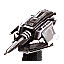
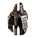

Armored Command Unit
----
<table align="right">
    <thead>
        <tr>
            <th align="left" colspan="2">
                <i>Unnamed</i> Armored Command Unit
            </th>
        </tr>
    </thead>
    <tbody>
        <tr>
            <td align="right"><strong>Source:</strong></td>
            <td><a href="Forged Alliance Forever">Forged Alliance Forever</a></td>
        </tr>
        <tr>
            <td align="right"><strong>Unit ID:</strong></td>
            <td><a href="https://github.com/FAForever/fa/D:/faf-development/fa/units/URL0001/URL0001_unit.bp"><code>url0001</code></a></td>
        </tr>
        <tr>
            <td align="right"><strong>Faction:</strong></td>
            <td><a href="categories.CYBRAN">Cybran</a></td>
        </tr>
        <tr><td align="center" colspan="2"></td></tr>
        <tr>
            <td align="right"><strong>Health:</strong></td>
            <td> 10000 (+18/s)</td>
        </tr>
        <tr>
            <td align="right"><strong>Armour:</strong></td>
            <td><code>Commander</code></td>
        </tr>
        <tr><td align="center" colspan="2"></td></tr>
        <tr>
            <td align="right"><strong>Energy cost:</strong></td>
            <td> 5000000</td>
        </tr>
        <tr>
            <td align="right"><strong>Mass cost:</strong></td>
            <td> 2000</td>
        </tr>
        <tr>
            <td align="right"><strong>Build time:</strong></td>
            <td>6000000</td>
        </tr>
        <tr>
            <td align="right"><strong>Maintenance cost:</strong></td>
            <td> 0/s</td>
        </tr>
        <tr>
            <td align="right"><strong>Build rate:</strong></td>
            <td> 10</td>
        </tr>
        <tr>
            <td align="right"><strong>Energy production:</strong></td>
            <td> 20/s</td>
        </tr>
        <tr>
            <td align="right"><strong>Mass production:</strong></td>
            <td> 1/s</td>
        </tr>
        <tr>
            <td align="right"><strong>Energy storage:</strong></td>
            <td> 3900</td>
        </tr>
        <tr>
            <td align="right"><strong>Mass storage:</strong></td>
            <td> 650</td>
        </tr>
        <tr><td align="center" colspan="2"></td></tr>
        <tr>
            <td align="right"><strong>Vision radius:</strong></td>
            <td> 26 (0.52 km)</td>
        </tr>
        <tr>
            <td align="right"><strong>Water vision radius:</strong></td>
            <td> 24 (480 m)</td>
        </tr>
        <tr>
            <td align="right"><strong>Sonar radius:</strong></td>
            <td> 24 (480 m)</td>
        </tr>
        <tr>
            <td align="right"><strong>Omni radius:</strong></td>
            <td> 24 (480 m)</td>
        </tr>
        <tr>
            <td align="right"><strong>Flags:</strong></td>
            <td>Cloak Radar stealth Sonar stealth</td>
        </tr>
        <tr><td align="center" colspan="2"></td></tr>
        <tr>
            <td align="right"><strong>Motion type:</strong></td>
            <td><code>RULEUMT_Amphibious</code></td>
        </tr>
        <tr>
            <td align="right"><strong>Movement speed:</strong></td>
            <td> 1.7 (34 m/s)</td>
        </tr>
        <tr>
            <td align="right"><strong>Transport class:</strong></td>
            <td> Large</td>
        </tr>
        <tr><td align="center" colspan="2"></td></tr>
        <tr>
            <td align="right"><strong>Weapons:</strong></td>
            <td>8 (<a href="#weapons">Details</a>)</td>
        </tr>
    </tbody>
</table>

This unnamed unit is a Cybran seabed amphibious unit included in *Forged Alliance Forever*.
It is classified as a armored command unit unit with no defined tech level.
This unit has no categories to define common builders, however the build description for it is:

<blockquote>The Armored Command Unit (ACU) is a combination of barracks and command center. Contains all the blueprints necessary to build a basic army from scratch. Upgradeable with combat enhancements, advanced engineering suites, resource allocation system, and teleportation. Lightly armoured, but with high Regeneration rate.</blockquote>

Contents

1. – <a href="#abilities">Abilities</a>
2. – <a href="#order-capabilities">Order capabilities</a>
3. – <a href="#engineering">Engineering</a>
4. – <a href="#enhancements">Enhancements</a>
5. – <a href="#weapons">Weapons</a>
6. – <a href="#veteran-levels">Veteran levels</a>

### Abilities
Hover over abilities to see effect descriptions.

* Amphibious
* Customizable
* Engineering Suite
* Not Capturable
* Omni Sensor
* Volatile

### Order capabilities
The following orders can be issued to the unit:
<table>
<td></td>
<td></td>
<td></td>
<td></td>
<td></td>
<td></td>
<tr>
<td></td>
<td></td>
<td></td>
<td></td>
<td></td>
<td></td>
</table>

### Engineering
The engineering capabilties of this unit consist of the ability to capture, reclaim, and repair.
It has the build categories:
* <code>BUILTBYCOMMANDER CYBRAN</code>
* <code>BUILTBYTIER2COMMANDER CYBRAN</code>
* <code>BUILTBYTIER3COMMANDER CYBRAN</code>
* <code>URL0001UPGRADE</code>

These build categories allow it to build the following mod units:

<table>
    <tr>
        <td rowspan="2"></td>
        <td></td>
        <td></td>
        <td></td>
        <td></td>
        <td></td>
        <td></td>
        <td></td>
        <td></td>
    </tr>
    <tr>
        <td></td>
        <td></td>
        <td></td>
        <td></td>
        <td></td>
        <td></td>
        <td></td>
    </tr>
    <tr>
        <td rowspan="3"></td>
        <td></td>
        <td></td>
        <td></td>
        <td></td>
        <td></td>
        <td></td>
        <td></td>
        <td></td>
    </tr>
    <tr>
        <td></td>
        <td></td>
        <td></td>
        <td></td>
        <td></td>
        <td></td>
        <td></td>
        <td></td>
    </tr>
    <tr>
        <td></td>
    </tr>
    <tr>
        <td rowspan="2"></td>
        <td></td>
        <td></td>
        <td></td>
        <td></td>
        <td></td>
        <td></td>
        <td></td>
        <td></td>
    </tr>
    <tr>
        <td></td>
        <td></td>
        <td></td>
        <td></td>
        <td></td>
        <td></td>
        <td></td>
        <td></td>
    </tr>
    <tr>
        <td></td>
        <td></td>
        <td></td>
        <td></td>
        <td></td>
    </tr>
</table>

### Enhancements

#### Back

Resource Allocation System

    <table>
        <tr>
            <td align="right"><strong>Description:</strong></td>
            <td>Increases ACU's resource generation to 13 mass per second and 2720 energy per second.</td>
        </tr>
        <tr>
            <td align="right"><strong>Energy cost:</strong></td>
            <td> 175000</td>
        </tr>
        <tr>
            <td align="right"><strong>Mass cost:</strong></td>
            <td> 5000</td>
        </tr>
        <tr>
            <td align="right"><strong>Build time:</strong></td>
            <td> 280 seconds</td>
        </tr>
        <tr>
            <td align="right"><strong>Prerequisite:</strong></td>
            <td>None</td>
        </tr>
    </table>

Personal Stealth Generator

    <table>
        <tr>
            <td align="right"><strong>Description:</strong></td>
            <td>Personal Stealth hiding the ACU from radar. Countered by omni sensors. Costs energy to run.

+2000 Health</td>
        </tr>
        <tr>
            <td align="right"><strong>Energy cost:</strong></td>
            <td> 14000</td>
        </tr>
        <tr>
            <td align="right"><strong>Mass cost:</strong></td>
            <td> 650</td>
        </tr>
        <tr>
            <td align="right"><strong>Build time:</strong></td>
            <td> 80 seconds</td>
        </tr>
        <tr>
            <td align="right"><strong>Prerequisite:</strong></td>
            <td>None</td>
        </tr>
    </table>

Nano-Repair System

    <table>
        <tr>
            <td align="right"><strong>Description:</strong></td>
            <td>Massively increases the rate at which the ACU repairs its armour.

+1500 Health
+60 Regen</td>
        </tr>
        <tr>
            <td align="right"><strong>Energy cost:</strong></td>
            <td> 45000</td>
        </tr>
        <tr>
            <td align="right"><strong>Mass cost:</strong></td>
            <td> 1500</td>
        </tr>
        <tr>
            <td align="right"><strong>Build time:</strong></td>
            <td> 150 seconds</td>
        </tr>
        <tr>
            <td align="right"><strong>Prerequisite:</strong></td>
            <td>Personal Stealth Generator</td>
        </tr>
    </table>

Personal Cloaking Generator

    <table>
        <tr>
            <td align="right"><strong>Description:</strong></td>
            <td>Personal Cloaking further hiding the ACU from optical sensors and massively boosts HP. Countered by omni sensors. Costs a large amount of energy to run.

+12000 Health</td>
        </tr>
        <tr>
            <td align="right"><strong>Energy cost:</strong></td>
            <td> 750000</td>
        </tr>
        <tr>
            <td align="right"><strong>Mass cost:</strong></td>
            <td> 6000</td>
        </tr>
        <tr>
            <td align="right"><strong>Build time:</strong></td>
            <td> 420 seconds</td>
        </tr>
        <tr>
            <td align="right"><strong>Prerequisite:</strong></td>
            <td>Nano-Repair System</td>
        </tr>
    </table>

Personal Teleporter

    <table>
        <tr>
            <td align="right"><strong>Description:</strong></td>
            <td>Adds Teleportation capability. Requires considerable energy to activate.</td>
        </tr>
        <tr>
            <td align="right"><strong>Energy cost:</strong></td>
            <td> 1500000</td>
        </tr>
        <tr>
            <td align="right"><strong>Mass cost:</strong></td>
            <td> 15000</td>
        </tr>
        <tr>
            <td align="right"><strong>Build time:</strong></td>
            <td> 420 seconds</td>
        </tr>
        <tr>
            <td align="right"><strong>Prerequisite:</strong></td>
            <td>None</td>
        </tr>
    </table>

#### Left Arm

Tech 2 Engineering Suite

    <table>
        <tr>
            <td align="right"><strong>Description:</strong></td>
            <td>Grants Tech 2 schematic access and increases the ACU's build speed and maximum health.

+32 Buildpower
+2000 Health
+10 Regen</td>
        </tr>
        <tr>
            <td align="right"><strong>Energy cost:</strong></td>
            <td> 21000</td>
        </tr>
        <tr>
            <td align="right"><strong>Mass cost:</strong></td>
            <td> 800</td>
        </tr>
        <tr>
            <td align="right"><strong>Build time:</strong></td>
            <td> 100 seconds</td>
        </tr>
        <tr>
            <td align="right"><strong>Prerequisite:</strong></td>
            <td>None</td>
        </tr>
    </table>

Tech 3 Engineering Suite

    <table>
        <tr>
            <td align="right"><strong>Description:</strong></td>
            <td>Grants Tech 3 and Experimental schematic access and further increases the ACU's build speed and maximum health.

+58 Buildpower
+1500 Health
+10 Regen</td>
        </tr>
        <tr>
            <td align="right"><strong>Energy cost:</strong></td>
            <td> 50000</td>
        </tr>
        <tr>
            <td align="right"><strong>Mass cost:</strong></td>
            <td> 2400</td>
        </tr>
        <tr>
            <td align="right"><strong>Build time:</strong></td>
            <td> 840 seconds</td>
        </tr>
        <tr>
            <td align="right"><strong>Prerequisite:</strong></td>
            <td>Tech 2 Engineering Suite</td>
        </tr>
    </table>

Microwave Accelerator

    <table>
        <tr>
            <td align="right"><strong>Description:</strong></td>
            <td>Doubles the main cannon's rate of fire, and increases its range and that of Overcharge. Increases the range of the Microwave Laser if present.

+100% Main cannon rate of fire
+8 Main cannon range
+8 Microwave Laser range</td>
        </tr>
        <tr>
            <td align="right"><strong>Energy cost:</strong></td>
            <td> 24000</td>
        </tr>
        <tr>
            <td align="right"><strong>Mass cost:</strong></td>
            <td> 800</td>
        </tr>
        <tr>
            <td align="right"><strong>Build time:</strong></td>
            <td> 80 seconds</td>
        </tr>
        <tr>
            <td align="right"><strong>Prerequisite:</strong></td>
            <td>None</td>
        </tr>
    </table>

#### Right Arm

Microwave Laser Generator

    <table>
        <tr>
            <td align="right"><strong>Description:</strong></td>
            <td>Enhances the ACU with a Microwave Laser weapon with unbelievable firepower.

Microwave Laser DPS = 3000</td>
        </tr>
        <tr>
            <td align="right"><strong>Energy cost:</strong></td>
            <td> 500000</td>
        </tr>
        <tr>
            <td align="right"><strong>Mass cost:</strong></td>
            <td> 4000</td>
        </tr>
        <tr>
            <td align="right"><strong>Build time:</strong></td>
            <td> 280 seconds</td>
        </tr>
        <tr>
            <td align="right"><strong>Prerequisite:</strong></td>
            <td>None</td>
        </tr>
    </table>

Nanite Torpedo Launcher

    <table>
        <tr>
            <td align="right"><strong>Description:</strong></td>
            <td>Enhances the ACU with a torpedo weapon and sonar sensor.

Nanite Torpedo DPS = 250
Nanite Torpedo range = 60
+34 Sonar Radius</td>
        </tr>
        <tr>
            <td align="right"><strong>Energy cost:</strong></td>
            <td> 37500</td>
        </tr>
        <tr>
            <td align="right"><strong>Mass cost:</strong></td>
            <td> 1500</td>
        </tr>
        <tr>
            <td align="right"><strong>Build time:</strong></td>
            <td> 150 seconds</td>
        </tr>
        <tr>
            <td align="right"><strong>Prerequisite:</strong></td>
            <td>None</td>
        </tr>
    </table>

### Weapons

DummyWeapon

    <table>
        <tr>
            <td align="right"><strong>Target type:</strong></td>
            <td><code>RULEWTT_Unit</code> (Anti-Ship, Seabed, &amp; Land)</td>
        </tr>
        <tr>
            <td align="right"><strong>Damage:</strong></td>
            <td>0 (<u>?</u>)</td>
        </tr>
        <tr>
            <td align="right"><strong>Max range:</strong></td>
            <td> 22 (440 m)</td>
        </tr>
        <tr>
            <td align="right"><strong>Firing cycle:</strong></td>
            <td>Once every 2.0s (<u>?</u>)</td>
        </tr>
    </table>

Molecular Ripper Cannon

    <table>
        <tr>
            <td align="right"><strong>Target type:</strong></td>
            <td><code>RULEWTT_Unit</code> (Anti-Surface)</td>
        </tr>
        <tr>
            <td align="right"><strong>Projectile:</strong></td>
            <td><a href="Projectiles#cdf-cannon-molecular-01"><code>CDFCannonMolecular01</code></a></td>
        </tr>
        <tr>
            <td align="right"><strong>DPS estimate:</strong></td>
            <td>100 (<u>?</u>)</td>
        </tr>
        <tr>
            <td align="right"><strong>Damage:</strong></td>
            <td>100 (<u>?</u>)</td>
        </tr>
        <tr>
            <td align="right"><strong>Damage type:</strong></td>
            <td><code>Normal</code></td>
        </tr>
        <tr>
            <td align="right"><strong>Max range:</strong></td>
            <td> 22 (440 m)</td>
        </tr>
        <tr>
            <td align="right"><strong>Min range:</strong></td>
            <td> 1 (20 m)</td>
        </tr>
        <tr>
            <td align="right"><strong>Firing cycle:</strong></td>
            <td>Once every 1.0s (<u>?</u>)</td>
        </tr>
    </table>

Overcharge Cannon

    <table>
        <tr>
            <td align="right"><strong>Target type:</strong></td>
            <td><code>RULEWTT_Unit</code> (Anti-Surface)</td>
        </tr>
        <tr>
            <td align="right"><strong>Projectile:</strong></td>
            <td><a href="Projectiles#cdf-cannon-molecular-overcharge-01"><code>CDFCannonMolecularOvercharge01</code></a></td>
        </tr>
        <tr>
            <td align="right"><strong>DPS estimate:</strong></td>
            <td>4545 (<u>?</u>)</td>
        </tr>
        <tr>
            <td align="right"><strong>Damage:</strong></td>
            <td>15000 (<u>?</u>)</td>
        </tr>
        <tr>
            <td align="right"><strong>Damage radius:</strong></td>
            <td> 2.5 (50 m)</td>
        </tr>
        <tr>
            <td align="right"><strong>Damage type:</strong></td>
            <td><code>Overcharge</code></td>
        </tr>
        <tr>
            <td align="right"><strong>Max range:</strong></td>
            <td> 22 (440 m)</td>
        </tr>
        <tr>
            <td align="right"><strong>Firing cycle:</strong></td>
            <td>Once every 3.3s (<u>?</u>)</td>
        </tr>
        <tr>
            <td align="right"><strong>Firing cost:</strong></td>
            <td> 7500</td>
        </tr>
    </table>

AutoOvercharge Cannon

    <table>
        <tr>
            <td align="right"><strong>Target type:</strong></td>
            <td><code>RULEWTT_Unit</code> (Anti-Surface)</td>
        </tr>
        <tr>
            <td align="right"><strong>Projectile:</strong></td>
            <td><a href="Projectiles#cdf-cannon-molecular-overcharge-01"><code>CDFCannonMolecularOvercharge01</code></a></td>
        </tr>
        <tr>
            <td align="right"><strong>DPS estimate:</strong></td>
            <td>3000 (<u>?</u>)</td>
        </tr>
        <tr>
            <td align="right"><strong>Damage:</strong></td>
            <td>15000 (<u>?</u>)</td>
        </tr>
        <tr>
            <td align="right"><strong>Damage radius:</strong></td>
            <td> 2.5 (50 m)</td>
        </tr>
        <tr>
            <td align="right"><strong>Damage type:</strong></td>
            <td><code>Overcharge</code></td>
        </tr>
        <tr>
            <td align="right"><strong>Max range:</strong></td>
            <td> 22 (440 m)</td>
        </tr>
        <tr>
            <td align="right"><strong>Firing cycle:</strong></td>
            <td>Once every 5.0s (<u>?</u>)</td>
        </tr>
        <tr>
            <td align="right"><strong>Firing cost:</strong></td>
            <td> 7500</td>
        </tr>
    </table>

Death Nuke

    <table>
        <tr>
            <td align="right"><strong>Projectile:</strong></td>
            <td><a href="Projectiles#cifemp-flux-warhead-02"><code>CIFEMPFluxWarhead02</code></a></td>
        </tr>
        <tr>
            <td align="right"><strong>Damage:</strong></td>
            <td>2000 (<u>?</u>)</td>
        </tr>
        <tr>
            <td align="right"><strong>Damage radius:</strong></td>
            <td> 30 (0.6 km)</td>
        </tr>
        <tr>
            <td align="right"><strong>Outer damage:</strong></td>
            <td>500</td>
        </tr>
        <tr>
            <td align="right"><strong>Outer radius:</strong></td>
            <td> 40 (0.8 km)</td>
        </tr>
        <tr>
            <td align="right"><strong>Damage type:</strong></td>
            <td><code>Deathnuke</code></td>
        </tr>
        <tr>
            <td align="right"><strong>Flags:</strong></td>
            <td>Damage friendly</td>
        </tr>
    </table>

Heavy Microwave Laser

    <table>
        <tr>
            <td align="right"><strong>Target type:</strong></td>
            <td><code>RULEWTT_Unit</code> (Anti-Surface)</td>
        </tr>
        <tr>
            <td align="right"><strong>DPS estimate:</strong></td>
            <td>3000 (<u>?</u>)</td>
        </tr>
        <tr>
            <td align="right"><strong>Damage:</strong></td>
            <td>300 (<u>?</u>)</td>
        </tr>
        <tr>
            <td align="right"><strong>Damage radius:</strong></td>
            <td> 0.5 (10 m)</td>
        </tr>
        <tr>
            <td align="right"><strong>Damage type:</strong></td>
            <td><code>Normal</code></td>
        </tr>
        <tr>
            <td align="right"><strong>Max range:</strong></td>
            <td> 22 (440 m)</td>
        </tr>
        <tr>
            <td align="right"><strong>Firing arc:</strong></td>
            <td>60°</td>
        </tr>
        <tr>
            <td align="right"><strong>Firing cycle:</strong></td>
            <td>Continuous beam Once every 0.1s (<u>?</u>)</td>
        </tr>
    </table>

Nanite Torpedo

    <table>
        <tr>
            <td align="right"><strong>Target type:</strong></td>
            <td><code>RULEWTT_Unit</code> (Anti-Naval)</td>
        </tr>
        <tr>
            <td align="right"><strong>Projectile:</strong></td>
            <td><a href="Projectiles#can-torpedo-nanite-01"><code>CANTorpedoNanite01</code></a></td>
        </tr>
        <tr>
            <td align="right"><strong>DPS estimate:</strong></td>
            <td>250 (<u>?</u>)</td>
        </tr>
        <tr>
            <td align="right"><strong>Damage:</strong></td>
            <td>500 (<u>?</u>)</td>
        </tr>
        <tr>
            <td align="right"><strong>Damage instances:</strong></td>
            <td>2 projectiles</td>
        </tr>
        <tr>
            <td align="right"><strong>Damage type:</strong></td>
            <td><code>Normal</code></td>
        </tr>
        <tr>
            <td align="right"><strong>Max range:</strong></td>
            <td> 60 (1.2 km)</td>
        </tr>
        <tr>
            <td align="right"><strong>Firing cycle:</strong></td>
            <td>Once every 4.0s (<u>?</u>)</td>
        </tr>
    </table>

Teleport in

    <table>
        <tr>
            <td align="right"><strong>Target type:</strong></td>
            <td>Untargeted</td>
        </tr>
        <tr>
            <td align="right"><strong>Damage:</strong></td>
            <td>100 (<u>?</u>)</td>
        </tr>
        <tr>
            <td align="right"><strong>Damage radius:</strong></td>
            <td> 4 (80 m)</td>
        </tr>
        <tr>
            <td align="right"><strong>Damage type:</strong></td>
            <td><code>Normal</code></td>
        </tr>
        <tr>
            <td align="right"><strong>Max range:</strong></td>
            <td> 1 (20 m)</td>
        </tr>
        <tr>
            <td align="right"><strong>Firing cycle:</strong></td>
            <td>Once every 1.0s (<u>?</u>)</td>
        </tr>
        <tr>
            <td align="right"><strong>Flags:</strong></td>
            <td>Damage friendly</td>
        </tr>
    </table>

### Veteran levels
Note: Each veteran level buff replaces the previous by default; values are shown here as written.

1. 20 kills gives:  +1000
2. 40 kills gives:  +2000
3. 65 kills gives:  +3000
4. 90 kills gives:  +4000
5. 120 kills gives:  +5000

<table align="center">
<td width="1215px">Categories : 
<a href="categories.CYBRAN">CYBRAN</a> · 
<a href="_categories.MOBILE">MOBILE</a> · 
<a href="_categories.DIRECTFIRE">DIRECTFIRE</a> · 
<a href="_categories.LAND">LAND</a> · 
<a href="_categories.ECONOMIC">ECONOMIC</a> · 
<a href="_categories.COMMAND">COMMAND</a> · 
<a href="_categories.ENGINEER">ENGINEER</a></td>
</table>
