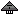

"Solace": Tech 3 Torpedo Bomber
----
<table align="right">
    <thead>
        <tr>
            <th align="left" colspan="2">
                Solace Tech 3 Torpedo Bomber
            </th>
        </tr>
    </thead>
    <tbody>
        <tr>
            <td align="right"><strong>Source:</strong></td>
            <td><a href="Forged Alliance Forever">Forged Alliance Forever</a></td>
        </tr>
        <tr>
            <td align="right"><strong>Unit ID:</strong></td>
            <td><a href="https://github.com/FAForever/fa/D:/faf-development/fa/units/XAA0306/XAA0306_unit.bp"><code>xaa0306</code></a></td>
        </tr>
        <tr>
            <td align="right"><strong>Faction:</strong></td>
            <td><a href="_categories.AEON">Aeon</a></td>
        </tr>
        <tr>
            <td align="right"><strong>Tech level:</strong></td>
            <td> 3</td>
        </tr>
        <tr><td align="center" colspan="2"></td></tr>
        <tr>
            <td align="right"><strong>Health:</strong></td>
            <td> 3750</td>
        </tr>
        <tr>
            <td align="right"><strong>Armour:</strong></td>
            <td><code>Light</code></td>
        </tr>
        <tr><td align="center" colspan="2"></td></tr>
        <tr>
            <td align="right"><strong>Energy cost:</strong></td>
            <td> 55000</td>
        </tr>
        <tr>
            <td align="right"><strong>Mass cost:</strong></td>
            <td> 1650</td>
        </tr>
        <tr>
            <td align="right"><strong>Build time:</strong></td>
            <td>6600 (<a href="#construction">Details</a>)</td>
        </tr>
        <tr><td align="center" colspan="2"></td></tr>
        <tr>
            <td align="right"><strong>Vision radius:</strong></td>
            <td> 32 (0.64 km)</td>
        </tr>
        <tr>
            <td align="right"><strong>Water vision radius:</strong></td>
            <td> 10 (200 m)</td>
        </tr>
        <tr>
            <td align="right"><strong>Sonar radius:</strong></td>
            <td> 88 (1.76 km)</td>
        </tr>
        <tr><td align="center" colspan="2"></td></tr>
        <tr>
            <td align="right"><strong>Motion type:</strong></td>
            <td><code>RULEUMT_Air</code></td>
        </tr>
        <tr>
            <td align="right"><strong>Movement speed:</strong></td>
            <td> 20 (400 m/s)</td>
        </tr>
        <tr>
            <td align="right"><strong>Fuel:</strong></td>
            <td> 20:00</td>
        </tr>
        <tr>
            <td align="right"><strong>Elevation:</strong></td>
            <td>14</td>
        </tr>
        <tr>
            <td align="right"><strong>Transport class:</strong></td>
            <td> Medium</td>
        </tr>
        <tr><td align="center" colspan="2"></td></tr>
        <tr>
            <td align="right"><strong>Weapons:</strong></td>
            <td>2 (<a href="#weapons">Details</a>)</td>
        </tr>
        <tr>
            <td align="right"><strong>Wreckage:</strong></td>
            <td> 3375  1336.5</td>
        </tr>
    </tbody>
</table>

"Solace" is an Aeon aircraft unit included in *Forged Alliance Forever*.
It is classified as a tech 3 torpedo bomber unit.
The build description for this unit is:

<blockquote>High-power Torpedo Bomber, designed to engage heavily armoured naval units.</blockquote>

Contents

1. – <a href="#abilities">Abilities</a>
2. – <a href="#construction">Construction</a>
3. – <a href="#order-capabilities">Order capabilities</a>
4. – <a href="#weapons">Weapons</a>
5. – <a href="#veteran-levels">Veteran levels</a>

### Abilities
Hover over abilities to see effect descriptions.

* Sonar
* Torpedoes

### Construction
Build times from the development branch of the game:
*  00:55 ‒  1000/s ‒  30/s — Built by <a href="UAB0302">Tech 3 Air Factory HQ</a>
*  00:55 ‒  1000/s ‒  30/s — Built by <a href="ZAB9602">Tech 3 Air Factory</a>
*  00:55 ‒  1000/s ‒  30/s — Built by <a href="UAS0303">Tech 3 Aircraft Carrier</a>
*  00:36 ‒  1500/s ‒  45/s — Built by <a href="UAA0310">Experimental Aircraft Carrier</a>

### Order capabilities
The following orders can be issued to the unit:
<table>
<td></td>
<td></td>
<td></td>
<td></td>
<td></td>
<td></td>
<tr>
<td></td>
<td></td>
</table>

### Weapons

Torpedo Cluster

    <table>
        <tr>
            <td align="right"><strong>Target type:</strong></td>
            <td><code>RULEWTT_Unit</code> (Anti-Naval)</td>
        </tr>
        <tr>
            <td align="right"><strong>Projectile:</strong></td>
            <td><a href="Projectiles#aan-torpedo-cluster-01"><code>AANTorpedoCluster01</code></a></td>
        </tr>
        <tr>
            <td align="right"><strong>DPS estimate:</strong></td>
            <td>400 (<u>?</u>)</td>
        </tr>
        <tr>
            <td align="right"><strong>Damage:</strong></td>
            <td>400 (<u>?</u>)</td>
        </tr>
        <tr>
            <td align="right"><strong>Damage instances:</strong></td>
            <td>5 projectiles 2 fragments</td>
        </tr>
        <tr>
            <td align="right"><strong>Damage type:</strong></td>
            <td><code>Normal</code></td>
        </tr>
        <tr>
            <td align="right"><strong>Max range:</strong></td>
            <td> 26 (0.52 km)</td>
        </tr>
        <tr>
            <td align="right"><strong>Min range:</strong></td>
            <td> 4 (80 m)</td>
        </tr>
        <tr>
            <td align="right"><strong>Firing cycle:</strong></td>
            <td>Once every 10.0s (<u>?</u>)</td>
        </tr>
    </table>

Air Crash

    <table>
        <tr>
            <td align="right"><strong>Damage:</strong></td>
            <td>400</td>
        </tr>
        <tr>
            <td align="right"><strong>Damage radius:</strong></td>
            <td> 2 (40 m)</td>
        </tr>
        <tr>
            <td align="right"><strong>Damage type:</strong></td>
            <td><code>Normal</code></td>
        </tr>
        <tr>
            <td align="right"><strong>Flags:</strong></td>
            <td>Damage friendly</td>
        </tr>
    </table>

### Veteran levels
Note: Each veteran level buff replaces the previous by default; values are shown here as written.

1. 4 kills gives:  +375
2. 8 kills gives:  +750
3. 12 kills gives:  +1125
4. 16 kills gives:  +1500
5. 20 kills gives:  +1875

<table align="center">
<td width="1215px">Categories : 
<a href="_categories.AEON">AEON</a> · 
<a href="_categories.TECH3">TECH3</a> · 
<a href="_categories.MOBILE">MOBILE</a> · 
<a href="_categories.ANTINAVY">ANTINAVY</a> · 
<a href="_categories.AIR">AIR</a> · 
<a href="_categories.BOMBER">BOMBER</a></td>
</table>
