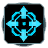

"Novax Center": Experimental Satellite System
----
<table align="right">
    <thead>
        <tr>
            <th align="left" colspan="2">
                Novax Center Experimental Satellite System
            </th>
        </tr>
    </thead>
    <tbody>
        <tr>
            <td align="right"><strong>Source:</strong></td>
            <td><a href="Forged Alliance Forever">Forged Alliance Forever</a></td>
        </tr>
        <tr>
            <td align="right"><strong>Unit ID:</strong></td>
            <td><a href="https://github.com/FAForever/fa/D:/faf-development/fa/units/XEB2402/XEB2402_unit.bp"><code>xeb2402</code></a></td>
        </tr>
        <tr>
            <td align="right"><strong>Faction:</strong></td>
            <td><a href="_categories.UEF">UEF</a></td>
        </tr>
        <tr>
            <td align="right"><strong>Tech level:</strong></td>
            <td> 4 (Experimental)</td>
        </tr>
        <tr><td align="center" colspan="2"></td></tr>
        <tr>
            <td align="right"><strong>Health:</strong></td>
            <td> 9000</td>
        </tr>
        <tr>
            <td align="right"><strong>Armour:</strong></td>
            <td><code>ExperimentalStructure</code></td>
        </tr>
        <tr><td align="center" colspan="2"></td></tr>
        <tr>
            <td align="right"><strong>Energy cost:</strong></td>
            <td> 512000</td>
        </tr>
        <tr>
            <td align="right"><strong>Mass cost:</strong></td>
            <td> 36000</td>
        </tr>
        <tr>
            <td align="right"><strong>Build time:</strong></td>
            <td>44800 (<a href="#construction">Details</a>)</td>
        </tr>
        <tr>
            <td align="right"><strong>Build rate:</strong></td>
            <td> 300</td>
        </tr>
        <tr><td align="center" colspan="2"></td></tr>
        <tr>
            <td align="right"><strong>Vision radius:</strong></td>
            <td> 10 (200 m)</td>
        </tr>
        <tr>
            <td align="right"><strong>Water vision radius:</strong></td>
            <td> 10 (200 m)</td>
        </tr>
        <tr><td align="center" colspan="2"></td></tr>
        <tr>
            <td align="right"><strong>Motion type:</strong></td>
            <td><code>RULEUMT_None</code></td>
        </tr>
        <tr>
            <td align="right"><strong>Buildable layers:</strong></td>
            <td>Land</td>
        </tr>
        <tr><td align="center" colspan="2"></td></tr>
        <tr>
            <td align="right"><strong>Wreckage:</strong></td>
            <td> 8100  29160</td>
        </tr>
    </tbody>
</table>

"Novax Center" is a UEF structure unit included in *Forged Alliance Forever*.
It is classified as a experimental satellite system unit.
The build description for this unit is:

<blockquote>Orbital Laser Bombardment Satellite. The Satellite is untargetable by any weapon, but can be impacted. If the Base Station dies, so does the Satellite.</blockquote>

Contents

1. – <a href="#construction">Construction</a>
2. – <a href="#order-capabilities">Order capabilities</a>
3. – <a href="#engineering">Engineering</a>
4. – <a href="#veteran-levels">Veteran levels</a>

### Construction
Build times from the development branch of the game:
*  13:20 ‒  640/s ‒  45/s — Built by <a href="UEL0301">Tech 3 Support Armored Command Unit</a>
*  22:58 ‒  371/s ‒  26/s — Built by <a href="UEL0309">Tech 3 Engineer</a>
*  21:20 ‒  400/s ‒  28/s — Built by <a href="UEA0003">Tech 3 Engineering Drone</a>
*  1:14:40 ‒  114/s ‒  8/s — Built by <a href="UEL0001">Armored Command Unit</a>

### Order capabilities
The following orders can be issued to the unit:
<table>
<td></td>
<td></td>
<td></td>
<tr>
<td></td>
</table>

### Engineering
It has the build category <code>SATELLITE</code>. This build category allows it to build the mod unit <a href="XEA0002">Defense Satellite</a>.

### Veteran levels
This unit has defined veteran levels, despite not having any weapons. Other effects can still give experience towards those levels though, which are as follows; note they replace each other by default:

1. 25 kills gives:  +900
2. 50 kills gives:  +1800
3. 75 kills gives:  +2700
4. 100 kills gives:  +3600
5. 125 kills gives:  +4500

<table align="center">
<td width="1215px">Categories : 
<a href="_categories.UEF">UEF</a> · 
<a href="_categories.EXPERIMENTAL">EXPERIMENTAL</a> · 
<a href="_categories.AIR">AIR</a> · 
<a href="_categories.FACTORY">FACTORY</a> · 
<a href="_categories.STRUCTURE">STRUCTURE</a></td>
</table>
