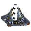

"Vishuyal": Tech 1 Energy Storage
----
<table align="right">
    <thead>
        <tr>
            <th align="left" colspan="2">
                Vishuyal Tech 1 Energy Storage
            </th>
        </tr>
    </thead>
    <tbody>
        <tr>
            <td align="right"><strong>Source:</strong></td>
            <td><a href="Forged Alliance Forever">Forged Alliance Forever</a></td>
        </tr>
        <tr>
            <td align="right"><strong>Unit ID:</strong></td>
            <td><a href="https://github.com/FAForever/fa/D:/faf-development/fa/units/XSB1105/XSB1105_unit.bp"><code>xsb1105</code></a></td>
        </tr>
        <tr>
            <td align="right"><strong>Faction:</strong></td>
            <td><a href="_categories.SERAPHIM">Seraphim</a></td>
        </tr>
        <tr>
            <td align="right"><strong>Tech level:</strong></td>
            <td> 1</td>
        </tr>
        <tr><td align="center" colspan="2"></td></tr>
        <tr>
            <td align="right"><strong>Health:</strong></td>
            <td> 500</td>
        </tr>
        <tr>
            <td align="right"><strong>Armour:</strong></td>
            <td><code>Structure</code></td>
        </tr>
        <tr><td align="center" colspan="2"></td></tr>
        <tr>
            <td align="right"><strong>Energy cost:</strong></td>
            <td> 1200</td>
        </tr>
        <tr>
            <td align="right"><strong>Mass cost:</strong></td>
            <td> 250</td>
        </tr>
        <tr>
            <td align="right"><strong>Build time:</strong></td>
            <td>200 (<a href="#construction">Details</a>)</td>
        </tr>
        <tr>
            <td align="right"><strong>Energy storage:</strong></td>
            <td> 10000</td>
        </tr>
        <tr><td align="center" colspan="2"></td></tr>
        <tr>
            <td align="right"><strong>Vision radius:</strong></td>
            <td> 10 (200 m)</td>
        </tr>
        <tr>
            <td align="right"><strong>Water vision radius:</strong></td>
            <td> 10 (200 m)</td>
        </tr>
        <tr><td align="center" colspan="2"></td></tr>
        <tr>
            <td align="right"><strong>Motion type:</strong></td>
            <td><code>RULEUMT_None</code></td>
        </tr>
        <tr>
            <td align="right"><strong>Buildable layers:</strong></td>
            <td>Land</td>
        </tr>
        <tr><td align="center" colspan="2"></td></tr>
        <tr>
            <td align="right"><strong>Weapons:</strong></td>
            <td>1 (<a href="#weapons">Details</a>)</td>
        </tr>
        <tr>
            <td align="right"><strong>Wreckage:</strong></td>
            <td> 450  202.5</td>
        </tr>
    </tbody>
</table>

"Vishuyal" is a Seraphim structure unit included in *Forged Alliance Forever*.
It is classified as a tech 1 energy storage unit.
The build description for this unit is:

<blockquote>Provides 10000 energy storage. Construct next to power generators for adjacency bonus. Required to enable ACU Overcharge ability.</blockquote>

Contents

1. – <a href="#abilities">Abilities</a>
2. – <a href="#adjacency">Adjacency</a>
3. – <a href="#construction">Construction</a>
4. – <a href="#weapons">Weapons</a>

### Abilities
Hover over abilities to see effect descriptions.

* Volatile

### Adjacency
This unit counts as `SIZE4` for adjacency effects from other structures. This theoretically means that it can be surrounded by exactly 4 structures the size of a standard tech 1 power generator, which is accurate; meaning it can get the maximum intended buff effects. 

The adjacency bonus `T1EnergyStorageAdjacencyBuffs` is given by this unit. This affects energy production.

<code>STRUCTURE SIZE4</code>

    <table>
        <tr>
            <td align="right"><strong>Energy production:</strong></td>
            <td>+1⁄4</td>
        </tr>
    </table>

<code>STRUCTURE SIZE8</code>

    <table>
        <tr>
            <td align="right"><strong>Energy production:</strong></td>
            <td>+1⁄8</td>
        </tr>
    </table>

<code>STRUCTURE SIZE12</code>

    <table>
        <tr>
            <td align="right"><strong>Energy production:</strong></td>
            <td>+1⁄12</td>
        </tr>
    </table>

<code>STRUCTURE SIZE16</code>

    <table>
        <tr>
            <td align="right"><strong>Energy production:</strong></td>
            <td>+1⁄16</td>
        </tr>
    </table>

<code>STRUCTURE SIZE20</code>

    <table>
        <tr>
            <td align="right"><strong>Energy production:</strong></td>
            <td>+1⁄20</td>
        </tr>
    </table>

### Construction
Build times from the development branch of the game:
*  00:40 ‒  30/s ‒  6/s — Built by <a href="XSL0105">Tech 1 Engineer</a>
*  00:15 ‒  78/s ‒  16/s — Built by <a href="XSL0208">Tech 2 Engineer</a>
*  00:03 ‒  336/s ‒  70/s — Built by <a href="XSL0301">Tech 3 Support Armored Command Unit</a>
*  00:06 ‒  195/s ‒  41/s — Built by <a href="XSL0309">Tech 3 Engineer</a>
*  00:20 ‒  60/s ‒  13/s — Built by <a href="XSL0001">Armored Command Unit</a>

### Weapons

Death Weapon

    <table>
        <tr>
            <td align="right"><strong>Damage:</strong></td>
            <td>1000</td>
        </tr>
        <tr>
            <td align="right"><strong>Damage radius:</strong></td>
            <td> 5 (100 m)</td>
        </tr>
        <tr>
            <td align="right"><strong>Damage type:</strong></td>
            <td><code>DeathExplosion</code></td>
        </tr>
        <tr>
            <td align="right"><strong>Flags:</strong></td>
            <td>Damage friendly</td>
        </tr>
    </table>

<table align="center">
<td width="1215px">Categories : 
<a href="_categories.SERAPHIM">SERAPHIM</a> · 
<a href="_categories.TECH1">TECH1</a> · 
<a href="_categories.ECONOMIC">ECONOMIC</a> · 
<a href="_categories.STRUCTURE">STRUCTURE</a></td>
</table>
