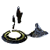
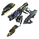

"Iya": Tech 2 Engineer
----
<table align="right">
    <thead>
        <tr>
            <th align="left" colspan="2">
                Iya Tech 2 Engineer
            </th>
        </tr>
    </thead>
    <tbody>
        <tr>
            <td align="right"><strong>Source:</strong></td>
            <td><a href="Forged Alliance Forever">Forged Alliance Forever</a></td>
        </tr>
        <tr>
            <td align="right"><strong>Unit ID:</strong></td>
            <td><a href="https://github.com/FAForever/fa/D:/faf-development/fa/units/XSL0208/XSL0208_unit.bp"><code>xsl0208</code></a></td>
        </tr>
        <tr>
            <td align="right"><strong>Faction:</strong></td>
            <td><a href="_categories.SERAPHIM">Seraphim</a></td>
        </tr>
        <tr>
            <td align="right"><strong>Tech level:</strong></td>
            <td> 2</td>
        </tr>
        <tr><td align="center" colspan="2"></td></tr>
        <tr>
            <td align="right"><strong>Health:</strong></td>
            <td> 350</td>
        </tr>
        <tr>
            <td align="right"><strong>Armour:</strong></td>
            <td><code>Normal</code></td>
        </tr>
        <tr><td align="center" colspan="2"></td></tr>
        <tr>
            <td align="right"><strong>Energy cost:</strong></td>
            <td> 650</td>
        </tr>
        <tr>
            <td align="right"><strong>Mass cost:</strong></td>
            <td> 130</td>
        </tr>
        <tr>
            <td align="right"><strong>Build time:</strong></td>
            <td>650 (<a href="#construction">Details</a>)</td>
        </tr>
        <tr>
            <td align="right"><strong>Build rate:</strong></td>
            <td> 13</td>
        </tr>
        <tr>
            <td align="right"><strong>Energy storage:</strong></td>
            <td> 0</td>
        </tr>
        <tr>
            <td align="right"><strong>Mass storage:</strong></td>
            <td> 20</td>
        </tr>
        <tr><td align="center" colspan="2"></td></tr>
        <tr>
            <td align="right"><strong>Vision radius:</strong></td>
            <td> 20 (400 m)</td>
        </tr>
        <tr>
            <td align="right"><strong>Water vision radius:</strong></td>
            <td> 10 (200 m)</td>
        </tr>
        <tr><td align="center" colspan="2"></td></tr>
        <tr>
            <td align="right"><strong>Motion type:</strong></td>
            <td><code>RULEUMT_Hover</code></td>
        </tr>
        <tr>
            <td align="right"><strong>Movement speed:</strong></td>
            <td> 1.9 (38 m/s)</td>
        </tr>
        <tr>
            <td align="right"><strong>Transport class:</strong></td>
            <td> Medium</td>
        </tr>
        <tr><td align="center" colspan="2"></td></tr>
        <tr>
            <td align="right"><strong>Wreckage:</strong></td>
            <td> 315  105.3</td>
        </tr>
    </tbody>
</table>

"Iya" is a Seraphim hover unit included in *Forged Alliance Forever*.
It is classified as a tech 2 engineer unit.
The build description for this unit is:

<blockquote>Tech 2 amphibious construction, Repair, Capture and Reclamation unit.</blockquote>

Contents

1. – <a href="#abilities">Abilities</a>
2. – <a href="#construction">Construction</a>
3. – <a href="#order-capabilities">Order capabilities</a>
4. – <a href="#engineering">Engineering</a>

### Abilities
Hover over abilities to see effect descriptions.

* Hover
* Engineering Suite

### Construction
Build times from the development branch of the game:
*  00:16 ‒  40/s ‒  8/s — Built by <a href="XSB0201">Tech 2 Land Factory HQ</a>
*  00:16 ‒  40/s ‒  8/s — Built by <a href="ZSB9501">Tech 2 Land Factory</a>
*  00:16 ‒  40/s ‒  8/s — Built by <a href="XSB0202">Tech 2 Air Factory HQ</a>
*  00:16 ‒  40/s ‒  8/s — Built by <a href="ZSB9502">Tech 2 Air Factory</a>
*  00:07 ‒  90/s ‒  18/s — Built by <a href="XSB0203">Tech 2 Naval Factory HQ</a>
*  00:07 ‒  90/s ‒  18/s — Built by <a href="ZSB9503">Tech 2 Naval Factory</a>
*  00:07 ‒  90/s ‒  18/s — Built by <a href="XSB0301">Tech 3 Land Factory HQ</a>
*  00:07 ‒  90/s ‒  18/s — Built by <a href="ZSB9601">Tech 3 Land Factory</a>
*  00:05 ‒  120/s ‒  24/s — Built by <a href="XSB0302">Tech 3 Air Factory HQ</a>
*  00:05 ‒  120/s ‒  24/s — Built by <a href="ZSB9602">Tech 3 Air Factory</a>
*  00:04 ‒  150/s ‒  30/s — Built by <a href="XSB0303">Tech 3 Naval Factory HQ</a>
*  00:04 ‒  150/s ‒  30/s — Built by <a href="ZSB9603">Tech 3 Naval Factory</a>

### Order capabilities
The following orders can be issued to the unit:
<table>
<td></td>
<td></td>
<td></td>
<td></td>
<tr>
<td></td>
<td></td>
<td></td>
<td></td>
<td></td>
</table>

### Engineering
The engineering capabilties of this unit consist of the ability to capture, reclaim, and repair.
It has the build category <code>BUILTBYTIER2ENGINEER SERAPHIM</code>. 

This build category allows it to build the following mod units:

<table>
    <tr>
        <td rowspan="2"></td>
        <td></td>
        <td></td>
        <td></td>
        <td></td>
        <td></td>
        <td></td>
        <td></td>
        <td></td>
    </tr>
    <tr>
        <td></td>
        <td></td>
        <td></td>
        <td></td>
        <td></td>
        <td></td>
        <td></td>
    </tr>
    <tr>
        <td rowspan="2"></td>
        <td></td>
        <td></td>
        <td></td>
        <td></td>
        <td></td>
        <td></td>
        <td></td>
        <td></td>
    </tr>
    <tr>
        <td></td>
        <td></td>
        <td></td>
        <td></td>
        <td></td>
        <td></td>
        <td></td>
        <td></td>
    </tr>
</table>

<table align="center">
<td width="1215px">Categories : 
<a href="_categories.SERAPHIM">SERAPHIM</a> · 
<a href="_categories.TECH2">TECH2</a> · 
<a href="_categories.MOBILE">MOBILE</a> · 
<a href="_categories.LAND">LAND</a> · 
<a href="_categories.HOVER">HOVER</a> · 
<a href="_categories.ENGINEER">ENGINEER</a></td>
</table>
