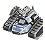

Tech 2 Land Factory
----
<table align="right">
    <thead>
        <tr>
            <th align="left" colspan="2">
                <i>Unnamed</i> Tech 2 Land Factory
            </th>
        </tr>
    </thead>
    <tbody>
        <tr>
            <td align="right"><strong>Source:</strong></td>
            <td><a href="Forged Alliance Forever">Forged Alliance Forever</a></td>
        </tr>
        <tr>
            <td align="right"><strong>Unit ID:</strong></td>
            <td><a href="https://github.com/FAForever/fa/D:/faf-development/fa/units/ZEB9501/ZEB9501_unit.bp"><code>zeb9501</code></a></td>
        </tr>
        <tr>
            <td align="right"><strong>Faction:</strong></td>
            <td><a href="_categories.UEF">UEF</a></td>
        </tr>
        <tr>
            <td align="right"><strong>Tech level:</strong></td>
            <td> 2</td>
        </tr>
        <tr><td align="center" colspan="2"></td></tr>
        <tr>
            <td align="right"><strong>Health:</strong></td>
            <td> 4000</td>
        </tr>
        <tr>
            <td align="right"><strong>Armour:</strong></td>
            <td><code>Structure</code></td>
        </tr>
        <tr><td align="center" colspan="2"></td></tr>
        <tr>
            <td align="right"><strong>Energy cost:</strong></td>
            <td> 4800</td>
        </tr>
        <tr>
            <td align="right"><strong>Mass cost:</strong></td>
            <td> 580</td>
        </tr>
        <tr>
            <td align="right"><strong>Build time:</strong></td>
            <td>1200 (<a href="#construction">Details</a>)</td>
        </tr>
        <tr>
            <td align="right"><strong>Build rate:</strong></td>
            <td> 40</td>
        </tr>
        <tr>
            <td align="right"><strong>Energy storage:</strong></td>
            <td> 0</td>
        </tr>
        <tr>
            <td align="right"><strong>Mass storage:</strong></td>
            <td> 160</td>
        </tr>
        <tr><td align="center" colspan="2"></td></tr>
        <tr>
            <td align="right"><strong>Vision radius:</strong></td>
            <td> 20 (400 m)</td>
        </tr>
        <tr>
            <td align="right"><strong>Water vision radius:</strong></td>
            <td> 10 (200 m)</td>
        </tr>
        <tr><td align="center" colspan="2"></td></tr>
        <tr>
            <td align="right"><strong>Motion type:</strong></td>
            <td><code>RULEUMT_None</code></td>
        </tr>
        <tr>
            <td align="right"><strong>Buildable layers:</strong></td>
            <td>Land</td>
        </tr>
        <tr><td align="center" colspan="2"></td></tr>
        <tr>
            <td align="right"><strong>Wreckage:</strong></td>
            <td> 3600  469.8</td>
        </tr>
    </tbody>
</table>

This unnamed unit is a UEF structure unit included in *Forged Alliance Forever*.
It is classified as a tech 2 land factory unit.
The build description for this unit is:

<blockquote>Constructs Tech 2 Land units. Upgradeable to T3 Factory if at least one T3 Land Factory HQ exists.</blockquote>

Contents

1. – <a href="#abilities">Abilities</a>
2. – <a href="#adjacency">Adjacency</a>
3. – <a href="#construction">Construction</a>
4. – <a href="#order-capabilities">Order capabilities</a>
5. – <a href="#engineering">Engineering</a>

### Abilities
Hover over abilities to see effect descriptions.

* Upgradable

### Adjacency
This unit counts as `SIZE16` for adjacency effects from other structures. This theoretically means that it can be surrounded by exactly 16 structures the size of a standard tech 1 power generator, which is accurate; meaning it can get the maximum intended buff effects. 

### Construction
Build times from the development branch of the game:
*  01:00 ‒  80/s ‒  10/s — Built by <a href="UEB0101">Tech 1 Land Factory</a>
*  01:32 ‒  52/s ‒  6/s — Built by <a href="UEL0208">Tech 2 Engineer</a>
*  00:21 ‒  224/s ‒  27/s — Built by <a href="UEL0301">Tech 3 Support Armored Command Unit</a>
*  00:36 ‒  130/s ‒  16/s — Built by <a href="UEL0309">Tech 3 Engineer</a>
*  00:34 ‒  140/s ‒  17/s — Built by <a href="UEA0003">Tech 3 Engineering Drone</a>
*  02:00 ‒  40/s ‒  5/s — Built by <a href="UEL0001">Armored Command Unit</a>

### Order capabilities
The following orders can be issued to the unit:
<table>
<td></td>
<td></td>
<td></td>
<td></td>
<td></td>
<tr>
<td></td>
</table>

### Engineering
It can be upgraded into the <a href="ZEB9601">Tech 3 Land Factory</a>.
It has the build categories:
* <code>BUILTBYTIER2FACTORY UEF MOBILE CONSTRUCTION</code>
* <code>BUILTBYTIER2SUPPORTFACTORY UEF STRUCTURE LAND</code>
* <code>BUILTBYTIER2FACTORY UEF MOBILE LAND</code>
* <code>BUILTBYLANDTIER2FACTORY UEF MOBILE CONSTRUCTION</code>

These build categories allow it to build the following mod units:

<table>
    <tr>
        <td></td>
        <td></td>
        <td></td>
        <td></td>
        <td></td>
        <td></td>
        <td></td>
    </tr>
    <tr>
        <td></td>
        <td></td>
        <td></td>
        <td></td>
        <td></td>
        <td></td>
        <td></td>
        <td></td>
        <td></td>
    </tr>
</table>

<table align="center">
<td width="1215px">Categories : 
<a href="_categories.UEF">UEF</a> · 
<a href="_categories.TECH2">TECH2</a> · 
<a href="_categories.LAND">LAND</a> · 
<a href="_categories.FACTORY">FACTORY</a> · 
<a href="_categories.STRUCTURE">STRUCTURE</a></td>
</table>
