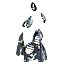

11 units have the <code>AIRSTAGINGPLATFORM</code> category.
<table>
    <tr>
        <td></td>
        <td><code>uab5202</code></td>
        <td></td>
        <td><a href="UAB5202">Cradle: Tech 1 Air Staging Facility</a></td>
    </tr>
    <tr>
        <td></td>
        <td><code>ueb5202</code></td>
        <td></td>
        <td><a href="UEB5202">Refuel & Repair: Tech 1 Air Staging Facility</a></td>
    </tr>
    <tr>
        <td></td>
        <td><code>urb5202</code></td>
        <td></td>
        <td><a href="URB5202">Tech 1 Air Staging Facility</a></td>
    </tr>
    <tr>
        <td></td>
        <td><code>xsb5202</code></td>
        <td></td>
        <td><a href="XSB5202">Iathu-uhthe: Tech 1 Air Staging Beacon</a></td>
    </tr>
    <tr>
        <td></td>
        <td><code>urs0202</code></td>
        <td></td>
        <td><a href="URS0202">Siren Class: Tech 2 Cruiser</a></td>
    </tr>
    <tr>
        <td></td>
        <td><code>uas0303</code></td>
        <td></td>
        <td><a href="UAS0303">Keefer Class: Tech 3 Aircraft Carrier</a></td>
    </tr>
    <tr>
        <td></td>
        <td><code>urs0303</code></td>
        <td></td>
        <td><a href="URS0303">Command Class: Tech 3 Aircraft Carrier</a></td>
    </tr>
    <tr>
        <td></td>
        <td><code>xss0303</code></td>
        <td></td>
        <td><a href="XSS0303">Iavish: Tech 3 Aircraft Carrier</a></td>
    </tr>
    <tr>
        <td></td>
        <td><code>uaa0310</code></td>
        <td></td>
        <td><a href="UAA0310">CZAR: Experimental Aircraft Carrier</a></td>
    </tr>
    <tr>
        <td></td>
        <td><code>uel0401</code></td>
        <td></td>
        <td><a href="UEL0401">Fatboy: Experimental Mobile Factory</a></td>
    </tr>
    <tr>
        <td></td>
        <td><code>ues0401</code></td>
        <td></td>
        <td><a href="UES0401">Atlantis: Experimental Aircraft Carrier</a></td>
    </tr>
</table>
