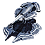

21 units have the <code>ARTILLERY</code> category.
<table>
    <tr>
        <td></td>
        <td><code>ual0103</code></td>
        <td></td>
        <td><a href="UAL0103">Fervor: Tech 1 Mobile Light Artillery</a></td>
    </tr>
    <tr>
        <td></td>
        <td><code>uel0103</code></td>
        <td></td>
        <td><a href="UEL0103">Lobo: Tech 1 Mobile Light Artillery</a></td>
    </tr>
    <tr>
        <td></td>
        <td><code>url0103</code></td>
        <td></td>
        <td><a href="URL0103">Medusa: Tech 1 Mobile Light Artillery</a></td>
    </tr>
    <tr>
        <td></td>
        <td><code>uxl0021</code></td>
        <td></td>
        <td><a href="UXL0021">uxl0021 name: Tech 1 Test Unit Arc Projectile</a></td>
    </tr>
    <tr>
        <td></td>
        <td><code>xsl0103</code></td>
        <td></td>
        <td><a href="XSL0103">Zthuee: Tech 1 Mobile Light Artillery</a></td>
    </tr>
    <tr>
        <td></td>
        <td><code>uab2303</code></td>
        <td></td>
        <td><a href="UAB2303">Miasma: Tech 2 Artillery Installation</a></td>
    </tr>
    <tr>
        <td></td>
        <td><code>ueb2303</code></td>
        <td></td>
        <td><a href="UEB2303">Klink Hammer: Tech 2 Artillery Installation</a></td>
    </tr>
    <tr>
        <td></td>
        <td><code>urb2303</code></td>
        <td></td>
        <td><a href="URB2303">Gunther: Tech 2 Artillery Installation</a></td>
    </tr>
    <tr>
        <td></td>
        <td><code>xsb2303</code></td>
        <td></td>
        <td><a href="XSB2303">Zthuthaam: Tech 2 Artillery Installation</a></td>
    </tr>
    <tr>
        <td></td>
        <td><code>uab2302</code></td>
        <td></td>
        <td><a href="UAB2302">Emissary: Tech 3 Heavy Artillery Installation</a></td>
    </tr>
    <tr>
        <td></td>
        <td><code>ual0304</code></td>
        <td></td>
        <td><a href="UAL0304">Serenity: Tech 3 Mobile Heavy Artillery</a></td>
    </tr>
    <tr>
        <td></td>
        <td><code>ueb2302</code></td>
        <td></td>
        <td><a href="UEB2302">Duke: Tech 3 Heavy Artillery Installation</a></td>
    </tr>
    <tr>
        <td></td>
        <td><code>uel0304</code></td>
        <td></td>
        <td><a href="UEL0304">Demolisher: Tech 3 Mobile Heavy Artillery</a></td>
    </tr>
    <tr>
        <td></td>
        <td><code>urb2302</code></td>
        <td></td>
        <td><a href="URB2302">Disruptor: Tech 3 Heavy Artillery Installation</a></td>
    </tr>
    <tr>
        <td></td>
        <td><code>url0304</code></td>
        <td></td>
        <td><a href="URL0304">Trebuchet: Tech 3 Mobile Heavy Artillery</a></td>
    </tr>
    <tr>
        <td></td>
        <td><code>xsb2302</code></td>
        <td></td>
        <td><a href="XSB2302">Hovatham: Tech 3 Heavy Artillery Installation</a></td>
    </tr>
    <tr>
        <td></td>
        <td><code>xsl0304</code></td>
        <td></td>
        <td><a href="XSL0304">Suthanus: Tech 3 Mobile Heavy Artillery</a></td>
    </tr>
    <tr>
        <td></td>
        <td><code>ueb2401</code></td>
        <td></td>
        <td><a href="UEB2401">Mavor: Experimental Artillery</a></td>
    </tr>
    <tr>
        <td></td>
        <td><code>uel0401</code></td>
        <td></td>
        <td><a href="UEL0401">Fatboy: Experimental Mobile Factory</a></td>
    </tr>
    <tr>
        <td></td>
        <td><code>url0401</code></td>
        <td></td>
        <td><a href="URL0401">Scathis: Experimental Mobile Rapid-Fire Artillery</a></td>
    </tr>
    <tr>
        <td></td>
        <td><code>xab2307</code></td>
        <td></td>
        <td><a href="XAB2307">Salvation: Rapid-Fire Artillery Installation</a></td>
    </tr>
</table>
