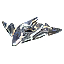

18 units have the <code>EXPERIMENTAL</code> category.
<table>
    <tr>
        <td></td>
        <td><code>uaa0310</code></td>
        <td></td>
        <td><a href="UAA0310">CZAR: Experimental Aircraft Carrier</a></td>
    </tr>
    <tr>
        <td></td>
        <td><code>ual0401</code></td>
        <td></td>
        <td><a href="UAL0401">Galactic Colossus: Experimental Assault Bot</a></td>
    </tr>
    <tr>
        <td></td>
        <td><code>uas0401</code></td>
        <td></td>
        <td><a href="UAS0401">Tempest: Experimental Battleship</a></td>
    </tr>
    <tr>
        <td></td>
        <td><code>ueb2401</code></td>
        <td></td>
        <td><a href="UEB2401">Mavor: Experimental Artillery</a></td>
    </tr>
    <tr>
        <td></td>
        <td><code>uel0401</code></td>
        <td></td>
        <td><a href="UEL0401">Fatboy: Experimental Mobile Factory</a></td>
    </tr>
    <tr>
        <td></td>
        <td><code>ues0401</code></td>
        <td></td>
        <td><a href="UES0401">Atlantis: Experimental Aircraft Carrier</a></td>
    </tr>
    <tr>
        <td></td>
        <td><code>ura0401</code></td>
        <td></td>
        <td><a href="URA0401">Soul Ripper: Experimental Gunship</a></td>
    </tr>
    <tr>
        <td></td>
        <td><code>url0401</code></td>
        <td></td>
        <td><a href="URL0401">Scathis: Experimental Mobile Rapid-Fire Artillery</a></td>
    </tr>
    <tr>
        <td></td>
        <td><code>url0402</code></td>
        <td></td>
        <td><a href="URL0402">Monkeylord: Experimental Spiderbot</a></td>
    </tr>
    <tr>
        <td></td>
        <td><code>xab1401</code></td>
        <td></td>
        <td><a href="XAB1401">Paragon: Experimental Resource Generator</a></td>
    </tr>
    <tr>
        <td></td>
        <td><code>xab2307</code></td>
        <td></td>
        <td><a href="XAB2307">Salvation: Rapid-Fire Artillery Installation</a></td>
    </tr>
    <tr>
        <td></td>
        <td><code>xea0002</code></td>
        <td></td>
        <td><a href="XEA0002">Defense Satellite</a></td>
    </tr>
    <tr>
        <td></td>
        <td><code>xeb2402</code></td>
        <td></td>
        <td><a href="XEB2402">Novax Center: Experimental Satellite System</a></td>
    </tr>
    <tr>
        <td></td>
        <td><code>xrl0403</code></td>
        <td></td>
        <td><a href="XRL0403">Megalith: Experimental Megabot</a></td>
    </tr>
    <tr>
        <td></td>
        <td><code>xsa0402</code></td>
        <td></td>
        <td><a href="XSA0402">Ahwassa: Experimental Bomber</a></td>
    </tr>
    <tr>
        <td></td>
        <td><code>xsb2401</code></td>
        <td></td>
        <td><a href="XSB2401">Yolona Oss: Experimental Missile Launcher</a></td>
    </tr>
    <tr>
        <td></td>
        <td><code>xsl0401</code></td>
        <td></td>
        <td><a href="XSL0401">Ythotha: Experimental Assault Bot</a></td>
    </tr>
    <tr>
        <td></td>
        <td><code>xsl0402</code></td>
        <td></td>
        <td><a href="XSL0402">Othuy: Unidentified Residual Energy Signature</a></td>
    </tr>
</table>
