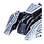
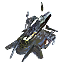
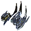

18 units have the <code>HOVER</code> category.
<table>
    <tr>
        <td></td>
        <td><code>ual0101</code></td>
        <td></td>
        <td><a href="UAL0101">Spirit: Tech 1 Land Scout</a></td>
    </tr>
    <tr>
        <td></td>
        <td><code>ual0105</code></td>
        <td></td>
        <td><a href="UAL0105">Tech 1 Engineer</a></td>
    </tr>
    <tr>
        <td></td>
        <td><code>ual0201</code></td>
        <td></td>
        <td><a href="UAL0201">Aurora: Tech 1 Light Tank</a></td>
    </tr>
    <tr>
        <td></td>
        <td><code>xsl0103</code></td>
        <td></td>
        <td><a href="XSL0103">Zthuee: Tech 1 Mobile Light Artillery</a></td>
    </tr>
    <tr>
        <td></td>
        <td><code>xsl0105</code></td>
        <td></td>
        <td><a href="XSL0105">Iya-istle: Tech 1 Engineer</a></td>
    </tr>
    <tr>
        <td></td>
        <td><code>ual0205</code></td>
        <td></td>
        <td><a href="UAL0205">Ascendant: Tech 2 Mobile AA Flak Artillery</a></td>
    </tr>
    <tr>
        <td></td>
        <td><code>ual0208</code></td>
        <td></td>
        <td><a href="UAL0208">Tech 2 Engineer</a></td>
    </tr>
    <tr>
        <td></td>
        <td><code>ual0307</code></td>
        <td></td>
        <td><a href="UAL0307">Asylum: Tech 2 Mobile Shield Generator</a></td>
    </tr>
    <tr>
        <td></td>
        <td><code>uel0203</code></td>
        <td></td>
        <td><a href="UEL0203">Riptide: Tech 2 Amphibious Tank</a></td>
    </tr>
    <tr>
        <td></td>
        <td><code>xal0203</code></td>
        <td></td>
        <td><a href="XAL0203">Blaze: Tech 2 Assault Tank</a></td>
    </tr>
    <tr>
        <td></td>
        <td><code>xsl0203</code></td>
        <td></td>
        <td><a href="XSL0203">Yenzyne: Tech 2 Hover Tank</a></td>
    </tr>
    <tr>
        <td></td>
        <td><code>xsl0205</code></td>
        <td></td>
        <td><a href="XSL0205">Iashavoh: Tech 2 Mobile Anti-Air Cannon</a></td>
    </tr>
    <tr>
        <td></td>
        <td><code>xsl0208</code></td>
        <td></td>
        <td><a href="XSL0208">Iya: Tech 2 Engineer</a></td>
    </tr>
    <tr>
        <td></td>
        <td><code>dal0310</code></td>
        <td></td>
        <td><a href="DAL0310">Absolver: Tech 3 Shield Disruptor</a></td>
    </tr>
    <tr>
        <td></td>
        <td><code>ual0309</code></td>
        <td></td>
        <td><a href="UAL0309">Tech 3 Engineer</a></td>
    </tr>
    <tr>
        <td></td>
        <td><code>xsl0307</code></td>
        <td></td>
        <td><a href="XSL0307">Athanah: Tech 3 Mobile Shield Generator</a></td>
    </tr>
    <tr>
        <td></td>
        <td><code>xsl0309</code></td>
        <td></td>
        <td><a href="XSL0309">Iyathuum: Tech 3 Engineer</a></td>
    </tr>
    <tr>
        <td></td>
        <td><code>xsl0402</code></td>
        <td></td>
        <td><a href="XSL0402">Othuy: Unidentified Residual Energy Signature</a></td>
    </tr>
</table>
