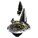
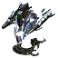
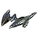
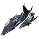

91 units have the <code>SERAPHIM</code> category.
<table>
    <tr>
        <td></td>
        <td><code>xsa0101</code></td>
        <td></td>
        <td><a href="XSA0101">Sele-istle: Tech 1 Air Scout</a></td>
    </tr>
    <tr>
        <td></td>
        <td><code>xsa0102</code></td>
        <td></td>
        <td><a href="XSA0102">Ia-atha: Tech 1 Interceptor</a></td>
    </tr>
    <tr>
        <td></td>
        <td><code>xsa0103</code></td>
        <td></td>
        <td><a href="XSA0103">Sinnve: Tech 1 Attack Bomber</a></td>
    </tr>
    <tr>
        <td></td>
        <td><code>xsa0107</code></td>
        <td></td>
        <td><a href="XSA0107">Vish: Tech 1 Light Air Transport</a></td>
    </tr>
    <tr>
        <td></td>
        <td><code>xsb0101</code></td>
        <td></td>
        <td><a href="XSB0101">Hethiya: Tech 1 Land Factory</a></td>
    </tr>
    <tr>
        <td></td>
        <td><code>xsb0102</code></td>
        <td></td>
        <td><a href="XSB0102">Ia-iya: Tech 1 Air Factory</a></td>
    </tr>
    <tr>
        <td></td>
        <td><code>xsb0103</code></td>
        <td></td>
        <td><a href="XSB0103">Uosiya: Tech 1 Naval Factory</a></td>
    </tr>
    <tr>
        <td></td>
        <td><code>xsb1101</code></td>
        <td></td>
        <td><a href="XSB1101">Uya-iya: Tech 1 Power Generator</a></td>
    </tr>
    <tr>
        <td></td>
        <td><code>xsb1102</code></td>
        <td></td>
        <td><a href="XSB1102">Uya-atoh: Tech 1 Hydrocarbon Power Plant</a></td>
    </tr>
    <tr>
        <td></td>
        <td><code>xsb1103</code></td>
        <td></td>
        <td><a href="XSB1103">Hyalatoh: Tech 1 Mass Extractor</a></td>
    </tr>
    <tr>
        <td></td>
        <td><code>xsb1105</code></td>
        <td></td>
        <td><a href="XSB1105">Vishuyal: Tech 1 Energy Storage</a></td>
    </tr>
    <tr>
        <td></td>
        <td><code>xsb1106</code></td>
        <td></td>
        <td><a href="XSB1106">Vishyal: Tech 1 Mass Storage</a></td>
    </tr>
    <tr>
        <td></td>
        <td><code>xsb2101</code></td>
        <td></td>
        <td><a href="XSB2101">Uttaus: Tech 1 Point Defense</a></td>
    </tr>
    <tr>
        <td></td>
        <td><code>xsb2104</code></td>
        <td></td>
        <td><a href="XSB2104">Ialla: Tech 1 Anti-Air Defense</a></td>
    </tr>
    <tr>
        <td></td>
        <td><code>xsb2109</code></td>
        <td></td>
        <td><a href="XSB2109">Sou-atha: Tech 1 Torpedo Launcher</a></td>
    </tr>
    <tr>
        <td></td>
        <td><code>xsb3101</code></td>
        <td></td>
        <td><a href="XSB3101">Esel: Tech 1 Radar System</a></td>
    </tr>
    <tr>
        <td></td>
        <td><code>xsb3102</code></td>
        <td></td>
        <td><a href="XSB3102">Shou: Tech 1 Sonar System</a></td>
    </tr>
    <tr>
        <td></td>
        <td><code>xsb5101</code></td>
        <td></td>
        <td><a href="XSB5101">Haas: Tech 1 Wall Section</a></td>
    </tr>
    <tr>
        <td></td>
        <td><code>xsb5202</code></td>
        <td></td>
        <td><a href="XSB5202">Iathu-uhthe: Tech 1 Air Staging Beacon</a></td>
    </tr>
    <tr>
        <td></td>
        <td><code>xsl0101</code></td>
        <td></td>
        <td><a href="XSL0101">Selen: Tech 1 Combat Scout</a></td>
    </tr>
    <tr>
        <td></td>
        <td><code>xsl0103</code></td>
        <td></td>
        <td><a href="XSL0103">Zthuee: Tech 1 Mobile Light Artillery</a></td>
    </tr>
    <tr>
        <td></td>
        <td><code>xsl0104</code></td>
        <td></td>
        <td><a href="XSL0104">Ia-istle: Tech 1 Mobile Anti-Air Gun</a></td>
    </tr>
    <tr>
        <td></td>
        <td><code>xsl0105</code></td>
        <td></td>
        <td><a href="XSL0105">Iya-istle: Tech 1 Engineer</a></td>
    </tr>
    <tr>
        <td></td>
        <td><code>xsl0201</code></td>
        <td></td>
        <td><a href="XSL0201">Thaam: Tech 1 Medium Tank</a></td>
    </tr>
    <tr>
        <td></td>
        <td><code>xss0103</code></td>
        <td></td>
        <td><a href="XSS0103">Hau-esel: Tech 1 Frigate</a></td>
    </tr>
    <tr>
        <td></td>
        <td><code>xss0203</code></td>
        <td></td>
        <td><a href="XSS0203">Sou-istle: Tech 1 Attack Submarine</a></td>
    </tr>
    <tr>
        <td></td>
        <td><code>xsa0104</code></td>
        <td></td>
        <td><a href="XSA0104">Vishala: Tech 2 Air Transport</a></td>
    </tr>
    <tr>
        <td></td>
        <td><code>xsa0202</code></td>
        <td></td>
        <td><a href="XSA0202">Notha: Tech 2 Fighter/Bomber</a></td>
    </tr>
    <tr>
        <td></td>
        <td><code>xsa0203</code></td>
        <td></td>
        <td><a href="XSA0203">Vulthoo: Tech 2 Gunship</a></td>
    </tr>
    <tr>
        <td></td>
        <td><code>xsa0204</code></td>
        <td></td>
        <td><a href="XSA0204">Uosioz: Tech 2 Torpedo Bomber</a></td>
    </tr>
    <tr>
        <td></td>
        <td><code>xsb0201</code></td>
        <td></td>
        <td><a href="XSB0201">Hethiya: Tech 2 Land Factory HQ</a></td>
    </tr>
    <tr>
        <td></td>
        <td><code>xsb0202</code></td>
        <td></td>
        <td><a href="XSB0202">Ia-iya: Tech 2 Air Factory HQ</a></td>
    </tr>
    <tr>
        <td></td>
        <td><code>xsb0203</code></td>
        <td></td>
        <td><a href="XSB0203">Uosiya: Tech 2 Naval Factory HQ</a></td>
    </tr>
    <tr>
        <td></td>
        <td><code>xsb1104</code></td>
        <td></td>
        <td><a href="XSB1104">Hyaliya: Tech 2 Mass Fabricator</a></td>
    </tr>
    <tr>
        <td></td>
        <td><code>xsb1201</code></td>
        <td></td>
        <td><a href="XSB1201">Uya-iya: Tech 2 Power Generator</a></td>
    </tr>
    <tr>
        <td></td>
        <td><code>xsb1202</code></td>
        <td></td>
        <td><a href="XSB1202">Hyalatoh: Tech 2 Mass Extractor</a></td>
    </tr>
    <tr>
        <td></td>
        <td><code>xsb2108</code></td>
        <td></td>
        <td><a href="XSB2108">Ythis: Tech 2 Tactical Missile Launcher</a></td>
    </tr>
    <tr>
        <td></td>
        <td><code>xsb2204</code></td>
        <td></td>
        <td><a href="XSB2204">Sinnatha: Tech 2 Anti-Air Flak Artillery</a></td>
    </tr>
    <tr>
        <td></td>
        <td><code>xsb2205</code></td>
        <td></td>
        <td><a href="XSB2205">Uosthu: Tech 2 Torpedo Launcher</a></td>
    </tr>
    <tr>
        <td></td>
        <td><code>xsb2301</code></td>
        <td></td>
        <td><a href="XSB2301">Uttaushala: Tech 2 Point Defense</a></td>
    </tr>
    <tr>
        <td></td>
        <td><code>xsb2303</code></td>
        <td></td>
        <td><a href="XSB2303">Zthuthaam: Tech 2 Artillery Installation</a></td>
    </tr>
    <tr>
        <td></td>
        <td><code>xsb3201</code></td>
        <td></td>
        <td><a href="XSB3201">Sele-esel: Tech 2 Radar System</a></td>
    </tr>
    <tr>
        <td></td>
        <td><code>xsb3202</code></td>
        <td></td>
        <td><a href="XSB3202">Shou-esel: Tech 2 Sonar System</a></td>
    </tr>
    <tr>
        <td></td>
        <td><code>xsb4201</code></td>
        <td></td>
        <td><a href="XSB4201">Ythisatha: Tech 2 Tactical Missile Defense</a></td>
    </tr>
    <tr>
        <td></td>
        <td><code>xsb4202</code></td>
        <td></td>
        <td><a href="XSB4202">Atha: Tech 2 Shield Generator</a></td>
    </tr>
    <tr>
        <td></td>
        <td><code>xsb4203</code></td>
        <td></td>
        <td><a href="XSB4203">Sele-ioz: Tech 2 Stealth Field Generator</a></td>
    </tr>
    <tr>
        <td></td>
        <td><code>xsl0111</code></td>
        <td></td>
        <td><a href="XSL0111">Ythisah: Tech 2 Mobile Missile Launcher</a></td>
    </tr>
    <tr>
        <td></td>
        <td><code>xsl0202</code></td>
        <td></td>
        <td><a href="XSL0202">Ilshavoh: Tech 2 Assault Bot</a></td>
    </tr>
    <tr>
        <td></td>
        <td><code>xsl0203</code></td>
        <td></td>
        <td><a href="XSL0203">Yenzyne: Tech 2 Hover Tank</a></td>
    </tr>
    <tr>
        <td></td>
        <td><code>xsl0205</code></td>
        <td></td>
        <td><a href="XSL0205">Iashavoh: Tech 2 Mobile Anti-Air Cannon</a></td>
    </tr>
    <tr>
        <td></td>
        <td><code>xsl0208</code></td>
        <td></td>
        <td><a href="XSL0208">Iya: Tech 2 Engineer</a></td>
    </tr>
    <tr>
        <td></td>
        <td><code>xss0201</code></td>
        <td></td>
        <td><a href="XSS0201">Uashavoh: Tech 2 Destroyer</a></td>
    </tr>
    <tr>
        <td></td>
        <td><code>xss0202</code></td>
        <td></td>
        <td><a href="XSS0202">Ithalua: Tech 2 Cruiser</a></td>
    </tr>
    <tr>
        <td></td>
        <td><code>zsb9501</code></td>
        <td></td>
        <td><a href="ZSB9501">Hethiya: Tech 2 Land Factory</a></td>
    </tr>
    <tr>
        <td></td>
        <td><code>zsb9502</code></td>
        <td></td>
        <td><a href="ZSB9502">Ia-iya: Tech 2 Air Factory</a></td>
    </tr>
    <tr>
        <td></td>
        <td><code>zsb9503</code></td>
        <td></td>
        <td><a href="ZSB9503">Uosiya: Tech 2 Naval Factory</a></td>
    </tr>
    <tr>
        <td></td>
        <td><code>dslk004</code></td>
        <td></td>
        <td><a href="DSLK004">Uyanah: Tech 3 Lightning Tank</a></td>
    </tr>
    <tr>
        <td></td>
        <td><code>xsa0302</code></td>
        <td></td>
        <td><a href="XSA0302">Iaselen: Tech 3 Spy Plane</a></td>
    </tr>
    <tr>
        <td></td>
        <td><code>xsa0303</code></td>
        <td></td>
        <td><a href="XSA0303">Iazyne: Tech 3 Air Superiority Fighter</a></td>
    </tr>
    <tr>
        <td></td>
        <td><code>xsa0304</code></td>
        <td></td>
        <td><a href="XSA0304">Sinntha: Tech 3 Strategic Bomber</a></td>
    </tr>
    <tr>
        <td></td>
        <td><code>xsb0301</code></td>
        <td></td>
        <td><a href="XSB0301">Hethiya: Tech 3 Land Factory HQ</a></td>
    </tr>
    <tr>
        <td></td>
        <td><code>xsb0302</code></td>
        <td></td>
        <td><a href="XSB0302">Ia-iya: Tech 3 Air Factory HQ</a></td>
    </tr>
    <tr>
        <td></td>
        <td><code>xsb0303</code></td>
        <td></td>
        <td><a href="XSB0303">Uosiya: Tech 3 Naval Factory HQ</a></td>
    </tr>
    <tr>
        <td></td>
        <td><code>xsb0304</code></td>
        <td></td>
        <td><a href="XSB0304">Aezthu-uhthe: Tech 3 Quantum Gateway</a></td>
    </tr>
    <tr>
        <td></td>
        <td><code>xsb1301</code></td>
        <td></td>
        <td><a href="XSB1301">Uya-iya: Tech 3 Power Generator</a></td>
    </tr>
    <tr>
        <td></td>
        <td><code>xsb1302</code></td>
        <td></td>
        <td><a href="XSB1302">Hyalatoh: Tech 3 Mass Extractor</a></td>
    </tr>
    <tr>
        <td></td>
        <td><code>xsb1303</code></td>
        <td></td>
        <td><a href="XSB1303">Hyaliya: Tech 3 Mass Fabricator</a></td>
    </tr>
    <tr>
        <td></td>
        <td><code>xsb2302</code></td>
        <td></td>
        <td><a href="XSB2302">Hovatham: Tech 3 Heavy Artillery Installation</a></td>
    </tr>
    <tr>
        <td></td>
        <td><code>xsb2304</code></td>
        <td></td>
        <td><a href="XSB2304">Iathu-ioz: Tech 3 Anti-Air Defense</a></td>
    </tr>
    <tr>
        <td></td>
        <td><code>xsb2305</code></td>
        <td></td>
        <td><a href="XSB2305">Hastue: Tech 3 Strategic Missile Launcher</a></td>
    </tr>
    <tr>
        <td></td>
        <td><code>xsb3104</code></td>
        <td></td>
        <td><a href="XSB3104">Aezesel: Tech 3 Omni Sensor Suite</a></td>
    </tr>
    <tr>
        <td></td>
        <td><code>xsb4301</code></td>
        <td></td>
        <td><a href="XSB4301">Athanuhthe: Tech 3 Heavy Shield Generator</a></td>
    </tr>
    <tr>
        <td></td>
        <td><code>xsb4302</code></td>
        <td></td>
        <td><a href="XSB4302">Ythisioz: Tech 3 Strategic Missile Defense</a></td>
    </tr>
    <tr>
        <td></td>
        <td><code>xsl0301</code></td>
        <td></td>
        <td><a href="XSL0301">Tech 3 Support Armored Command Unit</a></td>
    </tr>
    <tr>
        <td></td>
        <td><code>xsl0303</code></td>
        <td></td>
        <td><a href="XSL0303">Othuum: Tech 3 Siege Tank</a></td>
    </tr>
    <tr>
        <td></td>
        <td><code>xsl0304</code></td>
        <td></td>
        <td><a href="XSL0304">Suthanus: Tech 3 Mobile Heavy Artillery</a></td>
    </tr>
    <tr>
        <td></td>
        <td><code>xsl0305</code></td>
        <td></td>
        <td><a href="XSL0305">Usha-Ah: Tech 3 Sniper Bot</a></td>
    </tr>
    <tr>
        <td></td>
        <td><code>xsl0307</code></td>
        <td></td>
        <td><a href="XSL0307">Athanah: Tech 3 Mobile Shield Generator</a></td>
    </tr>
    <tr>
        <td></td>
        <td><code>xsl0309</code></td>
        <td></td>
        <td><a href="XSL0309">Iyathuum: Tech 3 Engineer</a></td>
    </tr>
    <tr>
        <td></td>
        <td><code>xss0302</code></td>
        <td></td>
        <td><a href="XSS0302">Hauthuum: Tech 3 Battleship</a></td>
    </tr>
    <tr>
        <td></td>
        <td><code>xss0303</code></td>
        <td></td>
        <td><a href="XSS0303">Iavish: Tech 3 Aircraft Carrier</a></td>
    </tr>
    <tr>
        <td></td>
        <td><code>xss0304</code></td>
        <td></td>
        <td><a href="XSS0304">Yathsou: Tech 3 Submarine Hunter</a></td>
    </tr>
    <tr>
        <td></td>
        <td><code>zsb9601</code></td>
        <td></td>
        <td><a href="ZSB9601">Hethiya: Tech 3 Land Factory</a></td>
    </tr>
    <tr>
        <td></td>
        <td><code>zsb9602</code></td>
        <td></td>
        <td><a href="ZSB9602">Ia-iya: Tech 3 Air Factory</a></td>
    </tr>
    <tr>
        <td></td>
        <td><code>zsb9603</code></td>
        <td></td>
        <td><a href="ZSB9603">Uosiya: Tech 3 Naval Factory</a></td>
    </tr>
    <tr>
        <td></td>
        <td><code>xsa0402</code></td>
        <td></td>
        <td><a href="XSA0402">Ahwassa: Experimental Bomber</a></td>
    </tr>
    <tr>
        <td></td>
        <td><code>xsb2401</code></td>
        <td></td>
        <td><a href="XSB2401">Yolona Oss: Experimental Missile Launcher</a></td>
    </tr>
    <tr>
        <td></td>
        <td><code>xsl0401</code></td>
        <td></td>
        <td><a href="XSL0401">Ythotha: Experimental Assault Bot</a></td>
    </tr>
    <tr>
        <td></td>
        <td><code>xsl0402</code></td>
        <td></td>
        <td><a href="XSL0402">Othuy: Unidentified Residual Energy Signature</a></td>
    </tr>
    <tr>
        <td></td>
        <td><code>xsb5102</code></td>
        <td></td>
        <td><a href="XSB5102">Seraphim Transport Beacon</a></td>
    </tr>
    <tr>
        <td></td>
        <td><code>xsl0001</code></td>
        <td></td>
        <td><a href="XSL0001">Armored Command Unit</a></td>
    </tr>
</table>
