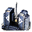
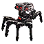

29 units have the <code>SILO</code> category.
<table>
    <tr>
        <td></td>
        <td><code>uab2108</code></td>
        <td></td>
        <td><a href="UAB2108">Serpentine: Tech 2 Tactical Missile Launcher</a></td>
    </tr>
    <tr>
        <td></td>
        <td><code>ual0111</code></td>
        <td></td>
        <td><a href="UAL0111">Evensong: Tech 2 Mobile Missile Launcher</a></td>
    </tr>
    <tr>
        <td></td>
        <td><code>ueb2108</code></td>
        <td></td>
        <td><a href="UEB2108">Aloha: Tech 2 Tactical Missile Launcher</a></td>
    </tr>
    <tr>
        <td></td>
        <td><code>uel0111</code></td>
        <td></td>
        <td><a href="UEL0111">Flapjack: Tech 2 Mobile Missile Launcher</a></td>
    </tr>
    <tr>
        <td></td>
        <td><code>ues0202</code></td>
        <td></td>
        <td><a href="UES0202">Governor Class: Tech 2 Cruiser</a></td>
    </tr>
    <tr>
        <td></td>
        <td><code>urb2108</code></td>
        <td></td>
        <td><a href="URB2108">TML-4: Tech 2 Tactical Missile Launcher</a></td>
    </tr>
    <tr>
        <td></td>
        <td><code>url0111</code></td>
        <td></td>
        <td><a href="URL0111">Viper: Tech 2 Mobile Missile Launcher</a></td>
    </tr>
    <tr>
        <td></td>
        <td><code>xsb2108</code></td>
        <td></td>
        <td><a href="XSB2108">Ythis: Tech 2 Tactical Missile Launcher</a></td>
    </tr>
    <tr>
        <td></td>
        <td><code>xsl0111</code></td>
        <td></td>
        <td><a href="XSL0111">Ythisah: Tech 2 Mobile Missile Launcher</a></td>
    </tr>
    <tr>
        <td></td>
        <td><code>xss0202</code></td>
        <td></td>
        <td><a href="XSS0202">Ithalua: Tech 2 Cruiser</a></td>
    </tr>
    <tr>
        <td></td>
        <td><code>srl0310</code></td>
        <td></td>
        <td><a href="SRL0310">Pulsar: Tech 3 Mobile EMP Missile Launcher</a></td>
    </tr>
    <tr>
        <td></td>
        <td><code>uab2305</code></td>
        <td></td>
        <td><a href="UAB2305">Apocalypse: Tech 3 Strategic Missile Launcher</a></td>
    </tr>
    <tr>
        <td></td>
        <td><code>uab4302</code></td>
        <td></td>
        <td><a href="UAB4302">Patron: Tech 3 Strategic Missile Defense</a></td>
    </tr>
    <tr>
        <td></td>
        <td><code>uas0304</code></td>
        <td></td>
        <td><a href="UAS0304">Silencer: Tech 3 Strategic Missile Submarine</a></td>
    </tr>
    <tr>
        <td></td>
        <td><code>ueb2305</code></td>
        <td></td>
        <td><a href="UEB2305">Stonager: Tech 3 Strategic Missile Launcher</a></td>
    </tr>
    <tr>
        <td></td>
        <td><code>ueb4302</code></td>
        <td></td>
        <td><a href="UEB4302">Nuke Eliminator: Tech 3 Strategic Missile Defense</a></td>
    </tr>
    <tr>
        <td></td>
        <td><code>ues0304</code></td>
        <td></td>
        <td><a href="UES0304">Ace: Tech 3 Strategic Missile Submarine</a></td>
    </tr>
    <tr>
        <td></td>
        <td><code>urb2305</code></td>
        <td></td>
        <td><a href="URB2305">Liberator: Tech 3 Strategic Missile Launcher</a></td>
    </tr>
    <tr>
        <td></td>
        <td><code>urb4302</code></td>
        <td></td>
        <td><a href="URB4302">Guardian: Tech 3 Strategic Missile Defense</a></td>
    </tr>
    <tr>
        <td></td>
        <td><code>urs0304</code></td>
        <td></td>
        <td><a href="URS0304">Plan B: Tech 3 Strategic Missile Submarine</a></td>
    </tr>
    <tr>
        <td></td>
        <td><code>xel0306</code></td>
        <td></td>
        <td><a href="XEL0306">Spearhead: Tech 3 Mobile Missile Platform</a></td>
    </tr>
    <tr>
        <td></td>
        <td><code>xsb2305</code></td>
        <td></td>
        <td><a href="XSB2305">Hastue: Tech 3 Strategic Missile Launcher</a></td>
    </tr>
    <tr>
        <td></td>
        <td><code>xsb4302</code></td>
        <td></td>
        <td><a href="XSB4302">Ythisioz: Tech 3 Strategic Missile Defense</a></td>
    </tr>
    <tr>
        <td></td>
        <td><code>xsl0301</code></td>
        <td></td>
        <td><a href="XSL0301">Tech 3 Support Armored Command Unit</a></td>
    </tr>
    <tr>
        <td></td>
        <td><code>xss0302</code></td>
        <td></td>
        <td><a href="XSS0302">Hauthuum: Tech 3 Battleship</a></td>
    </tr>
    <tr>
        <td></td>
        <td><code>xss0303</code></td>
        <td></td>
        <td><a href="XSS0303">Iavish: Tech 3 Aircraft Carrier</a></td>
    </tr>
    <tr>
        <td></td>
        <td><code>xsb2401</code></td>
        <td></td>
        <td><a href="XSB2401">Yolona Oss: Experimental Missile Launcher</a></td>
    </tr>
    <tr>
        <td></td>
        <td><code>uel0001</code></td>
        <td></td>
        <td><a href="UEL0001">Armored Command Unit</a></td>
    </tr>
    <tr>
        <td></td>
        <td><code>xsl0001</code></td>
        <td></td>
        <td><a href="XSL0001">Armored Command Unit</a></td>
    </tr>
</table>
